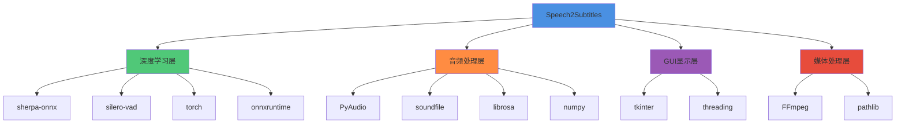
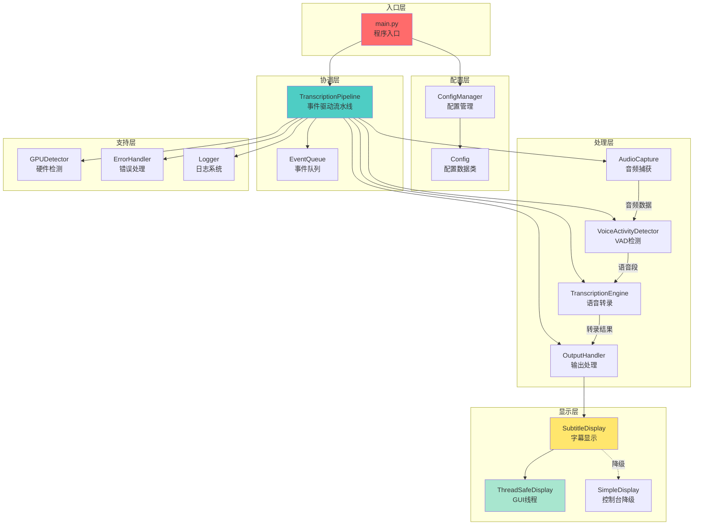
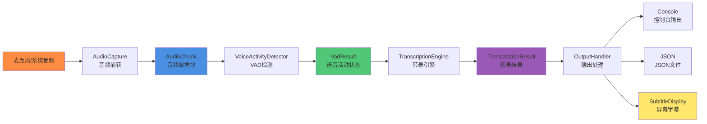
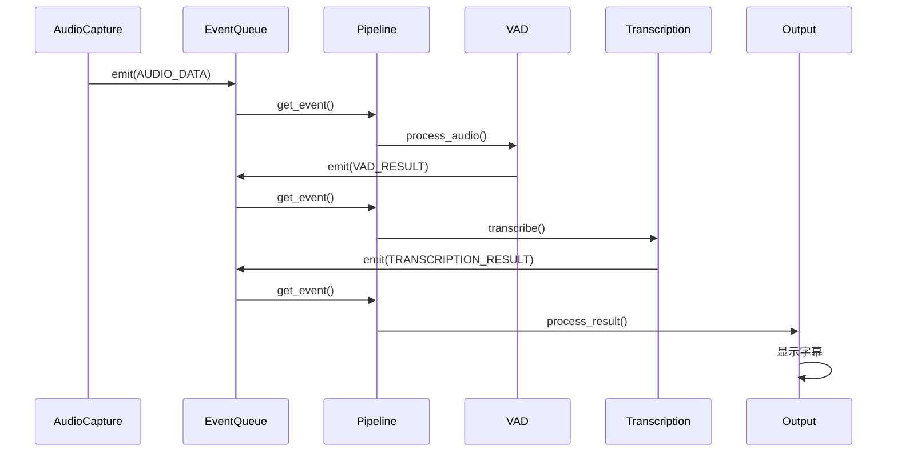
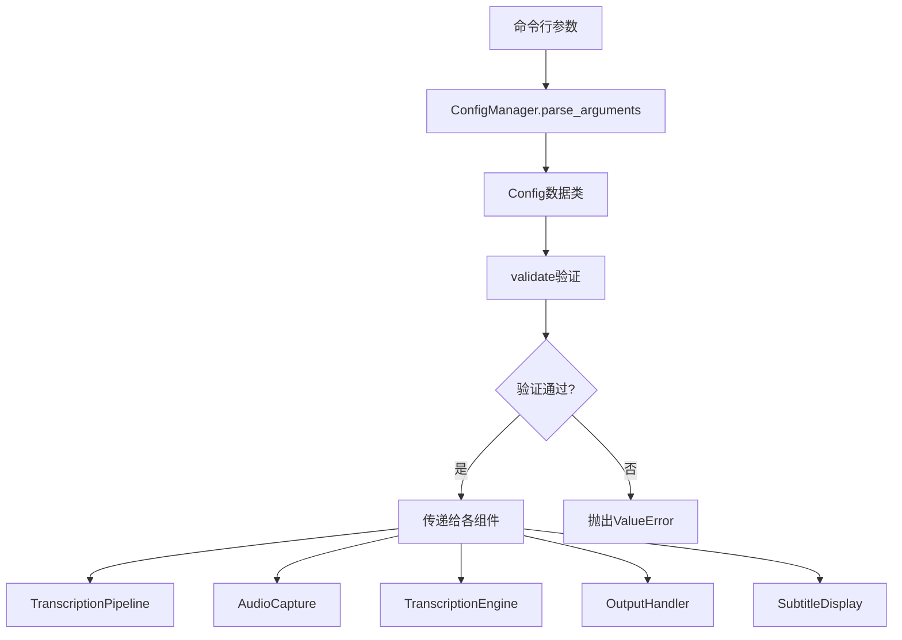
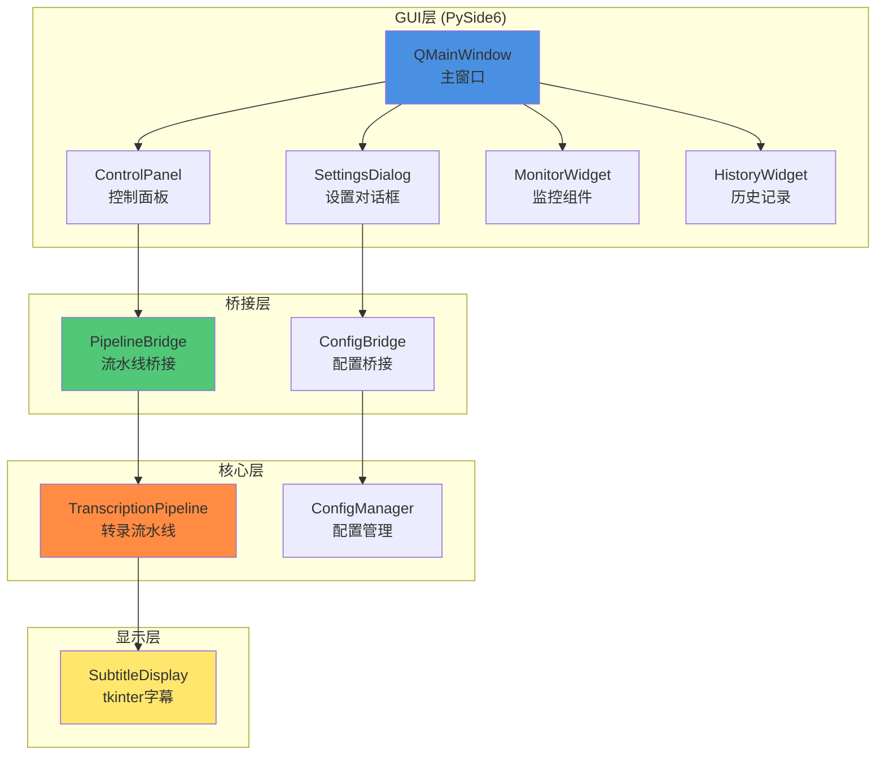

# Speech2Subtitles 仓库上下文分析报告

## 文档元信息
- **生成时间**: 2025-11-04
- **分析范围**: 完整项目仓库
- **目标**: 为PySide6 GUI界面开发提供完整的技术上下文
- **报告版本**: 1.0

---

## 1. 项目概览

### 1.1 项目类型和目的

**项目名称**: Speech2Subtitles - 实时语音转录系统

**核心目标**: 基于sherpa-onnx和silero_vad的高性能实时语音识别系统，提供离线、低延迟的语音转文本功能。

**主要特性**:
- 🎯 **实时转录**: 低延迟语音转文字，支持实时处理
- 🔒 **完全离线**: 无需网络连接，保护隐私数据
- 🎤 **多音频源**: 支持麦克风和系统音频捕获
- ⚡ **GPU加速**: 支持CUDA加速，提升处理性能
- 🎛️ **智能VAD**: 基于silero_vad的语音活动检测
- 📝 **字幕生成**: 支持媒体文件批量转字幕（srt/vtt/ass）
- 🖥️ **屏幕字幕**: 实时悬浮字幕显示功能（基于tkinter）

**应用场景**:
- 实时会议记录
- 视频/音频文件字幕生成
- 系统音频实时转录（浏览器、播放器等）
- 语音笔记
- 无障碍字幕支持

### 1.2 当前项目状态

**开发阶段**: 🚧 开发中 - 核心功能已完成

**版本信息**:
- 当前版本: v0.1.0
- Python要求: >=3.10
- 许可证: MIT

**最近更新**（从git status）:
- ✅ 完成字幕显示增强功能
- ✅ 新增媒体文件转字幕功能
- ✅ 实现系统音频捕获
- 📝 正在进行字幕显示功能的文档化

**模块状态总结**:
| 模块 | 状态 | 完成度 |
|------|------|--------|
| 配置管理 (config) | ✅ 完整 | 95%+ |
| 音频捕获 (audio) | ✅ 完整 | 85%+ |
| VAD检测 (vad) | ✅ 完整 | 90%+ |
| 转录引擎 (transcription) | ⚠️ 部分 | 80%+ |
| 输出处理 (output) | ✅ 完整 | 95%+ |
| 硬件检测 (hardware) | ✅ 完整 | 100% |
| 流程协调 (coordinator) | ✅ 完整 | 90%+ |
| 字幕显示 (subtitle_display) | ✅ 完整 | 100% |
| 媒体处理 (media) | ✅ 完整 | 90%+ |

---

## 2. 技术栈分析

### 2.1 核心技术栈

#### 编程语言
- **Python 3.10+**: 主开发语言
- **类型提示**: 使用typing-extensions进行类型标注

#### 深度学习和AI
- **sherpa-onnx (>=1.12.9)**: 语音识别核心引擎
  - 支持sense-voice模型
  - ONNX格式推理
  - 跨平台支持
- **silero-vad (>=4.0.0)**: 语音活动检测
  - 基于PyTorch
  - 预训练VAD模型
  - 低延迟实时检测
- **torch (>=2.6.0)**: 深度学习框架
  - 模型加载
  - GPU加速支持
- **onnxruntime**: ONNX模型推理引擎
  - CPU/GPU推理
  - 可选onnxruntime-gpu

#### 音频处理
- **PyAudio (>=0.2.11)**: 跨平台音频I/O
  - 麦克风捕获
  - 系统音频捕获
  - 实时音频流处理
- **soundfile (>=0.12.0)**: 音频文件读写
- **librosa (>=0.9.0)**: 音频分析和处理
- **numpy (>=1.21.0)**: 音频数据处理

#### 媒体处理
- **FFmpeg**: 外部依赖，用于媒体格式转换
  - 视频/音频提取
  - 格式转换
  - 必需的外部工具

#### GUI框架（现有）
- **tkinter**: Python标准库
  - 当前字幕显示实现
  - 轻量级、无额外依赖
  - 跨平台支持

#### 数据和序列化
- **dataclasses-json (>=0.5.7)**: 数据类JSON序列化
- **pathlib**: 路径处理（标准库）
- **json**: JSON处理（标准库）

#### 开发工具
- **pytest (>=7.0.0)**: 测试框架
- **pytest-cov (>=4.0.0)**: 代码覆盖率
- **black (>=22.0.0)**: 代码格式化
- **flake8 (>=5.0.0)**: 代码检查

#### 包管理
- **uv**: 现代Python包管理器（推荐）
- **pip**: 传统包管理器（兼容）

### 2.2 依赖关系图



### 2.3 技术栈版本要求

```toml
# 核心依赖（来自pyproject.toml）
[project.dependencies]
sherpa-onnx = ">=1.12.9"
torch = ">=2.6.0"
silero-vad = ">=4.0.0"
numpy = ">=1.21.0"
PyAudio = ">=0.2.11"
dataclasses-json = ">=0.5.7"
typing-extensions = ">=4.0.0"
soundfile = ">=0.12.0"
librosa = ">=0.9.0"

# GPU支持（可选）
[project.optional-dependencies]
gpu = ["onnxruntime-gpu>=1.12.0"]

# 开发依赖
dev = [
    "pytest>=7.0.0",
    "pytest-cov>=4.0.0",
    "black>=22.0.0",
    "flake8>=5.0.0"
]
```

---

## 3. 项目架构深度分析

### 3.1 整体架构模式

**架构风格**: **事件驱动的流水线架构 (Event-Driven Pipeline Architecture)**

**核心设计理念**:
- 模块化组件设计
- 松耦合、高内聚
- 事件驱动通信
- 异步流处理
- 统一配置管理

### 3.2 目录结构

```
speech2subtitles/
├── .claude/                          # AI上下文文档
│   └── specs/
│       ├── subtitle-display-enhancement/  # 字幕显示增强规范
│       └── pyside6-gui-interface/         # GUI界面规范（新）
├── docs/                             # 用户文档
│   ├── SYSTEM_AUDIO_GUIDE.md        # 系统音频使用指南
│   ├── SUBTITLE_DISPLAY_GUIDE.md    # 字幕显示使用指南
│   ├── SUBTITLE_DISPLAY_EXAMPLES.md # 字幕显示示例
│   ├── installation.md              # 安装指南
│   ├── usage.md                     # 使用指南
│   ├── deployment.md                # 部署指南
│   └── troubleshooting.md           # 故障排除
├── models/                           # AI模型文件
│   ├── sherpa-onnx-sense-voice-zh-en-ja-ko-yue-2024-07-17/
│   └── silero_vad/
├── src/                              # 源代码模块
│   ├── __init__.py
│   ├── audio/                       # 音频捕获模块
│   │   ├── __init__.py
│   │   ├── CLAUDE.md               # 模块文档
│   │   ├── models.py               # 数据模型
│   │   ├── capture.py              # 麦克风捕获
│   │   └── soundcard_capture.py    # 系统音频捕获
│   ├── config/                      # 配置管理模块
│   │   ├── __init__.py
│   │   ├── CLAUDE.md
│   │   ├── models.py               # 配置数据类
│   │   └── manager.py              # 配置管理器
│   ├── coordinator/                 # 流程协调模块
│   │   ├── __init__.py
│   │   ├── CLAUDE.md
│   │   └── pipeline.py             # 事件驱动流水线
│   ├── hardware/                    # 硬件检测模块
│   │   ├── __init__.py
│   │   ├── CLAUDE.md
│   │   ├── models.py
│   │   └── gpu_detector.py         # GPU检测
│   ├── media/                       # 媒体处理模块
│   │   ├── __init__.py
│   │   ├── CLAUDE.md
│   │   ├── converter.py            # 媒体格式转换
│   │   ├── subtitle_generator.py   # 字幕文件生成
│   │   └── batch_processor.py      # 批量处理
│   ├── output/                      # 输出处理模块
│   │   ├── __init__.py
│   │   ├── CLAUDE.md
│   │   ├── models.py
│   │   └── handler.py              # 输出格式化
│   ├── subtitle_display/            # 字幕显示模块 ⭐
│   │   ├── __init__.py
│   │   ├── CLAUDE.md               # 详细实现文档
│   │   ├── display_wrapper.py      # 统一接口
│   │   ├── thread_safe_display.py  # GUI实现（tkinter）
│   │   └── simple_display.py       # 控制台降级
│   ├── transcription/               # 转录引擎模块
│   │   ├── __init__.py
│   │   ├── CLAUDE.md
│   │   ├── models.py
│   │   └── engine.py               # sherpa-onnx封装
│   ├── utils/                       # 工具函数模块
│   │   ├── __init__.py
│   │   ├── logger.py               # 日志工具
│   │   └── error_handler.py        # 错误处理
│   └── vad/                         # 语音活动检测模块
│       ├── __init__.py
│       ├── CLAUDE.md
│       ├── models.py
│       └── detector.py             # VAD实现
├── tests/                           # 测试套件
├── tools/                           # 调试工具
│   ├── gpu_info.py
│   ├── audio_info.py
│   └── vad_test.py
├── main.py                          # 程序入口 ⭐
├── pyproject.toml                   # 项目配置
├── README.md                        # 项目README
├── CLAUDE.md                        # 根级AI上下文 ⭐
└── .venv/                           # 虚拟环境（uv管理）
```

### 3.3 核心组件交互图



### 3.4 数据流分析

#### 完整数据流管道



#### 关键数据结构

**AudioChunk** (音频数据):
```python
@dataclass
class AudioChunk:
    data: np.ndarray        # 音频采样数据
    sample_rate: int        # 采样率
    channels: int           # 声道数
    timestamp: float        # 时间戳
    duration_ms: float      # 持续时间
```

**VadResult** (VAD检测结果):
```python
@dataclass
class VadResult:
    is_speech: bool         # 是否为语音
    confidence: float       # 置信度
    start_time: float       # 开始时间
    end_time: float         # 结束时间
    audio_chunk: AudioChunk # 关联的音频块
```

**TranscriptionResult** (转录结果):
```python
@dataclass
class TranscriptionResult:
    text: str               # 转录文本
    confidence: float       # 置信度 (0.0-1.0)
    start_time: float       # 音频开始时间
    end_time: Optional[float]    # 音频结束时间
    duration_ms: Optional[float] # 持续时间
    language: Optional[str] # 检测语言
    is_final: bool          # 是否为最终结果
```

### 3.5 事件驱动架构详解

#### 事件类型

```python
class EventType(Enum):
    AUDIO_DATA = "audio_data"                      # 音频数据事件
    VAD_RESULT = "vad_result"                      # VAD检测结果
    TRANSCRIPTION_RESULT = "transcription_result"  # 转录结果
    ERROR = "error"                                # 错误事件
    STATE_CHANGE = "state_change"                  # 状态变化事件
```

#### 事件处理流程



#### 事件订阅机制

```python
# 添加事件处理器
pipeline.add_event_handler(EventType.TRANSCRIPTION_RESULT, on_transcription)

# 事件处理器签名
def on_transcription(event: PipelineEvent):
    result = event.data  # TranscriptionResult对象
    print(f"转录: {result.text}")
```

---

## 4. 现有字幕显示模块深度分析

### 4.1 模块架构

**位置**: `src/subtitle_display/`

**设计模式**: **策略模式 + 适配器模式 + 线程安全模式**

#### 模块组成

```
src/subtitle_display/
├── __init__.py                 # 模块入口，导出主接口
├── CLAUDE.md                   # 详细实现文档（530行）
├── display_wrapper.py          # 统一接口包装器
├── thread_safe_display.py      # 线程安全GUI实现 ⭐
└── simple_display.py           # 控制台后备实现
```

### 4.2 核心实现分析

#### 4.2.1 统一接口层 (`display_wrapper.py`)

**职责**: 提供统一的字幕显示接口，自动选择实现方式

**核心功能**:
- 自动降级机制（GUI → Console）
- 统一的API接口
- 配置验证

**实现选择逻辑**:
```python
def _create_implementation(self):
    """自动选择实现方式"""
    try:
        # 1. 优先尝试线程安全GUI实现
        from .thread_safe_display import ThreadSafeSubtitleDisplay
        return ThreadSafeSubtitleDisplay(self.config)
    except Exception as e:
        # 2. 降级到控制台实现
        logger.warning(f"GUI初始化失败，使用控制台模式: {e}")
        from .simple_display import SimpleSubtitleDisplay
        return SimpleSubtitleDisplay(self.config)
```

**公共API**:
```python
class SubtitleDisplay:
    def start() -> None                     # 启动字幕显示
    def stop() -> None                      # 停止字幕显示
    def show_subtitle(text, confidence)     # 显示字幕
    def clear_subtitle() -> None            # 清除字幕
    @property
    def is_running() -> bool                # 运行状态
```

#### 4.2.2 线程安全GUI实现 (`thread_safe_display.py`)

**技术方案**: **独立GUI线程 + 消息队列**

**核心特性**:
- ✅ 完全线程安全
- ✅ 无边框悬浮窗口
- ✅ 窗口置顶显示
- ✅ 可拖拽移动
- ✅ 自动文本换行
- ✅ 智能窗口大小调整
- ✅ 自动清除定时器

**线程架构**:


**关键实现细节**:

1. **GUI线程初始化**:
```python
def _start_gui_thread(self):
    """启动独立的GUI线程"""
    self._gui_thread = threading.Thread(
        target=self._gui_thread_main,
        name="SubtitleDisplayGUI",
        daemon=True
    )
    self._gui_thread.start()

    # 等待GUI线程初始化完成（5秒超时）
    if not self._started_event.wait(timeout=5.0):
        raise ComponentInitializationError("GUI线程启动超时")
```

2. **消息队列通信**:
```python
@dataclass
class SubtitleMessage:
    text: str
    confidence: float
    action: str  # 'show', 'clear', 'start', 'stop'

# 发送消息
self._message_queue.put(SubtitleMessage(text, confidence, 'show'))

# 接收和处理消息（在GUI线程中）
def _process_pending_messages(self):
    while True:
        try:
            message = self._message_queue.get_nowait()
            self._process_message(message)
        except queue.Empty:
            break
```

3. **窗口属性配置**:
```python
def _setup_window(self):
    self._root.title("实时字幕")
    self._root.overrideredirect(True)        # 无边框
    self._root.attributes("-topmost", True)  # 置顶
    self._root.attributes("-alpha", 0.8)     # 透明度
    self._root.geometry("800x100")           # 初始大小
    self._root.config(bg="#000000")          # 背景色
```

4. **拖拽功能实现**:
```python
def _on_mouse_press(self, event):
    """记录鼠标按下位置"""
    self._drag_data = {"x": event.x, "y": event.y}

def _on_mouse_drag(self, event):
    """拖拽移动窗口"""
    x = self._root.winfo_x() + (event.x - self._drag_data["x"])
    y = self._root.winfo_y() + (event.y - self._drag_data["y"])
    self._root.geometry(f"+{x}+{y}")
```

5. **智能窗口大小调整**:
```python
def _adjust_window_size(self):
    """根据文本内容自动调整窗口大小"""
    self._root.update_idletasks()
    width = self._label.winfo_reqwidth() + 40
    height = self._label.winfo_reqheight() + 20

    # 限制最大尺寸
    max_width = self._root.winfo_screenwidth() - 100
    max_height = 200
    width = min(width, max_width)
    height = min(height, max_height)

    self._root.geometry(f"{width}x{height}")
```

#### 4.2.3 控制台降级实现 (`simple_display.py`)

**职责**: GUI不可用时的后备方案

**特性**:
- 简单的控制台输出
- 线程安全
- 彩色文本支持

**实现示例**:
```python
def show_subtitle(self, text: str, confidence: float = 1.0) -> None:
    with self._lock:
        timestamp = time.strftime("%H:%M:%S")
        display_text = f"[{timestamp}] {text}"

        if self.config.show_confidence:
            display_text += f" (置信度: {confidence:.2f})"

        # 绿色输出
        print(f"\033[92m{display_text}\033[0m")
```

### 4.3 字幕显示配置

**配置数据类** (`src/config/models.py`):
```python
@dataclass
class SubtitleDisplayConfig:
    enabled: bool = False                    # 是否启用
    position: str = "bottom"                 # 位置(top/center/bottom)
    font_size: int = 24                      # 字体大小(12-72)
    font_family: str = "Microsoft YaHei"     # 字体
    opacity: float = 0.8                     # 透明度(0.1-1.0)
    max_display_time: float = 5.0            # 最大显示时间(秒)
    text_color: str = "#FFFFFF"              # 文字颜色
    background_color: str = "#000000"        # 背景颜色

    def validate(self) -> None:
        """配置验证逻辑"""
        # 验证位置、字体大小、透明度等
```

**命令行参数**:
```bash
--show-subtitles                        # 启用字幕显示
--subtitle-position {top,center,bottom} # 字幕位置
--subtitle-font-size INT                # 字体大小
--subtitle-font-family FONT             # 字体
--subtitle-opacity FLOAT                # 透明度
--subtitle-max-display-time FLOAT       # 最大显示时间
--subtitle-text-color COLOR             # 文字颜色
--subtitle-bg-color COLOR               # 背景颜色
```

### 4.4 字幕显示集成点

#### 在输出处理器中的集成 (`src/output/handler.py`)

**集成位置**: 第718-734行

```python
def _update_screen_subtitle(self, result: TranscriptionResult) -> None:
    """更新屏幕字幕显示"""
    # 检查是否为最终结果
    if not result.is_final:
        return  # 仅显示最终结果，避免中间结果闪烁

    # 检查文本有效性
    if not result.text or result.text.strip() == "":
        return

    # 显示字幕
    try:
        self.subtitle_display.show_subtitle(
            text=result.text,
            confidence=result.confidence
        )
    except Exception as e:
        logging.warning(f"屏幕字幕显示失败: {e}")
```

#### 在流水线中的初始化

```python
# TranscriptionPipeline初始化字幕显示
if config.subtitle_display.enabled:
    from src.subtitle_display import SubtitleDisplay
    self.subtitle_display = SubtitleDisplay(config.subtitle_display)
    self.subtitle_display.start()
```

### 4.5 现有GUI实现的优缺点

#### 优点 ✅
1. **零依赖**: tkinter是Python标准库，无需额外安装
2. **轻量级**: 资源占用极小
3. **跨平台**: Windows/Linux/macOS原生支持
4. **线程安全**: 通过独立GUI线程完全解决线程问题
5. **功能完整**: 基本字幕显示需求已满足
6. **文档完善**: 530行详细的CLAUDE.md文档

#### 缺点 ⚠️
1. **UI能力有限**: tkinter的视觉效果和控件有限
2. **扩展性差**: 难以实现复杂的GUI界面
3. **现代化不足**: 无法实现Material Design等现代UI
4. **交互受限**: 只能实现简单的鼠标拖拽
5. **样式定制**: CSS样式支持不足
6. **无控制面板**: 当前只有字幕显示，缺少设置界面

---

## 5. 配置管理系统分析

### 5.1 配置架构

**核心组件**:
- `ConfigManager`: 配置管理器，负责命令行解析
- `Config`: 主配置数据类
- `SubtitleDisplayConfig`: 字幕显示配置
- `AudioConfig`: 音频配置
- `TranscriptionConfig`: 转录配置

### 5.2 配置数据流



### 5.3 配置验证规则

**模型路径验证**:
```python
model_path = Path(self.model_path)
if not model_path.exists():
    raise ValueError(f"模型文件不存在: {self.model_path}")
if model_path.suffix not in ['.onnx', '.bin']:
    raise ValueError(f"不支持的模型格式: {model_path.suffix}")
```

**输入源验证**:
```python
if self.input_source not in ["microphone", "system"]:
    raise ValueError(f"不支持的输入源: {self.input_source}")
```

**VAD参数验证**:
```python
if not (0.0 <= self.vad_sensitivity <= 1.0):
    raise ValueError(f"VAD敏感度超出范围: {self.vad_sensitivity}")
```

### 5.4 配置扩展性

**添加新配置的步骤**:
1. 在`Config`数据类中添加字段
2. 在`ConfigManager._create_parser()`中添加命令行参数
3. 在`parse_arguments()`中处理参数
4. 在`validate()`中添加验证逻辑
5. 更新文档

**示例：添加GUI配置**:
```python
@dataclass
class Config:
    # 现有字段...

    # 新增GUI配置
    gui_enabled: bool = False
    gui_theme: str = "dark"
    gui_language: str = "zh_CN"
```

---

## 6. 编码标准和约定

### 6.1 代码风格

**格式化工具**: Black (line-length=88)

**Linting**: flake8

**配置** (`pyproject.toml`):
```toml
[tool.black]
line-length = 88
target-version = ['py310']
include = '\.pyi?$'
```

### 6.2 命名约定

| 类型 | 约定 | 示例 |
|------|------|------|
| 模块 | snake_case | `audio_capture.py` |
| 类 | PascalCase | `AudioCapture`, `ConfigManager` |
| 函数/方法 | snake_case | `process_audio()`, `get_config()` |
| 变量 | snake_case | `sample_rate`, `audio_chunk` |
| 常量 | UPPER_SNAKE_CASE | `DEFAULT_SAMPLE_RATE` |
| 私有成员 | _leading_underscore | `_internal_method()` |

### 6.3 文档字符串

**风格**: Google风格

**示例**:
```python
def process_audio(self, audio_data: np.ndarray) -> AudioChunk:
    """
    处理音频数据并创建音频块

    Args:
        audio_data: numpy数组格式的音频数据

    Returns:
        AudioChunk: 处理后的音频块对象

    Raises:
        AudioProcessingError: 音频处理失败时抛出

    Note:
        音频数据应该是16位整数格式
    """
```

### 6.4 类型提示

**强制使用类型提示**:
```python
from typing import Optional, List, Dict, Any

def transcribe(
    self,
    audio: np.ndarray,
    language: Optional[str] = None
) -> TranscriptionResult:
    """转录音频"""
    pass
```

### 6.5 错误处理

**自定义异常类**:
```python
class AudioCaptureError(Exception):
    """音频捕获错误"""
    pass

class TranscriptionError(Exception):
    """转录错误"""
    pass

class ConfigurationError(Exception):
    """配置错误"""
    pass
```

**错误处理模式**:
```python
try:
    result = self.transcribe(audio)
except TranscriptionError as e:
    self.logger.error(f"转录失败: {e}")
    # 错误恢复逻辑
    raise
```

### 6.6 日志规范

**日志级别使用**:
- `DEBUG`: 详细的调试信息
- `INFO`: 一般信息性消息
- `WARNING`: 警告信息，程序继续运行
- `ERROR`: 错误信息，功能受影响
- `CRITICAL`: 严重错误，程序可能停止

**日志格式**:
```python
logger.info(f"音频捕获开始 - 设备: {device_id}")
logger.warning(f"GPU不可用，使用CPU模式")
logger.error(f"模型加载失败: {model_path}")
```

---

## 7. 测试策略

### 7.1 测试框架

**主要工具**:
- pytest: 测试框架
- pytest-cov: 代码覆盖率
- unittest.mock: Mock对象

**配置** (`pyproject.toml`):
```toml
[tool.pytest.ini_options]
testpaths = ["tests"]
python_files = ["test_*.py"]
python_classes = ["Test*"]
python_functions = ["test_*"]
addopts = "--cov=src --cov-report=html --cov-report=term-missing"
```

### 7.2 测试覆盖率目标

| 模块 | 目标覆盖率 | 当前状态 |
|------|-----------|---------|
| config | 95%+ | ✅ 已达成 |
| audio | 85%+ | ✅ 已达成 |
| vad | 90%+ | ✅ 已达成 |
| transcription | 80%+ | ⚠️ 待提升 |
| output | 95%+ | ✅ 已达成 |
| subtitle_display | 90%+ | ✅ 已达成 |

### 7.3 测试层次

**1. 单元测试**: 测试单个模块的功能
```python
def test_config_validation():
    """测试配置验证"""
    config = Config(
        model_path="models/test.onnx",
        input_source="microphone"
    )
    config.validate()  # 不应抛出异常
```

**2. 集成测试**: 测试模块间协作
```python
def test_audio_to_transcription_pipeline():
    """测试音频到转录的完整流程"""
    # 创建模拟音频
    # 通过VAD检测
    # 执行转录
    # 验证结果
```

**3. 端到端测试**: 测试完整系统
```python
def test_full_pipeline():
    """测试完整的转录流水线"""
    with TranscriptionPipeline(config) as pipeline:
        # 模拟音频输入
        # 验证转录输出
```

---

## 8. GUI集成分析

### 8.1 PySide6集成的必要性

#### 8.1.1 为什么需要PySide6？

**现有tkinter的局限**:
1. ❌ **UI能力受限**: 无法实现现代化的GUI界面
2. ❌ **控制面板缺失**: 没有设置界面、模型管理等
3. ❌ **交互简单**: 只能鼠标拖拽，无法实现复杂交互
4. ❌ **扩展性差**: 难以添加新功能
5. ❌ **视觉效果**: 无法实现Material Design、毛玻璃效果等

**PySide6的优势**:
1. ✅ **现代UI**: Qt Widgets + QML支持
2. ✅ **丰富控件**: 各种现成的高级控件
3. ✅ **主题支持**: Material Design、自定义主题
4. ✅ **国际化**: 多语言支持
5. ✅ **跨平台**: Windows/Linux/macOS原生外观
6. ✅ **扩展性强**: 易于添加新功能
7. ✅ **商业许可**: LGPL v3许可，商业友好

#### 8.1.2 预期GUI功能

**核心面板**:
- 🏠 主控制面板
  - 启动/停止转录
  - 音频源选择
  - 模型选择
  - 实时状态显示
- ⚙️ 设置面板
  - VAD参数调整
  - 输出格式配置
  - 字幕显示设置
  - GPU/CPU选择
- 📊 监控面板
  - 实时转录结果
  - 音频波形显示
  - 性能指标监控
  - 日志查看
- 📝 历史记录
  - 转录历史
  - 导出功能
  - 搜索和过滤
- 🎬 媒体处理
  - 文件拖放
  - 批量转字幕
  - 进度显示

### 8.2 GUI集成点分析

#### 8.2.1 配置管理集成

**现有集成点**: `src/config/manager.py`

**扩展方向**:
```python
class ConfigManager:
    # 现有: 命令行参数解析
    def parse_arguments(self) -> Config:
        pass

    # 新增: GUI配置接口
    def load_from_gui(self, gui_config: dict) -> Config:
        """从GUI加载配置"""
        pass

    def save_to_file(self, config: Config, path: str):
        """保存配置到文件"""
        pass

    def load_from_file(self, path: str) -> Config:
        """从文件加载配置"""
        pass
```

#### 8.2.2 流水线控制集成

**现有集成点**: `src/coordinator/pipeline.py`

**扩展需求**:
```python
class TranscriptionPipeline:
    # 现有: 基本生命周期管理
    def start(self) -> bool:
        pass

    def stop(self) -> None:
        pass

    # 新增: GUI回调接口
    def set_progress_callback(self, callback: Callable):
        """设置进度回调"""
        pass

    def set_result_callback(self, callback: Callable):
        """设置结果回调"""
        pass

    def set_error_callback(self, callback: Callable):
        """设置错误回调"""
        pass

    def pause(self) -> None:
        """暂停转录（新功能）"""
        pass

    def resume(self) -> None:
        """恢复转录（新功能）"""
        pass
```

#### 8.2.3 实时显示集成

**现有实现**: `src/subtitle_display/`

**集成策略**:
```python
# 策略1: 保留现有tkinter实现作为字幕悬浮窗
# 策略2: 使用PySide6创建主GUI窗口
# 策略3: 两者共存，互不干扰

class GUIApplication(QMainWindow):
    def __init__(self):
        super().__init__()
        # PySide6主窗口
        self.subtitle_display = None  # tkinter字幕窗口

    def start_subtitle_display(self):
        """启动tkinter字幕显示（独立线程）"""
        self.subtitle_display = SubtitleDisplay(config)
        self.subtitle_display.start()
```

#### 8.2.4 事件系统集成

**现有事件系统**: 基于`queue.Queue`的事件队列

**与Qt信号槽集成**:
```python
from PySide6.QtCore import QObject, Signal

class PipelineSignals(QObject):
    """将流水线事件转换为Qt信号"""
    transcription_result = Signal(object)  # TranscriptionResult
    audio_data = Signal(object)            # AudioChunk
    vad_result = Signal(object)            # VadResult
    error = Signal(str)                    # 错误消息
    state_changed = Signal(str, str)       # old_state, new_state

class PipelineBridge:
    """流水线与GUI的桥接器"""
    def __init__(self, pipeline: TranscriptionPipeline):
        self.pipeline = pipeline
        self.signals = PipelineSignals()

        # 订阅流水线事件
        pipeline.add_event_handler(
            EventType.TRANSCRIPTION_RESULT,
            self._on_transcription_result
        )

    def _on_transcription_result(self, event):
        """将流水线事件转换为Qt信号"""
        self.signals.transcription_result.emit(event.data)
```

### 8.3 GUI架构建议

#### 8.3.1 推荐架构



#### 8.3.2 推荐技术栈

**GUI框架**: PySide6 (Qt for Python)

**UI设计**: Qt Widgets (推荐) 或 QML

**主题**:
- Qt Material (Material Design风格)
- PyQtDarkTheme (深色主题)
- 自定义QSS样式表

**布局管理**: QVBoxLayout, QHBoxLayout, QGridLayout

**异步处理**: QThread + Signal/Slot

### 8.4 集成注意事项

#### 8.4.1 线程安全

**问题**: PySide6的GUI操作必须在主线程

**解决方案**:
```python
from PySide6.QtCore import QMetaObject, Qt

def update_ui_from_worker(self, text):
    """从工作线程更新UI"""
    QMetaObject.invokeMethod(
        self.label,
        "setText",
        Qt.QueuedConnection,
        Q_ARG(str, text)
    )
```

#### 8.4.2 事件循环

**问题**: Qt事件循环与现有流水线的事件循环

**解决方案**:
```python
# 方案1: 使用QThread运行流水线
class PipelineThread(QThread):
    def run(self):
        with TranscriptionPipeline(config) as pipeline:
            pipeline.run()

# 方案2: 使用QTimer定期检查流水线状态
self.timer = QTimer()
self.timer.timeout.connect(self.check_pipeline_status)
self.timer.start(100)  # 100ms
```

#### 8.4.3 资源清理

**问题**: 确保GUI关闭时正确清理流水线

**解决方案**:
```python
class MainWindow(QMainWindow):
    def closeEvent(self, event):
        """窗口关闭事件"""
        # 停止流水线
        if self.pipeline:
            self.pipeline.stop()

        # 停止字幕显示
        if self.subtitle_display:
            self.subtitle_display.stop()

        # 接受关闭事件
        event.accept()
```

#### 8.4.4 配置持久化

**建议**: 使用QSettings保存GUI配置

```python
from PySide6.QtCore import QSettings

class ConfigManager:
    def __init__(self):
        self.settings = QSettings("YourCompany", "Speech2Subtitles")

    def save_gui_config(self, config: Config):
        """保存GUI配置"""
        self.settings.setValue("model_path", config.model_path)
        self.settings.setValue("input_source", config.input_source)
        # ...

    def load_gui_config(self) -> Config:
        """加载GUI配置"""
        config = Config(
            model_path=self.settings.value("model_path", ""),
            input_source=self.settings.value("input_source", "microphone")
        )
        return config
```

---

## 9. 开发约束和考虑因素

### 9.1 技术约束

#### 9.1.1 Python版本
- **最低要求**: Python 3.10
- **推荐版本**: Python 3.10或3.11
- **原因**: 使用了dataclass、类型提示等新特性

#### 9.1.2 操作系统
- **支持**: Windows 10/11, Linux, macOS
- **注意**: Windows文件编码需要UTF-8
- **建议**: 在多平台测试

#### 9.1.3 硬件要求
- **内存**: 最低4GB，推荐8GB+
- **CPU**: 多核处理器
- **GPU**: CUDA支持（可选，用于加速）
- **存储**: 2GB+用于模型文件

#### 9.1.4 依赖约束
- **FFmpeg**: 外部依赖，必须安装
- **PyAudio**: 音频驱动依赖
- **CUDA**: GPU加速需要NVIDIA驱动

### 9.2 架构约束

#### 9.2.1 事件驱动架构
- **必须遵循**: 所有组件通过事件通信
- **禁止**: 直接调用其他组件的内部方法
- **建议**: 使用回调或信号槽模式

#### 9.2.2 配置集中管理
- **必须**: 所有配置通过ConfigManager
- **禁止**: 硬编码配置值
- **建议**: 提供配置验证

#### 9.2.3 模块化设计
- **必须**: 每个模块职责单一
- **禁止**: 模块间强耦合
- **建议**: 使用接口和抽象类

### 9.3 性能约束

#### 9.3.1 实时性要求
- **音频延迟**: < 100ms
- **转录延迟**: < 500ms (GPU) / < 2s (CPU)
- **GUI响应**: < 50ms
- **事件处理**: < 10ms

#### 9.3.2 资源使用
- **内存**: < 2GB (含模型)
- **CPU**: < 30% (单核心)
- **GPU**: < 50% (如启用)

### 9.4 兼容性约束

#### 9.4.1 向后兼容
- **配置文件**: 必须支持旧版本配置
- **API接口**: 避免破坏性更改
- **数据格式**: 保持兼容性

#### 9.4.2 跨平台兼容
- **路径处理**: 使用pathlib
- **编码**: 统一使用UTF-8
- **GUI**: 测试多平台表现

### 9.5 安全约束

#### 9.5.1 数据隐私
- **完全离线**: 不发送任何数据到外部
- **本地存储**: 转录结果本地保存
- **权限控制**: 最小权限原则

#### 9.5.2 错误处理
- **不崩溃**: 错误不应导致程序崩溃
- **降级方案**: 提供降级功能
- **日志记录**: 详细的错误日志

---

## 10. GUI开发建议

### 10.1 开发优先级

#### Phase 1: 基础GUI框架 (2-3周)
1. **主窗口框架**
   - QMainWindow基础结构
   - 菜单栏、工具栏
   - 状态栏
   - 基础布局

2. **配置桥接**
   - ConfigBridge实现
   - GUI配置持久化
   - 配置验证

3. **流水线集成**
   - PipelineBridge实现
   - 信号槽连接
   - 基本启动/停止控制

#### Phase 2: 核心功能面板 (3-4周)
1. **控制面板**
   - 启动/停止按钮
   - 音频源选择
   - 模型选择
   - 实时状态显示

2. **设置对话框**
   - VAD参数调整
   - 输出配置
   - 字幕显示设置
   - 高级选项

3. **实时监控**
   - 转录结果显示
   - 音频波形可视化
   - 性能指标

#### Phase 3: 高级功能 (2-3周)
1. **历史记录**
   - 转录历史列表
   - 搜索和过滤
   - 导出功能

2. **媒体处理**
   - 文件拖放
   - 批量转字幕
   - 进度显示

3. **主题和国际化**
   - 深色/浅色主题
   - 多语言支持
   - 自定义样式

#### Phase 4: 优化和测试 (1-2周)
1. **性能优化**
2. **跨平台测试**
3. **用户体验优化**
4. **文档完善**

### 10.2 技术选型建议

#### GUI框架
✅ **推荐**: PySide6
- 原因: 商业友好、功能强大、社区活跃
- 许可: LGPL v3
- 文档: 官方文档完善

❌ **不推荐**: PyQt5
- 原因: 商业许可费用高
- 许可: GPL/商业双重许可

#### UI设计方案
✅ **推荐**: Qt Widgets
- 原因: 成熟稳定、学习曲线平缓
- 适用: 传统桌面应用

⚠️ **可选**: QML
- 原因: 现代化UI、动画效果好
- 适用: 需要炫酷效果的场景
- 缺点: 学习曲线陡峭

#### 主题方案
✅ **推荐**: PyQtDarkTheme
- 仓库: https://github.com/5yutan5/PyQtDarkTheme
- 特性: 简单易用、效果好
- 安装: `pip install pyqtdarktheme`

⚠️ **可选**: Qt Material
- 仓库: https://github.com/UN-GCPDS/qt-material
- 特性: Material Design风格
- 注意: 可能需要调整

### 10.3 代码结构建议

```
src/gui/                          # 新增GUI模块
├── __init__.py
├── CLAUDE.md                     # GUI模块文档
├── main_window.py                # 主窗口
├── widgets/                      # 自定义控件
│   ├── __init__.py
│   ├── control_panel.py          # 控制面板
│   ├── settings_dialog.py        # 设置对话框
│   ├── monitor_widget.py         # 监控组件
│   ├── history_widget.py         # 历史记录
│   └── waveform_widget.py        # 音频波形
├── bridges/                      # 桥接层
│   ├── __init__.py
│   ├── pipeline_bridge.py        # 流水线桥接
│   └── config_bridge.py          # 配置桥接
├── resources/                    # 资源文件
│   ├── icons/                    # 图标
│   ├── themes/                   # 主题
│   └── translations/             # 翻译文件
└── utils/                        # GUI工具函数
    ├── __init__.py
    ├── thread_utils.py           # 线程工具
    └── style_utils.py            # 样式工具
```

### 10.4 开发示例

#### 主窗口示例
```python
from PySide6.QtWidgets import QMainWindow, QVBoxLayout, QWidget
from PySide6.QtCore import QThread, Signal

class MainWindow(QMainWindow):
    def __init__(self):
        super().__init__()
        self.setWindowTitle("Speech2Subtitles")
        self.setGeometry(100, 100, 1200, 800)

        # 创建桥接器
        self.pipeline_bridge = None
        self.config_bridge = ConfigBridge()

        # 初始化UI
        self._init_ui()

        # 加载配置
        self.config = self.config_bridge.load_config()

    def _init_ui(self):
        """初始化UI"""
        central_widget = QWidget()
        self.setCentralWidget(central_widget)

        layout = QVBoxLayout(central_widget)

        # 添加控制面板
        self.control_panel = ControlPanel()
        layout.addWidget(self.control_panel)

        # 添加监控组件
        self.monitor = MonitorWidget()
        layout.addWidget(self.monitor)

        # 连接信号
        self.control_panel.start_clicked.connect(self.start_transcription)
        self.control_panel.stop_clicked.connect(self.stop_transcription)

    def start_transcription(self):
        """启动转录"""
        # 创建流水线
        self.pipeline = TranscriptionPipeline(self.config)

        # 创建桥接器
        self.pipeline_bridge = PipelineBridge(self.pipeline)

        # 连接信号
        self.pipeline_bridge.signals.transcription_result.connect(
            self.monitor.on_transcription_result
        )

        # 在独立线程启动流水线
        self.pipeline_thread = PipelineThread(self.pipeline)
        self.pipeline_thread.start()

    def stop_transcription(self):
        """停止转录"""
        if self.pipeline:
            self.pipeline.stop()
```

#### 控制面板示例
```python
from PySide6.QtWidgets import QWidget, QPushButton, QComboBox, QLabel
from PySide6.QtCore import Signal

class ControlPanel(QWidget):
    start_clicked = Signal()
    stop_clicked = Signal()

    def __init__(self):
        super().__init__()
        self._init_ui()

    def _init_ui(self):
        """初始化UI"""
        layout = QHBoxLayout(self)

        # 启动按钮
        self.start_btn = QPushButton("启动转录")
        self.start_btn.clicked.connect(self.start_clicked.emit)
        layout.addWidget(self.start_btn)

        # 停止按钮
        self.stop_btn = QPushButton("停止转录")
        self.stop_btn.clicked.connect(self.stop_clicked.emit)
        self.stop_btn.setEnabled(False)
        layout.addWidget(self.stop_btn)

        # 音频源选择
        layout.addWidget(QLabel("音频源:"))
        self.source_combo = QComboBox()
        self.source_combo.addItems(["麦克风", "系统音频"])
        layout.addWidget(self.source_combo)

        # 模型选择
        layout.addWidget(QLabel("模型:"))
        self.model_combo = QComboBox()
        layout.addWidget(self.model_combo)
```

### 10.5 测试建议

#### 单元测试
```python
import pytest
from PySide6.QtWidgets import QApplication
from src.gui.main_window import MainWindow

@pytest.fixture
def app():
    """创建QApplication实例"""
    app = QApplication.instance()
    if app is None:
        app = QApplication([])
    yield app

def test_main_window_creation(app):
    """测试主窗口创建"""
    window = MainWindow()
    assert window.windowTitle() == "Speech2Subtitles"
    window.close()

def test_control_panel_signals(app):
    """测试控制面板信号"""
    panel = ControlPanel()
    signal_received = False

    def on_start():
        nonlocal signal_received
        signal_received = True

    panel.start_clicked.connect(on_start)
    panel.start_btn.click()

    assert signal_received
```

---

## 11. 文档和资源

### 11.1 现有文档

#### 根级文档
- ✅ **CLAUDE.md**: 完整的项目AI上下文（580行）
- ✅ **README.md**: 用户使用指南（479行）
- ✅ **pyproject.toml**: 项目配置和依赖

#### 模块文档（CLAUDE.md）
- ✅ `src/config/CLAUDE.md`: 配置管理模块（176行）
- ✅ `src/coordinator/CLAUDE.md`: 流程协调模块（304行）
- ✅ `src/output/CLAUDE.md`: 输出处理模块（346行）
- ✅ `src/subtitle_display/CLAUDE.md`: 字幕显示模块（530行） ⭐
- ✅ `src/audio/CLAUDE.md`: 音频捕获模块
- ✅ `src/vad/CLAUDE.md`: VAD检测模块
- ✅ `src/transcription/CLAUDE.md`: 转录引擎模块
- ✅ `src/hardware/CLAUDE.md`: 硬件检测模块
- ✅ `src/media/CLAUDE.md`: 媒体处理模块

#### 用户文档
- ✅ `docs/SYSTEM_AUDIO_GUIDE.md`: 系统音频使用指南
- ✅ `docs/SUBTITLE_DISPLAY_GUIDE.md`: 字幕显示使用指南
- ✅ `docs/SUBTITLE_DISPLAY_EXAMPLES.md`: 字幕显示示例
- ✅ `docs/installation.md`: 安装指南
- ✅ `docs/usage.md`: 使用指南
- ✅ `docs/deployment.md`: 部署指南
- ✅ `docs/troubleshooting.md`: 故障排除

### 11.2 文档质量评估

**优点** ✅:
- 文档结构完整
- 多层级CLAUDE.md系统
- 详细的代码注释
- 丰富的使用示例

**需要改进** ⚠️:
- GUI相关文档缺失（需要创建）
- API文档自动生成（考虑使用Sphinx）
- 架构图需要更新（添加GUI层）

### 11.3 推荐学习资源

#### PySide6学习
1. **官方文档**: https://doc.qt.io/qtforpython-6/
2. **教程**: Qt for Python Tutorial
3. **示例**: PySide6 Examples
4. **书籍**: "Create GUI Applications with Python & Qt6"

#### 设计参考
1. **Material Design**: https://material.io/design
2. **Qt Design Studio**: 界面设计工具
3. **Qt Quick Controls**: 现代控件库

#### 社区资源
1. **Qt Forum**: https://forum.qt.io/
2. **Stack Overflow**: PySide6标签
3. **GitHub**: 优秀的PySide6项目

---

## 12. 总结和建议

### 12.1 项目优势

✅ **架构清晰**: 事件驱动的流水线架构，模块化设计
✅ **文档完善**: 多层级CLAUDE.md系统，详细的注释
✅ **功能完整**: 核心转录功能已实现并稳定
✅ **扩展性强**: 易于添加新功能和组件
✅ **代码质量**: 遵循编码规范，测试覆盖率高
✅ **字幕显示**: 已有线程安全的tkinter实现

### 12.2 GUI开发路径

#### 推荐方案: 渐进式集成

**Phase 1: 最小可用产品 (MVP)**
- 主窗口框架
- 基本控制面板（启动/停止）
- 配置桥接
- 实时结果显示

**Phase 2: 核心功能**
- 完整的设置界面
- 音频波形可视化
- 性能监控面板
- 历史记录管理

**Phase 3: 增强体验**
- 深色/浅色主题
- 多语言支持
- 拖放文件支持
- 快捷键配置

**Phase 4: 高级特性**
- 插件系统
- 自定义模型管理
- 高级字幕编辑
- 云同步（可选）

### 12.3 集成策略

#### 保留现有字幕显示
✅ **建议**: 保留tkinter字幕悬浮窗
- 原因: 功能完整、线程安全、已测试
- 角色: 作为屏幕字幕显示
- 改进: 可添加更多样式选项

#### PySide6作为主GUI
✅ **建议**: PySide6构建主控制界面
- 原因: 功能强大、可扩展性强
- 角色: 控制面板、设置、监控
- 共存: 与tkinter字幕窗口独立运行

#### 桥接层设计
✅ **关键**: 设计良好的桥接层
- PipelineBridge: 流水线事件 → Qt信号
- ConfigBridge: 配置管理 → GUI配置
- 线程安全: QMetaObject.invokeMethod

### 12.4 开发注意事项

#### 避免的陷阱
❌ **避免**: 破坏现有架构
❌ **避免**: 在主线程阻塞操作
❌ **避免**: 硬编码配置值
❌ **避免**: 忽略跨平台兼容性
❌ **避免**: 过度设计

#### 最佳实践
✅ **遵循**: 现有编码规范
✅ **使用**: 类型提示
✅ **编写**: 单元测试
✅ **保持**: 向后兼容
✅ **文档**: 同步更新文档

### 12.5 预期挑战

#### 技术挑战
1. **线程同步**: Qt事件循环与流水线事件循环
2. **性能优化**: GUI更新不应影响转录性能
3. **跨平台**: 不同平台的GUI表现差异

#### 解决方案
1. 使用QThread和信号槽
2. 异步更新，批量处理
3. 多平台测试，条件编译

### 12.6 下一步行动

#### 立即开始
1. ✅ 创建GUI模块目录结构
2. ✅ 安装PySide6依赖
3. ✅ 创建主窗口框架
4. ✅ 实现ConfigBridge

#### 短期目标（1-2周）
1. 完成主窗口基础UI
2. 实现PipelineBridge
3. 集成基本控制功能
4. 测试启动/停止流程

#### 中期目标（1个月）
1. 完成所有核心面板
2. 实现设置对话框
3. 添加实时监控
4. 完善文档

#### 长期目标（2-3个月）
1. 完整的功能覆盖
2. 主题和国际化
3. 性能优化
4. 发布稳定版本

---

## 附录

### A. 关键文件清单

**必读文件**:
1. `CLAUDE.md` - 项目总览
2. `main.py` - 程序入口
3. `src/config/models.py` - 配置数据结构
4. `src/coordinator/pipeline.py` - 核心流水线
5. `src/subtitle_display/CLAUDE.md` - 字幕显示详解

**参考文件**:
1. `pyproject.toml` - 依赖和配置
2. `README.md` - 用户指南
3. `src/output/handler.py` - 输出处理
4. `docs/SUBTITLE_DISPLAY_GUIDE.md` - 字幕使用指南

### B. 快速命令参考

```bash
# 激活虚拟环境
.venv\Scripts\activate  # Windows
source .venv/bin/activate  # Linux/macOS

# 安装依赖
uv sync

# 运行程序
python main.py --model-path models\sherpa-onnx-sense-voice-zh-en-ja-ko-yue-2024-07-17\model.onnx --input-source microphone

# 运行测试
pytest tests/ --cov=src

# 代码格式化
black src/ tests/

# 调试工具
python tools/gpu_info.py
python tools/audio_info.py
```

### C. 联系和支持

**项目仓库**: [GitHub URL]
**问题报告**: GitHub Issues
**文档Wiki**: 项目Wiki
**技术讨论**: GitHub Discussions

---

**报告结束**

生成时间: 2025-11-04
报告版本: 1.0
分析深度: 完整
建议状态: 可操作

**建议**: 基于本报告，可以立即开始PySide6 GUI界面的开发工作。重点关注桥接层设计，确保与现有架构的良好集成。保留现有的tkinter字幕显示作为屏幕悬浮窗，使用PySide6构建主控制界面。

**下一步**: 创建 `requirements-spec.md` 定义详细的GUI需求规范。
