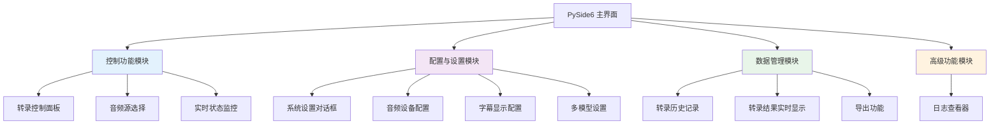
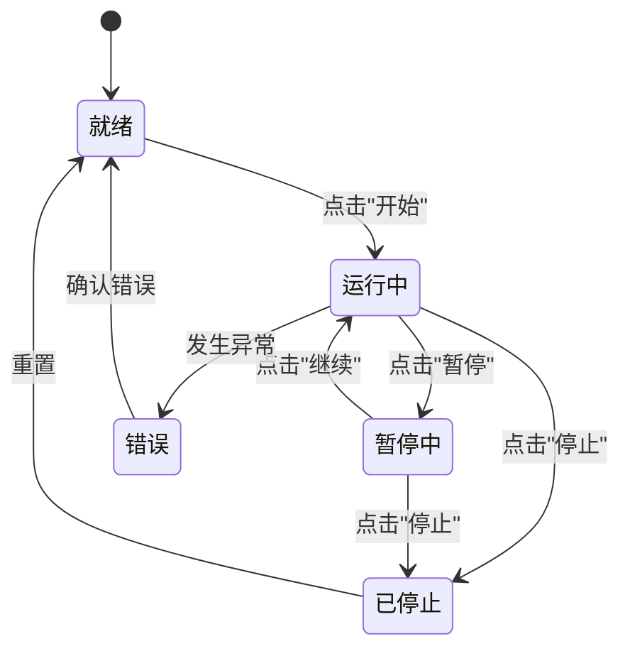
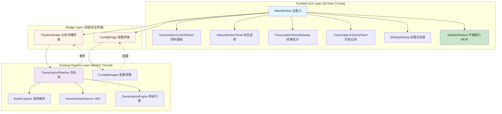
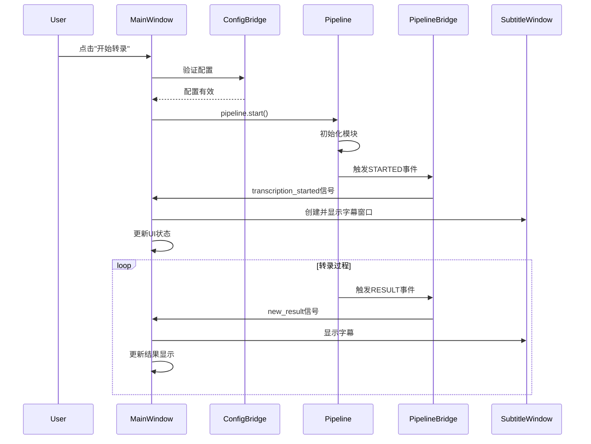
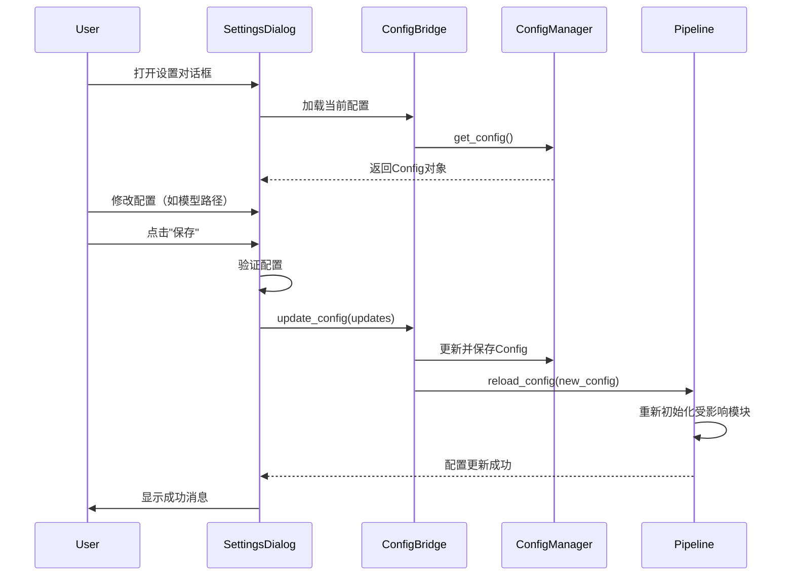
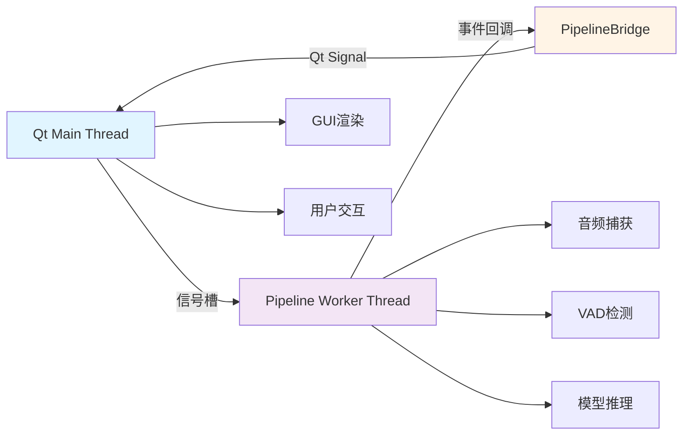
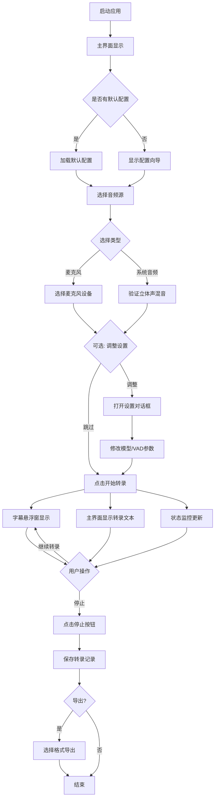
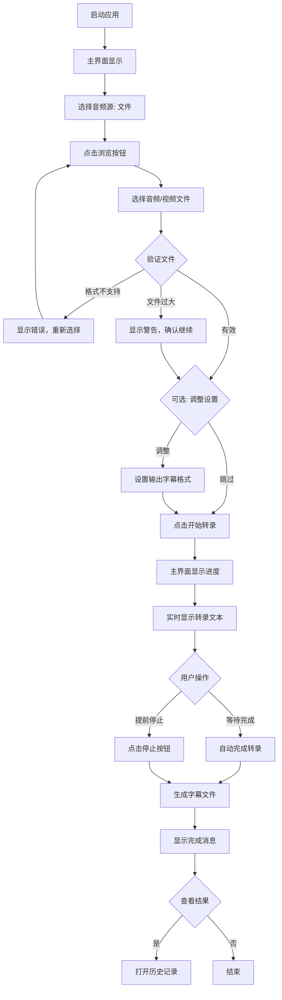
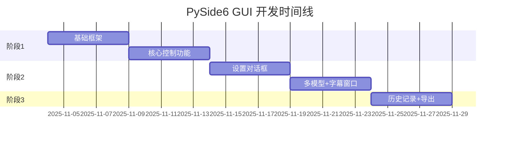

# PySide6 GUI 界面需求规格说明书

**版本**: 1.0
**状态**: 已确认 ✅
**创建日期**: 2025-11-04
**最后更新**: 2025-11-04
**需求质量评分**: 100/100 🎉

---

## 📋 文档信息

| 项目 | 内容 |
|-----|------|
| **项目名称** | Speech2Subtitles PySide6 GUI 界面 |
| **功能代号** | pyside6-gui-interface |
| **目标用户** | 需要实时语音转录的用户（会议记录、字幕生成等） |
| **开发周期** | 5周（3个阶段） |
| **技术栈** | PySide6 + Python 3.10+ + 现有事件驱动流水线 |

---

## 🎯 1. 概述

### 1.1 项目背景

Speech2Subtitles 是一个基于 sherpa-onnx 和 silero-vad 的高性能实时语音识别系统，目前通过命令行方式运行，字幕显示使用 tkinter 实现的悬浮窗。为了提升用户体验和功能丰富度，需要开发一个现代化的 PySide6 GUI 界面。

**现有系统特点**：
- ✅ 事件驱动的流水线架构（TranscriptionPipeline）
- ✅ 完善的配置管理系统（ConfigManager）
- ✅ tkinter实现的字幕悬浮窗（ThreadSafeSubtitleDisplay）
- ✅ 支持麦克风、系统音频、文件转录
- ✅ GPU加速支持

### 1.2 需求来源

**用户需求**：使用PySide6创建友好的gui界面，设计界面，最终确定页面上的功能和交互

**业务目标**：
1. **降低使用门槛**：提供图形化界面，取代命令行操作
2. **增强用户体验**：提供实时状态监控、历史记录、配置管理等功能
3. **统一GUI技术栈**：用PySide6替换现有的tkinter字幕窗口
4. **提升功能丰富度**：支持多模型管理、导出功能、日志查看等高级功能

### 1.3 技术决策

**技术选择**：
- **GUI框架**：PySide6（Qt for Python 6.x）
- **替换策略**：用PySide6完全替换现有的tkinter字幕窗口
- **备份策略**：保留旧的tkinter实现作为备份
- **集成方案**：
  - **配置管理**：通过ConfigManager统一管理（推荐方案A）
  - **事件通信**：通过Qt信号槽桥接（推荐方案A）

### 1.4 文档版本历史

| 版本 | 日期 | 变更内容 | 作者 |
|-----|------|---------|------|
| 1.0 | 2025-11-04 | 初始版本，需求确认完成 | Requirements Orchestrator |

---

## 🎨 2. 功能需求详述

### 2.1 功能模块总览



### 2.2 控制功能模块

#### 2.2.1 转录控制面板（P0 - 核心功能）

**功能描述**：提供转录的启动、暂停、停止控制

**用户故事**：
> 作为用户，我希望能通过清晰的按钮控制转录的开始和停止，以便在需要时快速启动或结束转录任务。

**界面组件**：
```
┌─────────────────────────────────┐
│  转录控制面板                    │
├─────────────────────────────────┤
│  [开始转录]  [暂停]  [停止]      │
│                                  │
│  状态: ⚫ 就绪                   │
│  时长: 00:00:00                  │
└─────────────────────────────────┘
```

**功能规格**：

| 组件 | 说明 | 状态变化 |
|-----|------|---------|
| 开始按钮 | 启动转录流水线 | 就绪→运行中 |
| 暂停按钮 | 暂停转录（仅麦克风/系统音频模式） | 运行中⇄暂停中 |
| 停止按钮 | 停止转录并保存结果 | 运行中/暂停中→已停止 |
| 状态指示器 | 显示当前转录状态（就绪/运行中/暂停中/已停止/错误） | - |
| 时长显示 | 显示转录已运行时长 | 每秒更新 |

**交互逻辑**：


**API接口**：
```python
class TranscriptionControlPanel(QWidget):
    """转录控制面板"""

    # 信号
    start_requested = Signal()  # 用户请求开始转录
    pause_requested = Signal()  # 用户请求暂停转录
    stop_requested = Signal()   # 用户请求停止转录

    def __init__(self, parent: Optional[QWidget] = None):
        super().__init__(parent)
        self._setup_ui()
        self._connect_signals()

    def set_state(self, state: TranscriptionState) -> None:
        """设置控制面板状态"""

    def update_duration(self, seconds: int) -> None:
        """更新转录时长显示"""
```

**边界条件与异常处理**：
- ✅ **开始转录前验证**：检查配置完整性（模型路径、音频设备等）
- ✅ **文件模式特殊处理**：文件转录模式不支持暂停，按钮置灰
- ✅ **转录中禁止配置修改**：转录运行时，设置对话框部分选项置灰
- ✅ **错误状态恢复**：发生错误时显示错误消息，用户确认后恢复到就绪状态
- ✅ **多次点击防抖**：防止用户快速多次点击按钮导致重复操作

---

#### 2.2.2 音频源选择（P0 - 核心功能）

**功能描述**：支持选择麦克风、系统音频或文件作为转录源

**用户故事**：
> 作为用户，我希望能方便地切换不同的音频源（麦克风、系统音频、文件），以适应不同的使用场景。

**界面组件**：
```
┌─────────────────────────────────────┐
│  音频源选择                          │
├─────────────────────────────────────┤
│  ⚪ 麦克风                            │
│  ⚪ 系统音频                          │
│  ⚪ 音频/视频文件                     │
│                                      │
│  [ 文件路径... ] [浏览...]           │
└─────────────────────────────────────┘
```

**功能规格**：

| 音频源类型 | 说明 | 支持格式 |
|----------|------|---------|
| 麦克风 | 使用系统麦克风输入 | 实时音频流 |
| 系统音频 | 捕获系统播放音频 | 实时音频流 |
| 音频文件 | 从文件导入 | WAV, MP3, FLAC, M4A, OGG |
| 视频文件 | 从视频提取音频 | MP4, AVI, MKV, MOV, FLV |

**交互逻辑**：
```mermaid
flowchart TD
    A[用户选择音频源] --> B{选择类型}
    B -->|麦克风| C[显示麦克风设备列表]
    B -->|系统音频| D[显示系统音频设备]
    B -->|文件| E[显示文件选择器]

    C --> F[验证设备可用性]
    D --> G[验证立体声混音开启]
    E --> H[验证文件格式]

    F --> I[更新配置]
    G --> I
    H --> I

    I --> J[启用"开始转录"按钮]

    G -->|未开启| K[显示帮助文档]
    H -->|格式不支持| L[显示错误消息]
```

**API接口**：
```python
class AudioSourceSelector(QWidget):
    """音频源选择器"""

    # 信号
    source_changed = Signal(AudioSourceType, str)  # (源类型, 路径/设备ID)

    def __init__(self, parent: Optional[QWidget] = None):
        super().__init__(parent)
        self._setup_ui()

    def get_selected_source(self) -> Tuple[AudioSourceType, str]:
        """获取当前选择的音频源"""

    def set_enabled(self, enabled: bool) -> None:
        """设置是否可选择（转录中禁用）"""
```

**边界条件与异常处理**：
- ✅ **麦克风未授权**：提示用户授予麦克风权限
- ✅ **系统音频未配置**：检测到未开启立体声混音时，显示帮助文档
- ✅ **文件不存在**：验证文件路径，不存在时提示
- ✅ **文件格式不支持**：使用白名单过滤文件类型
- ✅ **文件过大警告**：文件>2GB时显示警告（可能耗时较长）

---

#### 2.2.3 实时状态监控（P0 - 核心功能）

**功能描述**：显示转录状态、音频电平等实时信息

**用户故事**：
> 作为用户，我希望能实时看到转录的运行状态，以便了解系统是否正常工作。

**界面组件**：
```
┌─────────────────────────────────────┐
│  实时状态监控                        │
├─────────────────────────────────────┤
│  状态: ✅ 运行中                     │
│  音频源: 🎤 麦克风 (设备0)           │
│  模型: sense-voice-zh-en-ja-ko-yue  │
│  GPU: ✅ 已启用 (CUDA 0)             │
│                                      │
│  音频电平: ▓▓▓▓▓▓▓░░░ 65%           │
│  处理延迟: 128ms                     │
└─────────────────────────────────────┘
```

**功能规格**：

| 监控项 | 说明 | 更新频率 |
|-------|------|---------|
| 转录状态 | 就绪/运行中/暂停中/已停止/错误 | 实时 |
| 音频源 | 当前使用的音频源类型和设备 | 状态变化时 |
| 模型名称 | 当前使用的转录模型 | 状态变化时 |
| GPU状态 | GPU是否启用及设备信息 | 启动时 |
| 音频电平 | 实时音频输入电平（仅实时模式） | 每100ms |
| 处理延迟 | 转录处理延迟（可选显示） | 每1秒 |

**API接口**：
```python
class StatusMonitorPanel(QWidget):
    """状态监控面板"""

    def __init__(self, parent: Optional[QWidget] = None):
        super().__init__(parent)
        self._setup_ui()

    @Slot(TranscriptionState)
    def update_status(self, status: TranscriptionState) -> None:
        """更新转录状态"""

    @Slot(float)
    def update_audio_level(self, level: float) -> None:
        """更新音频电平（0.0-1.0）"""

    @Slot(int)
    def update_latency(self, latency_ms: int) -> None:
        """更新处理延迟"""
```

**边界条件与异常处理**：
- ✅ **无音频输入**：音频电平长时间为0时，显示提示
- ✅ **延迟过高警告**：延迟>2秒时，显示警告图标
- ✅ **GPU失效降级**：GPU初始化失败时，自动切换为CPU模式并提示

---

### 2.3 配置与设置模块

#### 2.3.1 系统设置对话框（P1 - 重要功能）

**功能描述**：提供模型配置、VAD参数、GPU选项等系统级设置

**用户故事**：
> 作为用户，我希望能通过图形化界面配置所有系统参数，而不需要编辑命令行参数或配置文件。

**界面布局**：
```
┌────────────────────────────────────────────────┐
│  系统设置                          [保存] [取消] │
├──────────┬─────────────────────────────────────┤
│          │                                      │
│  通用    │  ┌─ 模型配置 ──────────────────┐    │
│  模型    │  │ 当前模型: [下拉选择]         │    │
│  VAD     │  │ 模型路径: [_______________]  │    │
│  音频    │  │                              │    │
│  GPU     │  │ [管理模型...]                │    │
│  字幕    │  └──────────────────────────────┘    │
│          │                                      │
│          │  ┌─ VAD参数 ───────────────────┐    │
│          │  │ 敏感度: [滑块] 0.5           │    │
│          │  │ 最小语音时长: [____] ms      │    │
│          │  │ 最大静音时长: [____] ms      │    │
│          │  └──────────────────────────────┘    │
└──────────┴─────────────────────────────────────┘
```

**功能规格**：

**通用设置**：
- 语言选择（中文/English）
- 启动时行为（恢复上次状态/最小化到托盘）
- 日志级别（DEBUG/INFO/WARNING/ERROR）

**模型配置**：
- 当前模型选择（下拉列表）
- 模型路径显示
- 多模型管理（添加/删除/编辑）

**VAD参数**：
- 敏感度调整（0.0-1.0，默认0.5）
- 最小语音时长（默认250ms）
- 最大静音时长（默认2000ms）
- 语音前填充（默认300ms）
- 语音后填充（默认300ms）

**音频设置**：
- 采样率选择（8000/16000/44100/48000 Hz）
- 缓冲区大小（默认4096）
- 音频设备选择

**GPU设置**：
- 启用/禁用GPU加速
- GPU设备选择（多GPU情况）
- 备用CPU执行

**字幕显示配置**：
- 字体选择（系统字体列表）
- 字体大小（10-72）
- 文本颜色
- 背景颜色
- 背景透明度（0-100%）
- 默认位置（屏幕坐标）
- 窗口宽度/高度

**API接口**：
```python
class SettingsDialog(QDialog):
    """系统设置对话框"""

    # 信号
    settings_changed = Signal(Config)  # 配置已更改

    def __init__(self, config: Config, parent: Optional[QWidget] = None):
        super().__init__(parent)
        self._config = config
        self._setup_ui()

    def load_settings(self) -> None:
        """从Config对象加载设置到UI"""

    def save_settings(self) -> Config:
        """保存UI设置到Config对象"""

    def validate_settings(self) -> Tuple[bool, str]:
        """验证设置有效性，返回(是否有效, 错误消息)"""
```

**边界条件与异常处理**：
- ✅ **模型路径验证**：保存前检查模型文件是否存在
- ✅ **参数范围验证**：VAD参数、音频参数必须在合理范围内
- ✅ **转录中限制**：转录运行时，部分关键配置（模型、GPU）置灰不可修改
- ✅ **配置冲突检测**：GPU不可用时禁用GPU选项
- ✅ **恢复默认值**：提供"恢复默认"按钮

---

#### 2.3.2 多模型设置（P1 - 重要功能）

**功能描述**：管理多个转录模型（添加、删除、编辑、切换）

**用户故事**：
> 作为用户，我希望能管理多个不同的转录模型（如中英文模型、日语模型），并能快速切换使用。

**界面布局**：
```
┌──────────────────────────────────────────┐
│  模型管理                    [添加模型]    │
├──────────────────────────────────────────┤
│  ┌────────────────────────────────────┐  │
│  │ ✅ sense-voice-zh-en (默认)         │  │
│  │    路径: models/sense-voice-zh...   │  │
│  │    [编辑] [删除]                    │  │
│  ├────────────────────────────────────┤  │
│  │ ⚪ whisper-large-v3                 │  │
│  │    路径: models/whisper-large...    │  │
│  │    [编辑] [删除]                    │  │
│  └────────────────────────────────────┘  │
│                                           │
│  [确定] [取消]                            │
└──────────────────────────────────────────┘
```

**功能规格**：
- 模型列表显示（名称、路径、状态）
- 添加新模型（名称、路径、验证）
- 编辑模型信息
- 删除模型（不能删除最后一个）
- 设置默认模型
- 模型验证（加载测试）

**数据模型**：
```python
@dataclass
class ModelInfo:
    """模型信息"""
    name: str  # 模型名称
    path: str  # 模型文件路径
    is_default: bool = False  # 是否为默认模型
    language: str = "auto"  # 支持的语言
    description: str = ""  # 模型描述

    def validate(self) -> Tuple[bool, str]:
        """验证模型文件是否存在且有效"""
```

**API接口**：
```python
class ModelManager(QDialog):
    """模型管理对话框"""

    # 信号
    model_added = Signal(ModelInfo)
    model_removed = Signal(str)  # 模型名称
    default_model_changed = Signal(str)  # 新默认模型名称

    def __init__(self, models: List[ModelInfo], parent: Optional[QWidget] = None):
        super().__init__(parent)
        self._models = models
        self._setup_ui()

    def add_model(self) -> None:
        """添加新模型"""

    def remove_model(self, name: str) -> None:
        """删除模型"""

    def get_models(self) -> List[ModelInfo]:
        """获取模型列表"""
```

---

### 2.4 数据管理模块

#### 2.4.1 转录历史记录（P1 - 重要功能）

**功能描述**：查看、搜索、导出历史转录记录

**用户故事**：
> 作为用户，我希望能查看之前的转录记录，并能按时间、内容搜索，以便快速找到需要的历史转录。

**界面布局**：
```
┌──────────────────────────────────────────────────┐
│  转录历史                      [🔍 搜索...] [导出]  │
├──────────────────────────────────────────────────┤
│  ┌──────────┬──────────┬─────────┬───────────┐  │
│  │ 时间     │ 音频源   │ 时长    │ 预览      │  │
│  ├──────────┼──────────┼─────────┼───────────┤  │
│  │ 14:30    │ 麦克风   │ 00:05:23│ 今天我们... │  │
│  │ 13:15    │ 系统音频 │ 01:23:45│ 会议记录... │  │
│  │ 10:00    │ file.mp4 │ 00:45:12│ 视频转录... │  │
│  └──────────┴──────────┴─────────┴───────────┘  │
│                                                   │
│  [查看详情] [重新转录] [删除]                      │
└──────────────────────────────────────────────────┘
```

**功能规格**：
- 历史记录列表（时间倒序）
- 记录详情查看
- 全文搜索（标题、内容）
- 过滤（按日期、音频源类型）
- 批量操作（导出、删除）
- 记录统计（总数、总时长）

**数据模型**：
```python
@dataclass
class TranscriptionRecord:
    """转录记录"""
    id: str  # 唯一标识
    timestamp: datetime  # 转录时间
    audio_source: AudioSourceType  # 音频源类型
    audio_path: Optional[str]  # 文件路径（文件模式）
    duration: timedelta  # 转录时长
    text: str  # 转录文本
    model_name: str  # 使用的模型
    config_snapshot: Dict[str, Any]  # 配置快照

    def to_dict(self) -> Dict[str, Any]:
        """序列化为字典"""

    @classmethod
    def from_dict(cls, data: Dict[str, Any]) -> 'TranscriptionRecord':
        """从字典反序列化"""
```

**API接口**：
```python
class TranscriptionHistoryPanel(QWidget):
    """转录历史面板"""

    # 信号
    record_selected = Signal(TranscriptionRecord)
    export_requested = Signal(List[str])  # 记录ID列表
    delete_requested = Signal(List[str])  # 记录ID列表

    def __init__(self, parent: Optional[QWidget] = None):
        super().__init__(parent)
        self._setup_ui()

    def load_history(self) -> None:
        """从数据库加载历史记录"""

    def search(self, query: str) -> None:
        """搜索历史记录"""

    def filter_by_date(self, start: QDate, end: QDate) -> None:
        """按日期过滤"""
```

---

#### 2.4.2 转录结果实时显示（P0 - 核心功能）

**功能描述**：主界面内实时显示转录结果

**用户故事**：
> 作为用户，我希望在主界面内能实时看到转录结果，而不只是悬浮窗，以便同时查看历史记录和当前转录。

**界面组件**：
```
┌──────────────────────────────────────────┐
│  实时转录结果          [清空] [复制全部]   │
├──────────────────────────────────────────┤
│  14:30:15  今天的会议主要讨论...          │
│  14:30:22  关于项目进度，我们需要...      │
│  14:30:35  下周一之前完成测试...          │
│  14:30:48  [正在识别...]                  │
│                                           │
│                                           │
│                                           │
└──────────────────────────────────────────┘
```

**功能规格**：
- 实时滚动显示转录文本
- 时间戳前缀（HH:MM:SS）
- 自动滚动到最新（可关闭）
- 文本选择和复制
- 清空当前会话
- 复制全部文本
- 字数统计

**API接口**：
```python
class TranscriptionResultDisplay(QWidget):
    """转录结果实时显示"""

    def __init__(self, parent: Optional[QWidget] = None):
        super().__init__(parent)
        self._setup_ui()

    @Slot(str, datetime)
    def append_result(self, text: str, timestamp: datetime) -> None:
        """追加转录结果"""

    def clear(self) -> None:
        """清空显示"""

    def get_full_text(self) -> str:
        """获取完整文本"""
```

---

#### 2.4.3 导出功能（P1 - 重要功能）

**功能描述**：支持多种格式导出转录结果

**用户故事**：
> 作为用户，我希望能将转录结果导出为不同格式（TXT、SRT、JSON），以便用于不同的应用场景。

**支持的导出格式**：

| 格式 | 说明 | 用途 |
|-----|------|------|
| TXT | 纯文本格式 | 通用文本编辑 |
| SRT | SubRip字幕格式 | 视频字幕 |
| VTT | WebVTT字幕格式 | Web视频字幕 |
| JSON | JSON格式（包含时间戳） | 程序处理 |
| DOCX | Word文档 | 文档编辑 |
| PDF | PDF文档 | 打印和分享 |

**导出选项**：
```
┌──────────────────────────────────────┐
│  导出转录结果                         │
├──────────────────────────────────────┤
│  导出格式: [下拉选择: TXT]            │
│                                       │
│  选项:                                │
│  ☑ 包含时间戳                        │
│  ☑ 包含元数据（音频源、模型等）       │
│  ☐ 分段导出（按静音分割）             │
│                                       │
│  保存位置: [______________] [浏览]    │
│                                       │
│  [导出] [取消]                        │
└──────────────────────────────────────┘
```

**API接口**：
```python
class ExportDialog(QDialog):
    """导出对话框"""

    def __init__(self, record: TranscriptionRecord, parent: Optional[QWidget] = None):
        super().__init__(parent)
        self._record = record
        self._setup_ui()

    def export_to_txt(self, path: str, options: Dict[str, Any]) -> bool:
        """导出为TXT"""

    def export_to_srt(self, path: str, options: Dict[str, Any]) -> bool:
        """导出为SRT"""

    def export_to_json(self, path: str, options: Dict[str, Any]) -> bool:
        """导出为JSON"""
```

---

### 2.5 高级功能模块

#### 2.5.1 日志查看器（P1 - 重要功能）

**功能描述**：查看系统运行日志，便于调试和问题排查

**用户故事**：
> 作为用户/开发者，我希望能查看系统的运行日志，以便在出现问题时进行诊断。

**界面布局**：
```
┌──────────────────────────────────────────────────┐
│  系统日志        [级别: 全部▼] [清空] [导出]      │
├──────────────────────────────────────────────────┤
│  时间       │ 级别 │ 模块          │ 消息         │
│  ──────────────────────────────────────────────  │
│  14:30:15   │ INFO │ Pipeline      │ 转录已启动  │
│  14:30:16   │ DEBUG│ AudioCapture  │ 音频设备初始化│
│  14:30:20   │ WARN │ VAD           │ 检测到低信噪比│
│  14:30:25   │ ERROR│ Transcription │ 模型加载失败│
│                                                   │
└──────────────────────────────────────────────────┘
```

**功能规格**：
- 实时日志显示
- 日志级别过滤（DEBUG/INFO/WARNING/ERROR）
- 模块过滤
- 关键词搜索
- 日志导出
- 自动滚动
- 日志着色（不同级别不同颜色）

**API接口**：
```python
class LogViewer(QWidget):
    """日志查看器"""

    def __init__(self, parent: Optional[QWidget] = None):
        super().__init__(parent)
        self._setup_ui()
        self._connect_to_logger()

    @Slot(str, str, str, str)
    def append_log(self, timestamp: str, level: str, module: str, message: str) -> None:
        """追加日志条目"""

    def filter_by_level(self, level: str) -> None:
        """按级别过滤"""

    def export_logs(self, path: str) -> None:
        """导出日志"""
```

---

## 🏗️ 3. 技术架构设计

### 3.1 整体架构图



### 3.2 核心类设计

#### 3.2.1 MainWindow（主窗口）

```python
class MainWindow(QMainWindow):
    """主窗口 - 应用程序入口"""

    def __init__(self):
        super().__init__()

        # 核心组件
        self.config_manager = ConfigManager()
        self.config = self.config_manager.load_config()

        # 流水线和桥接
        self.pipeline = TranscriptionPipeline(self.config)
        self.pipeline_bridge = PipelineBridge(self.pipeline)
        self.config_bridge = ConfigBridge(self.config_manager)

        # UI组件
        self.control_panel = TranscriptionControlPanel()
        self.status_panel = StatusMonitorPanel()
        self.result_display = TranscriptionResultDisplay()
        self.history_panel = TranscriptionHistoryPanel()
        self.subtitle_window: Optional[SubtitleWindow] = None

        self._setup_ui()
        self._connect_signals()

    def _setup_ui(self) -> None:
        """设置UI布局"""

    def _connect_signals(self) -> None:
        """连接信号槽"""
        # 控制信号
        self.control_panel.start_requested.connect(self._on_start_transcription)
        self.control_panel.stop_requested.connect(self._on_stop_transcription)

        # 流水线事件
        self.pipeline_bridge.transcription_started.connect(self._on_transcription_started)
        self.pipeline_bridge.new_result.connect(self._on_new_result)
        self.pipeline_bridge.error_occurred.connect(self._on_error)

    @Slot()
    def _on_start_transcription(self) -> None:
        """处理开始转录请求"""
        try:
            # 验证配置
            if not self.config.validate():
                QMessageBox.warning(self, "配置错误", "请检查配置是否完整")
                return

            # 启动流水线
            self.pipeline.start()

            # 显示字幕窗口
            if self.config.subtitle.enabled:
                self.subtitle_window = SubtitleWindow(self.config.subtitle)
                self.subtitle_window.show()
                self.pipeline_bridge.new_result.connect(
                    self.subtitle_window.display_text
                )
        except Exception as e:
            QMessageBox.critical(self, "启动失败", f"无法启动转录: {str(e)}")

    @Slot(str, datetime)
    def _on_new_result(self, text: str, timestamp: datetime) -> None:
        """处理新的转录结果"""
        self.result_display.append_result(text, timestamp)
```

#### 3.2.2 PipelineBridge（流水线桥接）

```python
class PipelineBridge(QObject):
    """流水线事件桥接 - 将Pipeline事件转换为Qt信号"""

    # 定义信号
    transcription_started = Signal()
    transcription_stopped = Signal()
    transcription_paused = Signal()
    transcription_resumed = Signal()

    new_result = Signal(str, datetime)  # (文本, 时间戳)
    audio_level_changed = Signal(float)  # 音频电平 (0.0-1.0)
    status_changed = Signal(TranscriptionState, str)  # (状态, 消息)
    error_occurred = Signal(str, str)  # (错误类型, 错误消息)
    latency_updated = Signal(int)  # 延迟(ms)

    def __init__(self, pipeline: TranscriptionPipeline):
        super().__init__()
        self.pipeline = pipeline
        self._register_callbacks()

    def _register_callbacks(self) -> None:
        """注册Pipeline事件回调"""
        self.pipeline.on_event(
            PipelineEventType.STARTED,
            lambda e: self.transcription_started.emit()
        )

        self.pipeline.on_event(
            PipelineEventType.STOPPED,
            lambda e: self.transcription_stopped.emit()
        )

        self.pipeline.on_event(
            PipelineEventType.RESULT,
            lambda e: self.new_result.emit(
                e.data['text'],
                e.data['timestamp']
            )
        )

        self.pipeline.on_event(
            PipelineEventType.ERROR,
            lambda e: self.error_occurred.emit(
                e.data.get('error_type', 'UnknownError'),
                e.data.get('message', '未知错误')
            )
        )

        self.pipeline.on_event(
            PipelineEventType.AUDIO_LEVEL,
            lambda e: self.audio_level_changed.emit(e.data['level'])
        )
```

#### 3.2.3 ConfigBridge（配置桥接）

```python
class ConfigBridge:
    """配置桥接 - 管理GUI与Pipeline的配置同步"""

    def __init__(self, config_manager: ConfigManager):
        self.config_manager = config_manager

    def update_config(self, updates: Dict[str, Any]) -> Tuple[bool, str]:
        """更新配置

        Args:
            updates: 配置更新字典，支持点分路径
                例如: {"transcription.model_path": "/path/to/model"}

        Returns:
            (成功, 错误消息)
        """
        try:
            config = self.config_manager.get_config()

            for path, value in updates.items():
                self._set_nested_value(config, path, value)

            # 验证配置
            is_valid, error = config.validate()
            if not is_valid:
                return False, error

            # 保存配置
            self.config_manager.save_config(config)

            return True, ""
        except Exception as e:
            return False, f"配置更新失败: {str(e)}"

    def _set_nested_value(self, obj: Any, path: str, value: Any) -> None:
        """设置嵌套对象的值"""
        parts = path.split('.')
        for part in parts[:-1]:
            obj = getattr(obj, part)
        setattr(obj, parts[-1], value)

    def get_config_value(self, path: str) -> Any:
        """获取配置值"""
        config = self.config_manager.get_config()
        parts = path.split('.')
        value = config
        for part in parts:
            value = getattr(value, part)
        return value
```

#### 3.2.4 SubtitleWindow（PySide6字幕窗口）

```python
class SubtitleWindow(QWidget):
    """PySide6实现的字幕悬浮窗（替代tkinter版本）"""

    def __init__(self, config: SubtitleDisplayConfig):
        super().__init__()
        self.config = config
        self._dragging = False
        self._drag_position = QPoint()

        self._setup_ui()
        self._apply_config()

    def _setup_ui(self) -> None:
        """设置UI"""
        # 无边框、置顶、透明背景
        self.setWindowFlags(
            Qt.FramelessWindowHint |
            Qt.WindowStaysOnTopHint |
            Qt.Tool
        )
        self.setAttribute(Qt.WA_TranslucentBackground)

        # 主布局
        layout = QVBoxLayout(self)
        layout.setContentsMargins(10, 10, 10, 10)

        # 文本标签
        self.text_label = QLabel()
        self.text_label.setWordWrap(True)
        self.text_label.setAlignment(Qt.AlignCenter)
        layout.addWidget(self.text_label)

    def _apply_config(self) -> None:
        """应用配置"""
        # 字体
        font = QFont(self.config.font_family, self.config.font_size)
        self.text_label.setFont(font)

        # 颜色
        text_color = self.config.text_color
        bg_color = self.config.background_color
        bg_opacity = self.config.background_opacity

        self.text_label.setStyleSheet(f"""
            QLabel {{
                color: {text_color};
                background-color: rgba({bg_color}, {bg_opacity});
                padding: 10px;
                border-radius: 5px;
            }}
        """)

        # 位置和大小
        self.setGeometry(
            self.config.x, self.config.y,
            self.config.width, self.config.height
        )

    @Slot(str, datetime)
    def display_text(self, text: str, timestamp: datetime) -> None:
        """显示字幕文本（线程安全）"""
        self.text_label.setText(text)

        # 自动调整窗口大小
        self.adjustSize()

    def mousePressEvent(self, event: QMouseEvent) -> None:
        """鼠标按下事件 - 开始拖拽"""
        if event.button() == Qt.LeftButton:
            self._dragging = True
            self._drag_position = event.globalPosition().toPoint() - self.frameGeometry().topLeft()
            event.accept()

    def mouseMoveEvent(self, event: QMouseEvent) -> None:
        """鼠标移动事件 - 拖拽窗口"""
        if self._dragging:
            self.move(event.globalPosition().toPoint() - self._drag_position)
            event.accept()

    def mouseReleaseEvent(self, event: QMouseEvent) -> None:
        """鼠标释放事件 - 结束拖拽"""
        if event.button() == Qt.LeftButton:
            self._dragging = False
            # 保存新位置到配置
            self.config.x = self.x()
            self.config.y = self.y()
            event.accept()
```

### 3.3 数据流设计

#### 3.3.1 启动转录流程



#### 3.3.2 配置更新流程



### 3.4 线程模型



**线程安全保证**：
- ✅ **GUI操作仅在主线程**：所有UI更新必须在Qt主线程
- ✅ **Pipeline在独立线程**：音频捕获和转录在Worker线程
- ✅ **Qt信号槽自动线程同步**：PipelineBridge使用Qt::QueuedConnection
- ✅ **配置访问使用锁**：ConfigManager内部使用线程锁
- ✅ **避免共享可变状态**：通过消息传递而非共享内存通信

---

## 🎨 4. 用户交互流程

### 4.1 流程1：实时转录（麦克风/系统音频）



### 4.2 流程2：文件转录（音频/视频）



### 4.3 快速启动场景（一键启动）

**功能描述**：用户希望使用默认配置快速开始转录

**实现方案**：
```python
class MainWindow(QMainWindow):
    def __init__(self):
        super().__init__()
        # ...

        # 添加快速启动按钮
        self.quick_start_button = QPushButton("快速启动（使用默认配置）")
        self.quick_start_button.clicked.connect(self._on_quick_start)

    @Slot()
    def _on_quick_start(self) -> None:
        """快速启动 - 使用默认配置"""
        # 使用默认音频源（麦克风）
        self.audio_source_selector.set_source(AudioSourceType.MICROPHONE)

        # 直接启动转录
        self._on_start_transcription()
```

**界面位置**：主窗口工具栏或控制面板顶部

---

## 📐 5. 界面设计规范

### 5.1 主窗口布局

```
┌──────────────────────────────────────────────────────────────┐
│ Speech2Subtitles              [⚙️ 设置] [📋 历史] [❓ 帮助]  │
├──────────────────────────────────────────────────────────────┤
│ ┌────────────────┐  ┌────────────────────────────────────┐  │
│ │ 音频源选择     │  │ 转录控制面板                        │  │
│ │                │  │                                     │  │
│ │ ⚪ 麦克风       │  │ [🎙️ 开始转录] [⏸️ 暂停] [⏹️ 停止]  │  │
│ │ ⚪ 系统音频     │  │                                     │  │
│ │ ⚪ 文件         │  │ 状态: ⚫ 就绪                       │  │
│ │                │  │ 时长: 00:00:00                      │  │
│ │ [浏览文件...]  │  │                                     │  │
│ └────────────────┘  └────────────────────────────────────┘  │
│                                                              │
│ ┌──────────────────────────────────────────────────────┐   │
│ │ 实时转录结果                    [清空] [复制全部]     │   │
│ ├──────────────────────────────────────────────────────┤   │
│ │ 14:30:15  今天的会议主要讨论...                       │   │
│ │ 14:30:22  关于项目进度，我们需要...                   │   │
│ │ 14:30:35  下周一之前完成测试...                       │   │
│ │                                                        │   │
│ └──────────────────────────────────────────────────────┘   │
│                                                              │
│ ┌──────────────────────────────────────────────────────┐   │
│ │ 实时状态监控                                          │   │
│ ├──────────────────────────────────────────────────────┤   │
│ │ 音频源: 🎤 麦克风 (设备0)    模型: sense-voice-zh-en  │   │
│ │ GPU: ✅ 已启用 (CUDA 0)      音频电平: ▓▓▓▓▓░░░ 65%  │   │
│ └──────────────────────────────────────────────────────┘   │
│                                                              │
│ 状态栏: 就绪  |  已转录: 0条  |  总时长: 00:00:00            │
└──────────────────────────────────────────────────────────────┘
```

### 5.2 视觉设计规范

#### 5.2.1 颜色方案

**主色调**：
- **Primary Color（主色）**: `#2196F3` (蓝色) - 主要按钮、强调元素
- **Secondary Color（辅助色）**: `#4CAF50` (绿色) - 成功状态、运行中状态
- **Accent Color（点缀色）**: `#FF9800` (橙色) - 警告、提示

**状态颜色**：
- **就绪**: `#9E9E9E` (灰色)
- **运行中**: `#4CAF50` (绿色)
- **暂停中**: `#FF9800` (橙色)
- **已停止**: `#2196F3` (蓝色)
- **错误**: `#F44336` (红色)

**背景色**：
- **主背景**: `#FFFFFF` (白色) / `#212121` (深色模式)
- **面板背景**: `#F5F5F5` (浅灰) / `#303030` (深色模式)
- **卡片背景**: `#FFFFFF` (白色) / `#424242` (深色模式)

#### 5.2.2 字体规范

**字体家族**：
- **西文**: Segoe UI, Roboto, -apple-system, sans-serif
- **中文**: Microsoft YaHei, PingFang SC, Noto Sans CJK SC, sans-serif

**字体大小**：
- **标题**: 18pt (粗体)
- **子标题**: 14pt (半粗体)
- **正文**: 12pt (常规)
- **辅助文本**: 10pt (常规)

#### 5.2.3 间距和尺寸

**间距规范**：
- **小间距**: 4px
- **标准间距**: 8px
- **中间距**: 16px
- **大间距**: 24px

**组件尺寸**：
- **按钮高度**: 36px (标准), 48px (大型)
- **输入框高度**: 36px
- **图标尺寸**: 24px (标准), 32px (大型)
- **圆角半径**: 4px (标准), 8px (卡片)

### 5.3 交互规范

#### 5.3.1 快捷键

| 快捷键 | 功能 | 上下文 |
|-------|------|-------|
| `Ctrl+S` | 开始/停止转录 | 全局 |
| `Ctrl+P` | 暂停/继续转录 | 转录运行时 |
| `Ctrl+,` | 打开设置 | 全局 |
| `Ctrl+H` | 打开历史记录 | 全局 |
| `Ctrl+E` | 导出当前转录 | 转录完成后 |
| `Ctrl+L` | 打开日志查看器 | 全局 |
| `F1` | 打开帮助文档 | 全局 |

#### 5.3.2 拖拽支持

- **字幕窗口拖拽**: 鼠标左键拖拽移动字幕窗口位置
- **文件拖放**: 支持拖放音频/视频文件到主界面进行转录

#### 5.3.3 响应时间要求

| 操作 | 目标响应时间 | 说明 |
|-----|------------|------|
| 按钮点击 | < 50ms | 即时视觉反馈 |
| 界面切换 | < 200ms | 流畅的界面过渡 |
| 配置加载 | < 500ms | 启动时加载配置 |
| 转录启动 | < 2s | 流水线初始化 |
| 状态更新 | 每100ms | 音频电平、进度等 |

---

## 📅 6. 开发计划

### 6.1 阶段1：主窗口框架 + 转录控制 + 状态显示（2周）

**目标**：实现核心转录功能，用户能通过GUI启动和停止转录

#### Week 1：基础框架

**任务清单**：
- [ ] **任务1.1**：项目结构搭建（1天）
  - 创建`src/gui/`目录
  - 安装PySide6依赖 (`uv pip install PySide6`)
  - 创建主窗口骨架 (`main_window.py`)

- [ ] **任务1.2**：PipelineBridge实现（2天）
  - 实现信号定义
  - 注册Pipeline事件回调
  - 单元测试（模拟Pipeline事件）

- [ ] **任务1.3**：ConfigBridge实现（1天）
  - 实现配置读取/更新接口
  - 配置验证逻辑
  - 单元测试

- [ ] **任务1.4**：MainWindow基础UI（1天）
  - 主窗口布局
  - 菜单栏和工具栏
  - 状态栏

#### Week 2：核心控制功能

**任务清单**：
- [ ] **任务2.1**：TranscriptionControlPanel实现（1.5天）
  - 控制按钮（开始/暂停/停止）
  - 状态显示
  - 时长显示
  - 信号槽连接

- [ ] **任务2.2**：AudioSourceSelector实现（1天）
  - 音频源选择UI
  - 设备枚举
  - 文件选择器

- [ ] **任务2.3**：StatusMonitorPanel实现（1天）
  - 状态显示UI
  - 音频电平可视化
  - 性能指标显示

- [ ] **任务2.4**：集成测试（1.5天）
  - 完整启动/停止流程测试
  - 音频源切换测试
  - 错误处理测试

#### 验收标准：
- ✅ 能通过GUI启动和停止转录
- ✅ 能选择不同的音频源（麦克风/系统音频/文件）
- ✅ 能实时显示转录状态
- ✅ 能显示音频电平（实时模式）
- ✅ 错误能正确提示用户

---

### 6.2 阶段2：设置界面 + 音频源配置（2周）

**目标**：实现完整的配置管理功能，用户能通过GUI配置所有参数

#### Week 3：设置对话框

**任务清单**：
- [ ] **任务3.1**：SettingsDialog框架（1天）
  - 对话框布局（左侧导航 + 右侧内容）
  - 页面切换逻辑

- [ ] **任务3.2**：通用设置页（0.5天）
  - 语言选择
  - 启动行为
  - 日志级别

- [ ] **任务3.3**：模型配置页（1天）
  - 模型选择下拉框
  - 模型路径显示
  - 模型验证

- [ ] **任务3.4**：VAD参数页（0.5天）
  - 敏感度滑块
  - 时长参数输入框
  - 实时预览（可选）

- [ ] **任务3.5**：音频设置页（0.5天）
  - 采样率选择
  - 缓冲区大小
  - 设备选择

- [ ] **任务3.6**：GPU设置页（0.5天）
  - GPU启用开关
  - 设备选择（多GPU）

- [ ] **任务3.7**：字幕显示配置页（1天）
  - 字体选择
  - 颜色选择
  - 位置和大小设置

#### Week 4：多模型管理 + PySide6字幕窗口

**任务清单**：
- [ ] **任务4.1**：ModelManager实现（1.5天）
  - 模型列表显示
  - 添加/编辑/删除模型
  - 模型验证
  - 数据持久化

- [ ] **任务4.2**：SubtitleWindow实现（2天）
  - 无边框悬浮窗口
  - 字幕文本显示
  - 拖拽功能
  - 配置应用
  - 替换旧tkinter实现

- [ ] **任务4.3**：配置持久化（0.5天）
  - 保存用户配置到文件
  - 启动时加载配置

- [ ] **任务4.4**：集成测试（1天）
  - 配置修改测试
  - 配置持久化测试
  - 字幕窗口测试

#### 验收标准：
- ✅ 能通过GUI配置所有参数
- ✅ 配置能正确保存和加载
- ✅ 能管理多个模型
- ✅ PySide6字幕窗口功能正常（替代tkinter）
- ✅ 配置验证能捕获错误

---

### 6.3 阶段3：历史记录 + 导出功能（1周）

**目标**：实现转录历史管理和多格式导出功能

#### Week 5：历史记录和导出

**任务清单**：
- [ ] **任务5.1**：TranscriptionResultDisplay实现（1天）
  - 实时转录文本显示
  - 自动滚动
  - 文本复制

- [ ] **任务5.2**：TranscriptionHistoryPanel实现（1.5天）
  - 历史记录列表
  - 搜索功能
  - 日期过滤
  - 记录详情查看

- [ ] **任务5.3**：ExportDialog实现（1.5天）
  - 导出格式选择
  - 导出选项配置
  - TXT导出
  - SRT导出
  - JSON导出

- [ ] **任务5.4**：LogViewer实现（1天）
  - 日志显示
  - 日志过滤
  - 日志导出

- [ ] **任务5.5**：集成测试和Bug修复（1天）
  - 完整功能测试
  - 性能测试
  - Bug修复

#### 验收标准：
- ✅ 能查看和搜索历史转录记录
- ✅ 能导出为TXT/SRT/JSON格式
- ✅ 能查看系统日志
- ✅ 所有功能稳定可用

---

### 6.4 开发时间线



---

## 🧪 7. 测试策略

### 7.1 单元测试

**测试框架**：pytest + pytest-qt

**测试覆盖范围**：
- **PipelineBridge**: 信号发射正确性
- **ConfigBridge**: 配置读写正确性
- **TranscriptionControlPanel**: 状态切换逻辑
- **SettingsDialog**: 配置验证逻辑
- **SubtitleWindow**: 文本显示和拖拽

**目标覆盖率**: ≥ 80%

### 7.2 集成测试

**测试场景**：
1. **启动转录流程**: GUI → Pipeline → 字幕显示
2. **配置修改流程**: SettingsDialog → ConfigBridge → Pipeline重载
3. **历史记录流程**: 转录完成 → 保存记录 → 查看历史
4. **导出流程**: 选择记录 → 选择格式 → 导出文件

### 7.3 用户测试

**测试计划**：
- **Alpha测试**: 内部开发者测试（每个阶段结束）
- **Beta测试**: 邀请5-10名用户测试（阶段3结束后）
- **反馈收集**: 使用问卷和一对一访谈

**测试重点**：
- 易用性
- 界面响应速度
- 功能完整性
- Bug发现

---

## 📝 8. 非功能需求

### 8.1 性能要求

基于Q6，用户表示无特殊性能要求，但我们设定合理的性能目标：

| 指标 | 目标值 | 说明 |
|-----|-------|------|
| GUI启动时间 | < 3s | 应用启动到主窗口显示 |
| 转录启动时间 | < 2s | 点击开始到转录运行 |
| UI响应时间 | < 100ms | 按钮点击等操作响应 |
| 内存占用 | < 200MB | GUI部分的内存占用 |
| CPU占用 | < 10% | GUI部分的CPU占用（空闲时） |

### 8.2 可用性要求

- **学习时间**: 新用户5分钟内能完成第一次转录
- **错误率**: 用户操作错误率 < 5%
- **帮助文档**: 提供完整的用户手册和视频教程
- **错误提示**: 所有错误提供明确的提示和解决建议

### 8.3 兼容性要求

**操作系统**：
- ✅ Windows 10/11
- ✅ macOS 11+
- ✅ Ubuntu 20.04+ / Debian 11+

**Python版本**：
- ✅ Python 3.10+

**屏幕分辨率**：
- ✅ 最小支持: 1280x720
- ✅ 推荐: 1920x1080+

### 8.4 安全性要求

- **麦克风权限**: 首次使用时请求权限
- **文件访问**: 遵循操作系统文件权限
- **配置文件**: 本地存储，不上传云端
- **隐私保护**: 转录数据仅本地存储，不上传服务器

---

## 📖 9. 附录

### 9.1 术语表

| 术语 | 说明 |
|-----|------|
| Pipeline | 转录流水线，负责协调音频捕获、VAD、转录等模块 |
| VAD | Voice Activity Detection，语音活动检测 |
| PipelineBridge | 流水线桥接层，将Pipeline事件转换为Qt信号 |
| ConfigBridge | 配置桥接层，管理GUI与Pipeline的配置同步 |
| SubtitleWindow | 字幕悬浮窗口 |
| sense-voice | 使用的转录模型名称 |

### 9.2 依赖的现有模块

| 模块路径 | 说明 | 使用方式 |
|---------|------|---------|
| `src/config/manager.py` | 配置管理器 | 通过ConfigBridge访问 |
| `src/coordinator/pipeline.py` | 转录流水线 | 通过PipelineBridge集成 |
| `src/audio/capture.py` | 音频捕获 | Pipeline内部使用 |
| `src/vad/detector.py` | VAD检测器 | Pipeline内部使用 |
| `src/transcription/engine.py` | 转录引擎 | Pipeline内部使用 |

### 9.3 参考资料

- **PySide6官方文档**: https://doc.qt.io/qtforpython/
- **Qt Widgets文档**: https://doc.qt.io/qt-6/qtwidgets-index.html
- **sherpa-onnx文档**: https://k2-fsa.github.io/sherpa/onnx/
- **Speech2Subtitles仓库上下文**: `.claude/specs/pyside6-gui-interface/00-repository-context.md`

---

## ✅ 需求确认签字

| 角色 | 签字 | 日期 |
|-----|------|------|
| **需求提出者（用户）** | ___________ | 2025-11-04 |
| **需求分析师（Orchestrator）** | Requirements-Driven Workflow | 2025-11-04 |

**需求质量评分**: 100/100 🎉
**状态**: ✅ 已确认，等待用户批准进入实施阶段

---

**文档结束**
