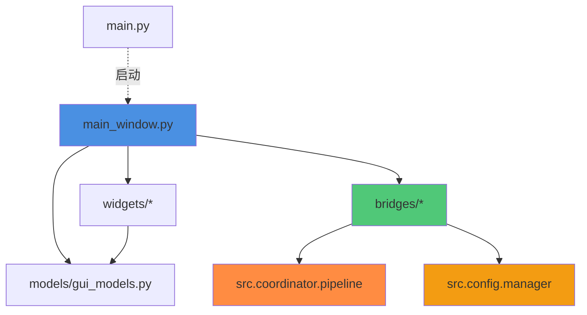

# PySide6 GUI界面 - 阶段1技术实施规格

**文档版本**: 1.0
**状态**: 实施就绪 ✅
**创建日期**: 2025-11-05
**目标阶段**: 阶段1 - 主窗口框架 + 转录控制 + 状态显示
**优化目标**: 自动代码生成

---

## 📋 1. 概述

### 1.1 文档目的

本文档是**代码生成优化的技术规格**，提供阶段1开发所需的所有技术细节，包括：
- 完整的类定义和方法签名
- 详细的代码实现示例
- 明确的依赖关系
- 具体的集成方式

**设计原则**: KISS + YAGNI + DRY
- ✅ 保持简单，避免过度工程
- ✅ 只实现当前需要的功能
- ✅ 避免代码重复

### 1.2 阶段1目标

**实现范围**:
1. 主窗口框架（QMainWindow）
2. 转录控制面板（开始/暂停/停止）
3. 音频源选择器（麦克风/系统音频/文件）
4. 状态监控面板（实时状态显示）
5. 转录结果显示（主界面内）
6. Pipeline桥接层（事件通信）
7. Config桥接层（配置管理）

**核心验收标准**:
- ✅ 用户能通过GUI启动和停止转录
- ✅ 能选择不同的音频源
- ✅ 能实时显示转录状态和结果
- ✅ 错误能正确提示用户
- ✅ 保留现有tkinter字幕窗口功能

---

## 🏗️ 2. 模块结构设计

### 2.1 目录结构

```
src/gui/                                # 新增GUI模块
├── __init__.py                         # 模块导出
├── CLAUDE.md                           # 模块文档
├── main_window.py                      # 主窗口实现
├── widgets/                            # UI组件
│   ├── __init__.py
│   ├── control_panel.py                # 转录控制面板
│   ├── audio_source_selector.py        # 音频源选择器
│   ├── status_monitor.py               # 状态监控面板
│   └── result_display.py               # 转录结果显示
├── bridges/                            # 桥接层
│   ├── __init__.py
│   ├── pipeline_bridge.py              # Pipeline桥接
│   └── config_bridge.py                # 配置桥接
└── models/                             # 数据模型
    ├── __init__.py
    └── gui_models.py                   # GUI相关数据类
```

### 2.2 模块导入关系



### 2.3 依赖清单

**PySide6组件**:
```python
from PySide6.QtWidgets import (
    QMainWindow, QWidget, QVBoxLayout, QHBoxLayout,
    QPushButton, QLabel, QTextEdit, QComboBox,
    QRadioButton, QGroupBox, QFileDialog, QMessageBox,
    QStatusBar, QMenuBar, QToolBar, QSplitter
)
from PySide6.QtCore import (
    QObject, Signal, Slot, QThread, QTimer,
    Qt, QMetaObject, Q_ARG
)
from PySide6.QtGui import (
    QFont, QColor, QIcon, QAction
)
```

**项目内部依赖**:
```python
from src.config.manager import ConfigManager
from src.config.models import Config, SubtitleDisplayConfig
from src.coordinator.pipeline import (
    TranscriptionPipeline, PipelineState, EventType, PipelineEvent
)
from src.audio.models import AudioSourceType
```

---

## 🎨 3. 核心类详细设计

### 3.1 TranscriptionState（转录状态枚举）

```python
# 文件: src/gui/models/gui_models.py

from enum import Enum
from dataclasses import dataclass
from typing import Optional
from datetime import datetime

class TranscriptionState(Enum):
    """转录状态枚举

    GUI层使用的状态定义，简化Pipeline的状态展示
    """
    READY = "ready"           # 就绪 - 未开始或已停止
    RUNNING = "running"       # 运行中 - 正在转录
    PAUSED = "paused"         # 暂停中 - 暂停转录（仅实时模式）
    STOPPED = "stopped"       # 已停止 - 转录结束
    ERROR = "error"           # 错误 - 发生错误

    def to_display_text(self) -> str:
        """获取显示文本"""
        display_map = {
            TranscriptionState.READY: "就绪",
            TranscriptionState.RUNNING: "运行中",
            TranscriptionState.PAUSED: "暂停中",
            TranscriptionState.STOPPED: "已停止",
            TranscriptionState.ERROR: "错误",
        }
        return display_map.get(self, "未知")

    def to_color(self) -> str:
        """获取状态颜色（十六进制）"""
        color_map = {
            TranscriptionState.READY: "#9E9E9E",     # 灰色
            TranscriptionState.RUNNING: "#4CAF50",   # 绿色
            TranscriptionState.PAUSED: "#FF9800",    # 橙色
            TranscriptionState.STOPPED: "#2196F3",   # 蓝色
            TranscriptionState.ERROR: "#F44336",     # 红色
        }
        return color_map.get(self, "#000000")


@dataclass
class AudioSourceInfo:
    """音频源信息"""
    source_type: AudioSourceType    # 音频源类型
    display_name: str               # 显示名称
    device_id: Optional[int] = None # 设备ID（麦克风/系统音频）
    file_path: Optional[str] = None # 文件路径（文件模式）

    def __str__(self) -> str:
        if self.source_type == AudioSourceType.MICROPHONE:
            return f"麦克风 (设备{self.device_id if self.device_id is not None else '默认'})"
        elif self.source_type == AudioSourceType.SYSTEM_AUDIO:
            return "系统音频"
        elif self.source_type == AudioSourceType.FILE:
            return f"文件: {self.file_path}"
        return "未知"
```

### 3.2 PipelineBridge（流水线桥接）

```python
# 文件: src/gui/bridges/pipeline_bridge.py

"""Pipeline事件桥接器
将TranscriptionPipeline的事件转换为Qt信号
"""

import logging
from typing import Optional
from PySide6.QtCore import QObject, Signal

from src.coordinator.pipeline import (
    TranscriptionPipeline, PipelineEvent, EventType, PipelineState
)
from src.transcription.models import TranscriptionResult

logger = logging.getLogger(__name__)


class PipelineBridge(QObject):
    """流水线事件桥接器

    负责将Pipeline的回调事件转换为Qt信号，实现线程安全的GUI通信

    核心职责:
        1. 注册Pipeline事件处理器
        2. 将事件转换为Qt信号发射
        3. 确保线程安全通信

    使用方式:
        bridge = PipelineBridge(pipeline)
        bridge.transcription_result.connect(my_slot)
    """

    # Qt信号定义（所有信号必须在类级别定义）
    transcription_started = Signal()                    # 转录已启动
    transcription_stopped = Signal()                    # 转录已停止
    transcription_paused = Signal()                     # 转录已暂停
    transcription_resumed = Signal()                    # 转录已恢复

    new_result = Signal(object)                         # 新转录结果 (TranscriptionResult)
    audio_level_changed = Signal(float)                 # 音频电平变化 (0.0-1.0)
    status_changed = Signal(str, str)                   # 状态变化 (old_state, new_state)
    error_occurred = Signal(str, str)                   # 错误发生 (error_type, error_message)
    latency_updated = Signal(int)                       # 延迟更新 (latency_ms)

    def __init__(self, pipeline: TranscriptionPipeline, parent: Optional[QObject] = None):
        """初始化桥接器

        Args:
            pipeline: TranscriptionPipeline实例
            parent: Qt父对象
        """
        super().__init__(parent)
        self.pipeline = pipeline
        self._register_pipeline_callbacks()
        logger.info("PipelineBridge initialized")

    def _register_pipeline_callbacks(self) -> None:
        """注册Pipeline事件回调

        将Pipeline的事件处理器注册到对应的事件类型
        每个事件类型都有一个lambda函数来发射相应的Qt信号
        """
        # 转录结果事件
        self.pipeline.add_event_handler(
            EventType.TRANSCRIPTION_RESULT,
            self._on_transcription_result
        )

        # 状态变化事件
        self.pipeline.add_event_handler(
            EventType.STATE_CHANGE,
            self._on_state_change
        )

        # 错误事件
        self.pipeline.add_event_handler(
            EventType.ERROR,
            self._on_error
        )

        # 音频数据事件（用于电平监控）
        self.pipeline.add_event_handler(
            EventType.AUDIO_DATA,
            self._on_audio_data
        )

        logger.debug("Pipeline event handlers registered")

    def _on_transcription_result(self, event: PipelineEvent) -> None:
        """处理转录结果事件

        Args:
            event: Pipeline事件对象，data字段包含TranscriptionResult
        """
        if isinstance(event.data, TranscriptionResult):
            # 发射Qt信号（自动在主线程执行）
            self.new_result.emit(event.data)
            logger.debug(f"Transcription result emitted: {event.data.text[:50]}...")

    def _on_state_change(self, event: PipelineEvent) -> None:
        """处理状态变化事件

        Args:
            event: Pipeline事件对象，data字段包含{'old': str, 'new': str}
        """
        if isinstance(event.data, dict):
            old_state = event.data.get('old', '')
            new_state = event.data.get('new', '')

            # 发射状态变化信号
            self.status_changed.emit(old_state, new_state)

            # 根据新状态发射特定信号
            if new_state == PipelineState.RUNNING.value:
                self.transcription_started.emit()
            elif new_state == PipelineState.IDLE.value:
                self.transcription_stopped.emit()

            logger.info(f"Pipeline state changed: {old_state} -> {new_state}")

    def _on_error(self, event: PipelineEvent) -> None:
        """处理错误事件

        Args:
            event: Pipeline事件对象，data字段包含错误信息
        """
        error_type = event.metadata.get('error_type', 'UnknownError')
        error_message = str(event.data)

        self.error_occurred.emit(error_type, error_message)
        logger.error(f"Pipeline error: {error_type} - {error_message}")

    def _on_audio_data(self, event: PipelineEvent) -> None:
        """处理音频数据事件（用于电平监控）

        Args:
            event: Pipeline事件对象，data字段包含AudioChunk
        """
        # 计算音频电平（简化实现）
        if hasattr(event.data, 'data'):
            import numpy as np
            audio_data = event.data.data
            if isinstance(audio_data, np.ndarray) and len(audio_data) > 0:
                # 计算RMS电平并归一化到0.0-1.0
                rms = np.sqrt(np.mean(audio_data.astype(np.float32) ** 2))
                normalized_level = min(rms / 32768.0, 1.0)  # 假设16位音频
                self.audio_level_changed.emit(normalized_level)
```

### 3.3 ConfigBridge（配置桥接）

```python
# 文件: src/gui/bridges/config_bridge.py

"""配置管理桥接器
提供GUI和ConfigManager之间的配置同步接口
"""

import logging
from typing import Dict, Any, Tuple, Optional
from pathlib import Path

from src.config.manager import ConfigManager
from src.config.models import Config, SubtitleDisplayConfig

logger = logging.getLogger(__name__)


class ConfigBridge:
    """配置桥接器

    负责GUI和ConfigManager之间的配置管理

    核心职责:
        1. 加载和保存配置
        2. 配置验证
        3. 配置更新和同步

    使用方式:
        bridge = ConfigBridge()
        config = bridge.load_config()
        bridge.update_config({'model_path': '/path/to/model'})
    """

    def __init__(self):
        """初始化配置桥接器"""
        self.config_manager = ConfigManager()
        self._current_config: Optional[Config] = None
        logger.info("ConfigBridge initialized")

    def load_config(self, config_file: Optional[str] = None) -> Config:
        """加载配置

        Args:
            config_file: 配置文件路径（暂未实现文件配置）

        Returns:
            Config: 配置对象
        """
        # 目前返回默认配置
        # TODO: 实现从文件加载配置
        self._current_config = self.config_manager.get_default_config()
        logger.info("Configuration loaded")
        return self._current_config

    def save_config(self, config: Config, config_file: Optional[str] = None) -> bool:
        """保存配置

        Args:
            config: 要保存的配置对象
            config_file: 配置文件路径（暂未实现文件配置）

        Returns:
            bool: 保存是否成功
        """
        try:
            # 验证配置
            config.validate()
            self._current_config = config

            # TODO: 实现配置文件持久化
            logger.info("Configuration saved")
            return True

        except Exception as e:
            logger.error(f"Failed to save config: {e}")
            return False

    def update_config(self, updates: Dict[str, Any]) -> Tuple[bool, str]:
        """更新配置

        Args:
            updates: 配置更新字典，支持点分路径
                例如: {"model_path": "/path/to/model", "use_gpu": True}

        Returns:
            Tuple[bool, str]: (成功, 错误消息)
        """
        if self._current_config is None:
            return False, "配置未初始化"

        try:
            # 创建配置副本
            config_dict = self._config_to_dict(self._current_config)

            # 应用更新
            for key, value in updates.items():
                if '.' in key:
                    # 支持嵌套配置更新，如 "subtitle_display.enabled"
                    self._set_nested_value(config_dict, key, value)
                else:
                    config_dict[key] = value

            # 重建配置对象
            new_config = self._dict_to_config(config_dict)

            # 验证配置
            new_config.validate()

            # 应用新配置
            self._current_config = new_config
            logger.info(f"Configuration updated: {list(updates.keys())}")
            return True, ""

        except ValueError as e:
            logger.error(f"Config validation failed: {e}")
            return False, str(e)
        except Exception as e:
            logger.error(f"Config update failed: {e}")
            return False, f"配置更新失败: {str(e)}"

    def get_config(self) -> Optional[Config]:
        """获取当前配置

        Returns:
            Optional[Config]: 当前配置对象
        """
        return self._current_config

    def validate_config(self, config: Config) -> Tuple[bool, str]:
        """验证配置有效性

        Args:
            config: 要验证的配置对象

        Returns:
            Tuple[bool, str]: (是否有效, 错误消息)
        """
        try:
            config.validate()
            return True, ""
        except ValueError as e:
            return False, str(e)

    def _config_to_dict(self, config: Config) -> Dict[str, Any]:
        """将Config对象转换为字典

        Args:
            config: Config对象

        Returns:
            Dict: 配置字典
        """
        from dataclasses import asdict
        return asdict(config)

    def _dict_to_config(self, config_dict: Dict[str, Any]) -> Config:
        """将字典转换为Config对象

        Args:
            config_dict: 配置字典

        Returns:
            Config: Config对象
        """
        return Config(**config_dict)

    def _set_nested_value(self, d: Dict, path: str, value: Any) -> None:
        """设置嵌套字典的值

        Args:
            d: 目标字典
            path: 点分路径，如 "subtitle_display.enabled"
            value: 要设置的值
        """
        keys = path.split('.')
        for key in keys[:-1]:
            d = d.setdefault(key, {})
        d[keys[-1]] = value
```

### 3.4 TranscriptionControlPanel（转录控制面板）

```python
# 文件: src/gui/widgets/control_panel.py

"""转录控制面板组件
提供转录的开始、暂停、停止控制
"""

import logging
from typing import Optional
from PySide6.QtWidgets import (
    QWidget, QHBoxLayout, QVBoxLayout, QPushButton, QLabel, QGroupBox
)
from PySide6.QtCore import Signal, Slot, Qt, QTimer
from PySide6.QtGui import QFont
from datetime import timedelta

from src.gui.models.gui_models import TranscriptionState

logger = logging.getLogger(__name__)


class TranscriptionControlPanel(QWidget):
    """转录控制面板

    核心功能:
        - 开始/暂停/停止按钮
        - 状态显示（图标+文字）
        - 转录时长显示
        - 按钮状态管理

    信号:
        start_requested: 用户点击开始按钮
        pause_requested: 用户点击暂停按钮
        stop_requested: 用户点击停止按钮
    """

    # 信号定义
    start_requested = Signal()
    pause_requested = Signal()
    stop_requested = Signal()

    def __init__(self, parent: Optional[QWidget] = None):
        """初始化控制面板

        Args:
            parent: 父组件
        """
        super().__init__(parent)

        # 内部状态
        self._current_state = TranscriptionState.READY
        self._start_time: Optional[float] = None
        self._elapsed_seconds = 0

        # UI组件
        self.start_button: Optional[QPushButton] = None
        self.pause_button: Optional[QPushButton] = None
        self.stop_button: Optional[QPushButton] = None
        self.status_label: Optional[QLabel] = None
        self.duration_label: Optional[QLabel] = None

        # 定时器（用于更新时长）
        self.timer = QTimer(self)
        self.timer.timeout.connect(self._update_duration)

        # 初始化UI
        self._setup_ui()
        self._update_button_states()

        logger.debug("TranscriptionControlPanel initialized")

    def _setup_ui(self) -> None:
        """设置UI布局"""
        # 主布局
        main_layout = QVBoxLayout(self)
        main_layout.setContentsMargins(0, 0, 0, 0)

        # 创建分组框
        group_box = QGroupBox("转录控制")
        group_box_layout = QVBoxLayout(group_box)

        # 按钮布局
        button_layout = QHBoxLayout()

        # 开始按钮
        self.start_button = QPushButton("开始转录")
        self.start_button.setMinimumHeight(40)
        self.start_button.clicked.connect(self._on_start_clicked)
        button_layout.addWidget(self.start_button)

        # 暂停按钮
        self.pause_button = QPushButton("暂停")
        self.pause_button.setMinimumHeight(40)
        self.pause_button.clicked.connect(self._on_pause_clicked)
        button_layout.addWidget(self.pause_button)

        # 停止按钮
        self.stop_button = QPushButton("停止")
        self.stop_button.setMinimumHeight(40)
        self.stop_button.clicked.connect(self._on_stop_clicked)
        button_layout.addWidget(self.stop_button)

        group_box_layout.addLayout(button_layout)

        # 状态信息布局
        info_layout = QHBoxLayout()

        # 状态标签
        status_container = QVBoxLayout()
        status_title = QLabel("状态:")
        self.status_label = QLabel("⚫ 就绪")
        self.status_label.setFont(QFont("Microsoft YaHei", 10))
        status_container.addWidget(status_title)
        status_container.addWidget(self.status_label)
        info_layout.addLayout(status_container)

        # 时长标签
        duration_container = QVBoxLayout()
        duration_title = QLabel("时长:")
        self.duration_label = QLabel("00:00:00")
        self.duration_label.setFont(QFont("Courier New", 10))
        duration_container.addWidget(duration_title)
        duration_container.addWidget(self.duration_label)
        info_layout.addLayout(duration_container)

        group_box_layout.addLayout(info_layout)

        # 添加到主布局
        main_layout.addWidget(group_box)

    @Slot()
    def _on_start_clicked(self) -> None:
        """处理开始按钮点击"""
        logger.info("Start button clicked")
        self.start_requested.emit()

    @Slot()
    def _on_pause_clicked(self) -> None:
        """处理暂停按钮点击"""
        logger.info("Pause button clicked")
        self.pause_requested.emit()

    @Slot()
    def _on_stop_clicked(self) -> None:
        """处理停止按钮点击"""
        logger.info("Stop button clicked")
        self.stop_requested.emit()

    @Slot(TranscriptionState)
    def set_state(self, state: TranscriptionState) -> None:
        """设置控制面板状态

        Args:
            state: 新的转录状态
        """
        self._current_state = state
        self._update_button_states()
        self._update_status_display()

        # 处理计时器
        if state == TranscriptionState.RUNNING:
            if not self.timer.isActive():
                import time
                self._start_time = time.time()
                self.timer.start(1000)  # 每秒更新一次
        elif state in [TranscriptionState.STOPPED, TranscriptionState.ERROR]:
            self.timer.stop()
            self._elapsed_seconds = 0
            self.duration_label.setText("00:00:00")
        elif state == TranscriptionState.PAUSED:
            self.timer.stop()

        logger.debug(f"Control panel state changed to: {state.value}")

    def _update_button_states(self) -> None:
        """更新按钮启用/禁用状态"""
        state = self._current_state

        # 开始按钮
        self.start_button.setEnabled(
            state in [TranscriptionState.READY, TranscriptionState.STOPPED, TranscriptionState.PAUSED]
        )
        if state == TranscriptionState.PAUSED:
            self.start_button.setText("继续")
        else:
            self.start_button.setText("开始转录")

        # 暂停按钮（仅运行时可用）
        self.pause_button.setEnabled(state == TranscriptionState.RUNNING)

        # 停止按钮
        self.stop_button.setEnabled(
            state in [TranscriptionState.RUNNING, TranscriptionState.PAUSED]
        )

    def _update_status_display(self) -> None:
        """更新状态显示"""
        state = self._current_state

        # 状态图标映射
        icon_map = {
            TranscriptionState.READY: "⚫",
            TranscriptionState.RUNNING: "🟢",
            TranscriptionState.PAUSED: "🟡",
            TranscriptionState.STOPPED: "🔵",
            TranscriptionState.ERROR: "🔴",
        }

        icon = icon_map.get(state, "⚫")
        text = state.to_display_text()
        color = state.to_color()

        self.status_label.setText(f"{icon} {text}")
        self.status_label.setStyleSheet(f"color: {color}; font-weight: bold;")

    @Slot()
    def _update_duration(self) -> None:
        """更新转录时长显示"""
        if self._start_time is not None:
            import time
            self._elapsed_seconds = int(time.time() - self._start_time)

            # 格式化为 HH:MM:SS
            td = timedelta(seconds=self._elapsed_seconds)
            hours, remainder = divmod(td.seconds, 3600)
            minutes, seconds = divmod(remainder, 60)

            self.duration_label.setText(f"{hours:02d}:{minutes:02d}:{seconds:02d}")
```

### 3.5 AudioSourceSelector（音频源选择器）

```python
# 文件: src/gui/widgets/audio_source_selector.py

"""音频源选择组件
提供麦克风、系统音频、文件的选择功能
"""

import logging
from typing import Optional, Tuple
from pathlib import Path

from PySide6.QtWidgets import (
    QWidget, QVBoxLayout, QHBoxLayout, QRadioButton,
    QLabel, QLineEdit, QPushButton, QGroupBox, QFileDialog
)
from PySide6.QtCore import Signal, Slot

from src.audio.models import AudioSourceType
from src.gui.models.gui_models import AudioSourceInfo

logger = logging.getLogger(__name__)


class AudioSourceSelector(QWidget):
    """音频源选择器

    核心功能:
        - 音频源类型选择（单选按钮）
        - 文件路径选择（文件对话框）
        - 音频设备枚举（TODO）

    信号:
        source_changed: 音频源发生变化 (AudioSourceInfo)
    """

    # 信号定义
    source_changed = Signal(object)  # AudioSourceInfo

    def __init__(self, parent: Optional[QWidget] = None):
        """初始化音频源选择器

        Args:
            parent: 父组件
        """
        super().__init__(parent)

        # UI组件
        self.microphone_radio: Optional[QRadioButton] = None
        self.system_audio_radio: Optional[QRadioButton] = None
        self.file_radio: Optional[QRadioButton] = None
        self.file_path_edit: Optional[QLineEdit] = None
        self.browse_button: Optional[QPushButton] = None

        # 当前选择
        self._current_source: Optional[AudioSourceInfo] = None

        # 初始化UI
        self._setup_ui()

        # 默认选择麦克风
        self.microphone_radio.setChecked(True)
        self._on_source_changed()

        logger.debug("AudioSourceSelector initialized")

    def _setup_ui(self) -> None:
        """设置UI布局"""
        # 主布局
        main_layout = QVBoxLayout(self)
        main_layout.setContentsMargins(0, 0, 0, 0)

        # 创建分组框
        group_box = QGroupBox("音频源选择")
        group_box_layout = QVBoxLayout(group_box)

        # 麦克风选项
        self.microphone_radio = QRadioButton("麦克风")
        self.microphone_radio.toggled.connect(self._on_source_changed)
        group_box_layout.addWidget(self.microphone_radio)

        # 系统音频选项
        self.system_audio_radio = QRadioButton("系统音频")
        self.system_audio_radio.toggled.connect(self._on_source_changed)
        group_box_layout.addWidget(self.system_audio_radio)

        # 文件选项
        self.file_radio = QRadioButton("音频/视频文件")
        self.file_radio.toggled.connect(self._on_source_changed)
        group_box_layout.addWidget(self.file_radio)

        # 文件路径输入
        file_layout = QHBoxLayout()
        self.file_path_edit = QLineEdit()
        self.file_path_edit.setPlaceholderText("选择音频或视频文件...")
        self.file_path_edit.setEnabled(False)
        self.file_path_edit.textChanged.connect(self._on_file_path_changed)
        file_layout.addWidget(self.file_path_edit)

        # 浏览按钮
        self.browse_button = QPushButton("浏览...")
        self.browse_button.setEnabled(False)
        self.browse_button.clicked.connect(self._on_browse_clicked)
        file_layout.addWidget(self.browse_button)

        group_box_layout.addLayout(file_layout)

        # 添加到主布局
        main_layout.addWidget(group_box)

    @Slot()
    def _on_source_changed(self) -> None:
        """处理音频源变化"""
        # 更新文件输入组件状态
        file_selected = self.file_radio.isChecked()
        self.file_path_edit.setEnabled(file_selected)
        self.browse_button.setEnabled(file_selected)

        # 确定当前选择的音频源
        if self.microphone_radio.isChecked():
            source_info = AudioSourceInfo(
                source_type=AudioSourceType.MICROPHONE,
                display_name="麦克风",
                device_id=None  # 使用默认设备
            )
        elif self.system_audio_radio.isChecked():
            source_info = AudioSourceInfo(
                source_type=AudioSourceType.SYSTEM_AUDIO,
                display_name="系统音频"
            )
        elif self.file_radio.isChecked():
            file_path = self.file_path_edit.text().strip()
            source_info = AudioSourceInfo(
                source_type=AudioSourceType.FILE,
                display_name="文件",
                file_path=file_path if file_path else None
            )
        else:
            return

        # 保存并发射信号
        self._current_source = source_info
        self.source_changed.emit(source_info)

        logger.debug(f"Audio source changed to: {source_info}")

    @Slot()
    def _on_file_path_changed(self) -> None:
        """处理文件路径变化"""
        if self.file_radio.isChecked():
            self._on_source_changed()

    @Slot()
    def _on_browse_clicked(self) -> None:
        """处理浏览按钮点击"""
        # 打开文件对话框
        file_path, _ = QFileDialog.getOpenFileName(
            self,
            "选择音频或视频文件",
            "",
            "媒体文件 (*.mp3 *.wav *.flac *.m4a *.ogg *.mp4 *.avi *.mkv *.mov);;所有文件 (*.*)"
        )

        if file_path:
            self.file_path_edit.setText(file_path)
            logger.info(f"File selected: {file_path}")

    def get_selected_source(self) -> Optional[AudioSourceInfo]:
        """获取当前选择的音频源

        Returns:
            Optional[AudioSourceInfo]: 当前选择的音频源信息
        """
        return self._current_source

    def set_enabled(self, enabled: bool) -> None:
        """设置是否可选择（转录中禁用）

        Args:
            enabled: 是否启用
        """
        self.microphone_radio.setEnabled(enabled)
        self.system_audio_radio.setEnabled(enabled)
        self.file_radio.setEnabled(enabled)
        self.file_path_edit.setEnabled(enabled and self.file_radio.isChecked())
        self.browse_button.setEnabled(enabled and self.file_radio.isChecked())
```

### 3.6 StatusMonitorPanel（状态监控面板）

```python
# 文件: src/gui/widgets/status_monitor.py

"""状态监控面板组件
显示转录状态、音频电平等实时信息
"""

import logging
from typing import Optional
from PySide6.QtWidgets import (
    QWidget, QVBoxLayout, QHBoxLayout, QLabel,
    QProgressBar, QGroupBox, QGridLayout
)
from PySide6.QtCore import Slot, Qt
from PySide6.QtGui import QFont

logger = logging.getLogger(__name__)


class StatusMonitorPanel(QWidget):
    """状态监控面板

    核心功能:
        - 转录状态显示
        - 音频源信息显示
        - 模型信息显示
        - GPU状态显示
        - 音频电平实时显示
        - 处理延迟显示（可选）
    """

    def __init__(self, parent: Optional[QWidget] = None):
        """初始化状态监控面板

        Args:
            parent: 父组件
        """
        super().__init__(parent)

        # UI组件
        self.status_label: Optional[QLabel] = None
        self.audio_source_label: Optional[QLabel] = None
        self.model_label: Optional[QLabel] = None
        self.gpu_label: Optional[QLabel] = None
        self.audio_level_bar: Optional[QProgressBar] = None
        self.latency_label: Optional[QLabel] = None

        # 初始化UI
        self._setup_ui()

        logger.debug("StatusMonitorPanel initialized")

    def _setup_ui(self) -> None:
        """设置UI布局"""
        # 主布局
        main_layout = QVBoxLayout(self)
        main_layout.setContentsMargins(0, 0, 0, 0)

        # 创建分组框
        group_box = QGroupBox("实时状态监控")
        group_box_layout = QGridLayout(group_box)

        # 状态信息（使用网格布局）
        row = 0

        # 状态行
        group_box_layout.addWidget(QLabel("状态:"), row, 0)
        self.status_label = QLabel("✅ 就绪")
        self.status_label.setFont(QFont("Microsoft YaHei", 10))
        group_box_layout.addWidget(self.status_label, row, 1)
        row += 1

        # 音频源行
        group_box_layout.addWidget(QLabel("音频源:"), row, 0)
        self.audio_source_label = QLabel("🎤 未选择")
        group_box_layout.addWidget(self.audio_source_label, row, 1)
        row += 1

        # 模型行
        group_box_layout.addWidget(QLabel("模型:"), row, 0)
        self.model_label = QLabel("未加载")
        self.model_label.setWordWrap(True)
        group_box_layout.addWidget(self.model_label, row, 1)
        row += 1

        # GPU行
        group_box_layout.addWidget(QLabel("GPU:"), row, 0)
        self.gpu_label = QLabel("⏳ 检测中...")
        group_box_layout.addWidget(self.gpu_label, row, 1)
        row += 1

        # 音频电平行
        group_box_layout.addWidget(QLabel("音频电平:"), row, 0)
        self.audio_level_bar = QProgressBar()
        self.audio_level_bar.setRange(0, 100)
        self.audio_level_bar.setValue(0)
        self.audio_level_bar.setTextVisible(True)
        self.audio_level_bar.setFormat("%v%")
        group_box_layout.addWidget(self.audio_level_bar, row, 1)
        row += 1

        # 处理延迟行
        group_box_layout.addWidget(QLabel("处理延迟:"), row, 0)
        self.latency_label = QLabel("-- ms")
        group_box_layout.addWidget(self.latency_label, row, 1)

        # 添加到主布局
        main_layout.addWidget(group_box)

    @Slot(str)
    def update_status(self, status_text: str) -> None:
        """更新转录状态

        Args:
            status_text: 状态文本
        """
        self.status_label.setText(status_text)
        logger.debug(f"Status updated: {status_text}")

    @Slot(str)
    def update_audio_source(self, source_text: str) -> None:
        """更新音频源信息

        Args:
            source_text: 音频源文本
        """
        self.audio_source_label.setText(source_text)
        logger.debug(f"Audio source updated: {source_text}")

    @Slot(str)
    def update_model(self, model_text: str) -> None:
        """更新模型信息

        Args:
            model_text: 模型文本
        """
        self.model_label.setText(model_text)
        logger.debug(f"Model updated: {model_text}")

    @Slot(bool, str)
    def update_gpu_status(self, gpu_available: bool, gpu_info: str = "") -> None:
        """更新GPU状态

        Args:
            gpu_available: GPU是否可用
            gpu_info: GPU信息（可选）
        """
        if gpu_available:
            text = f"✅ 已启用 {gpu_info}"
        else:
            text = "❌ 未启用 (使用CPU)"

        self.gpu_label.setText(text)
        logger.debug(f"GPU status updated: {text}")

    @Slot(float)
    def update_audio_level(self, level: float) -> None:
        """更新音频电平（0.0-1.0）

        Args:
            level: 音频电平（0.0-1.0）
        """
        # 转换为百分比
        percentage = int(level * 100)
        self.audio_level_bar.setValue(percentage)

    @Slot(int)
    def update_latency(self, latency_ms: int) -> None:
        """更新处理延迟

        Args:
            latency_ms: 延迟（毫秒）
        """
        self.latency_label.setText(f"{latency_ms} ms")

        # 根据延迟设置颜色
        if latency_ms < 500:
            color = "green"
        elif latency_ms < 2000:
            color = "orange"
        else:
            color = "red"

        self.latency_label.setStyleSheet(f"color: {color}; font-weight: bold;")
```

### 3.7 TranscriptionResultDisplay（转录结果显示）

```python
# 文件: src/gui/widgets/result_display.py

"""转录结果显示组件
在主界面内实时显示转录结果
"""

import logging
from typing import Optional
from datetime import datetime

from PySide6.QtWidgets import (
    QWidget, QVBoxLayout, QHBoxLayout, QTextEdit,
    QPushButton, QGroupBox, QLabel
)
from PySide6.QtCore import Slot, Qt
from PySide6.QtGui import QFont, QTextCursor

from src.transcription.models import TranscriptionResult

logger = logging.getLogger(__name__)


class TranscriptionResultDisplay(QWidget):
    """转录结果实时显示

    核心功能:
        - 实时滚动显示转录文本
        - 时间戳前缀（HH:MM:SS）
        - 自动滚动到最新
        - 文本选择和复制
        - 清空当前会话
        - 复制全部文本
        - 字数统计
    """

    def __init__(self, parent: Optional[QWidget] = None):
        """初始化转录结果显示

        Args:
            parent: 父组件
        """
        super().__init__(parent)

        # UI组件
        self.text_edit: Optional[QTextEdit] = None
        self.clear_button: Optional[QPushButton] = None
        self.copy_all_button: Optional[QPushButton] = None
        self.word_count_label: Optional[QLabel] = None

        # 内部状态
        self._auto_scroll = True
        self._word_count = 0

        # 初始化UI
        self._setup_ui()

        logger.debug("TranscriptionResultDisplay initialized")

    def _setup_ui(self) -> None:
        """设置UI布局"""
        # 主布局
        main_layout = QVBoxLayout(self)
        main_layout.setContentsMargins(0, 0, 0, 0)

        # 创建分组框
        group_box = QGroupBox("实时转录结果")
        group_box_layout = QVBoxLayout(group_box)

        # 工具栏
        toolbar_layout = QHBoxLayout()

        # 清空按钮
        self.clear_button = QPushButton("清空")
        self.clear_button.clicked.connect(self.clear)
        toolbar_layout.addWidget(self.clear_button)

        # 复制全部按钮
        self.copy_all_button = QPushButton("复制全部")
        self.copy_all_button.clicked.connect(self._copy_all)
        toolbar_layout.addWidget(self.copy_all_button)

        # 弹簧（将后续元素推到右侧）
        toolbar_layout.addStretch()

        # 字数统计标签
        self.word_count_label = QLabel("字数: 0")
        self.word_count_label.setStyleSheet("color: gray;")
        toolbar_layout.addWidget(self.word_count_label)

        group_box_layout.addLayout(toolbar_layout)

        # 文本显示区域
        self.text_edit = QTextEdit()
        self.text_edit.setReadOnly(True)
        self.text_edit.setFont(QFont("Microsoft YaHei", 10))
        self.text_edit.setMinimumHeight(200)
        group_box_layout.addWidget(self.text_edit)

        # 添加到主布局
        main_layout.addWidget(group_box)

    @Slot(object)
    def append_result(self, result: TranscriptionResult) -> None:
        """追加转录结果

        Args:
            result: 转录结果对象
        """
        # 格式化时间戳
        if result.start_time:
            dt = datetime.fromtimestamp(result.start_time)
            timestamp_str = dt.strftime("%H:%M:%S")
        else:
            timestamp_str = datetime.now().strftime("%H:%M:%S")

        # 格式化文本
        formatted_text = f"[{timestamp_str}] {result.text}"

        # 追加到文本编辑器
        self.text_edit.append(formatted_text)

        # 自动滚动到底部
        if self._auto_scroll:
            cursor = self.text_edit.textCursor()
            cursor.movePosition(QTextCursor.End)
            self.text_edit.setTextCursor(cursor)

        # 更新字数统计
        self._update_word_count()

        logger.debug(f"Result appended: {result.text[:50]}...")

    @Slot()
    def clear(self) -> None:
        """清空显示"""
        self.text_edit.clear()
        self._word_count = 0
        self._update_word_count()
        logger.debug("Result display cleared")

    @Slot()
    def _copy_all(self) -> None:
        """复制全部文本到剪贴板"""
        from PySide6.QtWidgets import QApplication

        full_text = self.text_edit.toPlainText()
        QApplication.clipboard().setText(full_text)
        logger.info("All text copied to clipboard")

    def get_full_text(self) -> str:
        """获取完整文本

        Returns:
            str: 完整转录文本
        """
        return self.text_edit.toPlainText()

    def _update_word_count(self) -> None:
        """更新字数统计"""
        full_text = self.text_edit.toPlainText()

        # 简单字数统计（中文字符 + 英文单词）
        chinese_chars = len([c for c in full_text if '\u4e00' <= c <= '\u9fff'])
        english_words = len(full_text.split())

        self._word_count = chinese_chars + english_words
        self.word_count_label.setText(f"字数: {self._word_count}")
```

### 3.8 MainWindow（主窗口）

```python
# 文件: src/gui/main_window.py

"""主窗口实现
PySide6 GUI的主入口点
"""

import logging
import sys
from typing import Optional
from pathlib import Path

from PySide6.QtWidgets import (
    QMainWindow, QWidget, QVBoxLayout, QHBoxLayout,
    QSplitter, QMessageBox, QStatusBar, QMenuBar, QMenu
)
from PySide6.QtCore import Slot, Qt, QThread
from PySide6.QtGui import QAction, QCloseEvent

# 导入自定义组件
from src.gui.widgets.control_panel import TranscriptionControlPanel
from src.gui.widgets.audio_source_selector import AudioSourceSelector
from src.gui.widgets.status_monitor import StatusMonitorPanel
from src.gui.widgets.result_display import TranscriptionResultDisplay
from src.gui.bridges.pipeline_bridge import PipelineBridge
from src.gui.bridges.config_bridge import ConfigBridge
from src.gui.models.gui_models import TranscriptionState, AudioSourceInfo

# 导入核心组件
from src.config.manager import ConfigManager
from src.config.models import Config, SubtitleDisplayConfig
from src.coordinator.pipeline import TranscriptionPipeline
from src.audio.models import AudioSourceType
from src.transcription.models import TranscriptionResult

logger = logging.getLogger(__name__)


class PipelineThread(QThread):
    """Pipeline运行线程

    将TranscriptionPipeline放在独立线程运行，避免阻塞GUI
    """

    def __init__(self, pipeline: TranscriptionPipeline, parent=None):
        """初始化Pipeline线程

        Args:
            pipeline: TranscriptionPipeline实例
            parent: 父对象
        """
        super().__init__(parent)
        self.pipeline = pipeline

    def run(self) -> None:
        """线程主循环"""
        try:
            logger.info("Pipeline thread started")
            # Pipeline的run()会阻塞直到停止
            self.pipeline.run()
        except Exception as e:
            logger.error(f"Pipeline thread error: {e}")
        finally:
            logger.info("Pipeline thread stopped")


class MainWindow(QMainWindow):
    """主窗口类

    核心职责:
        1. 创建和管理所有UI组件
        2. 集成Pipeline和Config桥接器
        3. 处理用户交互和事件
        4. 管理应用生命周期
    """

    def __init__(self):
        """初始化主窗口"""
        super().__init__()

        # 核心组件（先初始化为None）
        self.config: Optional[Config] = None
        self.config_bridge: Optional[ConfigBridge] = None
        self.pipeline: Optional[TranscriptionPipeline] = None
        self.pipeline_bridge: Optional[PipelineBridge] = None
        self.pipeline_thread: Optional[PipelineThread] = None

        # UI组件
        self.control_panel: Optional[TranscriptionControlPanel] = None
        self.audio_source_selector: Optional[AudioSourceSelector] = None
        self.status_monitor: Optional[StatusMonitorPanel] = None
        self.result_display: Optional[TranscriptionResultDisplay] = None

        # 字幕窗口（保留tkinter实现）
        self.subtitle_display = None

        # 初始化配置
        self._init_config()

        # 设置UI
        self._setup_ui()

        # 连接信号槽
        self._connect_signals()

        # 应用启动后的初始化
        self._post_init()

        logger.info("MainWindow initialized")

    def _init_config(self) -> None:
        """初始化配置系统"""
        try:
            self.config_bridge = ConfigBridge()
            self.config = self.config_bridge.load_config()

            # 为GUI使用设置合理的默认值
            if not self.config.model_path or self.config.model_path == "":
                # 尝试查找默认模型
                default_model_path = Path("models/sherpa-onnx-sense-voice-zh-en-ja-ko-yue-2024-07-17/model.onnx")
                if default_model_path.exists():
                    self.config.model_path = str(default_model_path.absolute())

            # 设置默认输入源为麦克风
            if not self.config.input_source:
                self.config.input_source = "microphone"

            logger.info("Configuration initialized")

        except Exception as e:
            logger.error(f"Failed to initialize config: {e}")
            QMessageBox.critical(
                self,
                "配置错误",
                f"配置初始化失败: {e}\n\n程序将退出。"
            )
            sys.exit(1)

    def _setup_ui(self) -> None:
        """设置UI"""
        # 设置窗口属性
        self.setWindowTitle("Speech2Subtitles - 实时语音转录系统")
        self.setGeometry(100, 100, 1000, 700)

        # 创建菜单栏
        self._create_menu_bar()

        # 创建中心组件
        central_widget = QWidget()
        self.setCentralWidget(central_widget)

        # 主布局
        main_layout = QVBoxLayout(central_widget)

        # 创建水平分割器（左右布局）
        h_splitter = QSplitter(Qt.Horizontal)

        # 左侧面板（控制区域）
        left_panel = self._create_left_panel()
        h_splitter.addWidget(left_panel)

        # 右侧面板（显示区域）
        right_panel = self._create_right_panel()
        h_splitter.addWidget(right_panel)

        # 设置分割器比例
        h_splitter.setStretchFactor(0, 1)  # 左侧
        h_splitter.setStretchFactor(1, 2)  # 右侧

        main_layout.addWidget(h_splitter)

        # 创建状态栏
        self._create_status_bar()

        logger.debug("UI setup completed")

    def _create_menu_bar(self) -> None:
        """创建菜单栏"""
        menubar = self.menuBar()

        # 文件菜单
        file_menu = menubar.addMenu("文件(&F)")

        # 退出操作
        exit_action = QAction("退出(&X)", self)
        exit_action.setShortcut("Ctrl+Q")
        exit_action.triggered.connect(self.close)
        file_menu.addAction(exit_action)

        # 帮助菜单
        help_menu = menubar.addMenu("帮助(&H)")

        # 关于操作
        about_action = QAction("关于(&A)", self)
        about_action.triggered.connect(self._show_about)
        help_menu.addAction(about_action)

    def _create_status_bar(self) -> None:
        """创建状态栏"""
        self.status_bar = QStatusBar()
        self.setStatusBar(self.status_bar)
        self.status_bar.showMessage("就绪")

    def _create_left_panel(self) -> QWidget:
        """创建左侧面板（控制区域）"""
        panel = QWidget()
        layout = QVBoxLayout(panel)

        # 音频源选择器
        self.audio_source_selector = AudioSourceSelector()
        layout.addWidget(self.audio_source_selector)

        # 转录控制面板
        self.control_panel = TranscriptionControlPanel()
        layout.addWidget(self.control_panel)

        # 状态监控面板
        self.status_monitor = StatusMonitorPanel()
        layout.addWidget(self.status_monitor)

        # 添加弹簧（将组件推到顶部）
        layout.addStretch()

        return panel

    def _create_right_panel(self) -> QWidget:
        """创建右侧面板（显示区域）"""
        panel = QWidget()
        layout = QVBoxLayout(panel)

        # 转录结果显示
        self.result_display = TranscriptionResultDisplay()
        layout.addWidget(self.result_display)

        return panel

    def _connect_signals(self) -> None:
        """连接信号槽"""
        # 控制面板信号
        self.control_panel.start_requested.connect(self._on_start_transcription)
        self.control_panel.pause_requested.connect(self._on_pause_transcription)
        self.control_panel.stop_requested.connect(self._on_stop_transcription)

        # 音频源选择器信号
        self.audio_source_selector.source_changed.connect(self._on_audio_source_changed)

        logger.debug("Signals connected")

    def _post_init(self) -> None:
        """启动后初始化"""
        # 更新状态监控显示
        model_name = Path(self.config.model_path).name if self.config.model_path else "未指定"
        self.status_monitor.update_model(model_name)

        # 检测GPU
        from src.hardware.gpu_detector import GPUDetector
        gpu_detector = GPUDetector()
        gpu_available = gpu_detector.detect_cuda()
        gpu_info = f"(CUDA)" if gpu_available else ""
        self.status_monitor.update_gpu_status(gpu_available, gpu_info)

        # 更新音频源显示
        source_info = self.audio_source_selector.get_selected_source()
        if source_info:
            self.status_monitor.update_audio_source(str(source_info))

    @Slot()
    def _on_start_transcription(self) -> None:
        """处理开始转录请求"""
        try:
            # 获取当前音频源
            source_info = self.audio_source_selector.get_selected_source()
            if not source_info:
                QMessageBox.warning(self, "配置错误", "请先选择音频源")
                return

            # 验证文件模式的文件路径
            if source_info.source_type == AudioSourceType.FILE:
                if not source_info.file_path or not Path(source_info.file_path).exists():
                    QMessageBox.warning(self, "文件错误", "请选择有效的音频或视频文件")
                    return

            # 更新配置
            self._update_config_from_ui(source_info)

            # 验证配置
            success, error_msg = self.config_bridge.validate_config(self.config)
            if not success:
                QMessageBox.warning(self, "配置错误", f"配置验证失败:\n{error_msg}")
                return

            # 创建Pipeline
            self.pipeline = TranscriptionPipeline(self.config)

            # 创建桥接器
            self.pipeline_bridge = PipelineBridge(self.pipeline)

            # 连接Pipeline信号
            self._connect_pipeline_signals()

            # 在独立线程启动Pipeline
            self.pipeline_thread = PipelineThread(self.pipeline, self)
            self.pipeline_thread.start()

            # 更新UI状态
            self.control_panel.set_state(TranscriptionState.RUNNING)
            self.audio_source_selector.set_enabled(False)
            self.status_monitor.update_status("✅ 运行中")
            self.status_bar.showMessage("转录已启动")

            # 启动字幕显示（如果配置启用）
            if self.config.subtitle_display.enabled:
                self._start_subtitle_display()

            logger.info("Transcription started")

        except Exception as e:
            logger.error(f"Failed to start transcription: {e}")
            QMessageBox.critical(
                self,
                "启动失败",
                f"无法启动转录:\n{e}"
            )
            self.control_panel.set_state(TranscriptionState.ERROR)

    @Slot()
    def _on_pause_transcription(self) -> None:
        """处理暂停转录请求"""
        # TODO: 实现暂停功能
        logger.warning("Pause functionality not implemented yet")
        QMessageBox.information(self, "功能提示", "暂停功能将在后续版本实现")

    @Slot()
    def _on_stop_transcription(self) -> None:
        """处理停止转录请求"""
        try:
            if self.pipeline:
                # 停止Pipeline
                self.pipeline.stop()

                # 等待线程结束
                if self.pipeline_thread:
                    self.pipeline_thread.wait(3000)  # 最多等待3秒

                # 清理资源
                self.pipeline = None
                self.pipeline_bridge = None
                self.pipeline_thread = None

                # 停止字幕显示
                if self.subtitle_display:
                    self.subtitle_display.stop()
                    self.subtitle_display = None

            # 更新UI状态
            self.control_panel.set_state(TranscriptionState.STOPPED)
            self.audio_source_selector.set_enabled(True)
            self.status_monitor.update_status("🔵 已停止")
            self.status_bar.showMessage("转录已停止")

            logger.info("Transcription stopped")

        except Exception as e:
            logger.error(f"Failed to stop transcription: {e}")
            QMessageBox.warning(
                self,
                "停止警告",
                f"停止转录时发生错误:\n{e}"
            )

    @Slot(object)
    def _on_audio_source_changed(self, source_info: AudioSourceInfo) -> None:
        """处理音频源变化

        Args:
            source_info: 音频源信息
        """
        self.status_monitor.update_audio_source(str(source_info))
        logger.debug(f"Audio source changed: {source_info}")

    def _update_config_from_ui(self, source_info: AudioSourceInfo) -> None:
        """从UI更新配置

        Args:
            source_info: 音频源信息
        """
        # 更新音频源
        if source_info.source_type == AudioSourceType.MICROPHONE:
            self.config.input_source = "microphone"
            self.config.input_file = None
        elif source_info.source_type == AudioSourceType.SYSTEM_AUDIO:
            self.config.input_source = "system"
            self.config.input_file = None
        elif source_info.source_type == AudioSourceType.FILE:
            self.config.input_source = None
            self.config.input_file = [source_info.file_path] if source_info.file_path else None

        # 保存配置
        self.config_bridge.save_config(self.config)

    def _connect_pipeline_signals(self) -> None:
        """连接Pipeline桥接器信号"""
        if not self.pipeline_bridge:
            return

        # 转录结果信号
        self.pipeline_bridge.new_result.connect(self._on_new_result)

        # 状态变化信号
        self.pipeline_bridge.status_changed.connect(self._on_pipeline_status_changed)

        # 错误信号
        self.pipeline_bridge.error_occurred.connect(self._on_pipeline_error)

        # 音频电平信号
        self.pipeline_bridge.audio_level_changed.connect(
            self.status_monitor.update_audio_level
        )

        logger.debug("Pipeline signals connected")

    @Slot(object)
    def _on_new_result(self, result: TranscriptionResult) -> None:
        """处理新转录结果

        Args:
            result: 转录结果对象
        """
        # 显示在结果面板
        self.result_display.append_result(result)

        # 更新状态栏
        self.status_bar.showMessage(f"转录: {result.text[:30]}...")

    @Slot(str, str)
    def _on_pipeline_status_changed(self, old_state: str, new_state: str) -> None:
        """处理Pipeline状态变化

        Args:
            old_state: 旧状态
            new_state: 新状态
        """
        logger.info(f"Pipeline state: {old_state} -> {new_state}")

    @Slot(str, str)
    def _on_pipeline_error(self, error_type: str, error_message: str) -> None:
        """处理Pipeline错误

        Args:
            error_type: 错误类型
            error_message: 错误消息
        """
        logger.error(f"Pipeline error: {error_type} - {error_message}")

        # 显示错误对话框
        QMessageBox.critical(
            self,
            "转录错误",
            f"转录过程中发生错误:\n\n{error_message}"
        )

        # 更新UI状态
        self.control_panel.set_state(TranscriptionState.ERROR)
        self.status_monitor.update_status("🔴 错误")

    def _start_subtitle_display(self) -> None:
        """启动字幕显示（tkinter实现）"""
        try:
            from src.subtitle_display import SubtitleDisplay

            self.subtitle_display = SubtitleDisplay(self.config.subtitle_display)
            self.subtitle_display.start()

            # 连接信号（将转录结果传递给字幕显示）
            if self.pipeline_bridge:
                # 注意：需要适配信号格式
                self.pipeline_bridge.new_result.connect(self._update_subtitle)

            logger.info("Subtitle display started")

        except Exception as e:
            logger.warning(f"Failed to start subtitle display: {e}")

    @Slot(object)
    def _update_subtitle(self, result: TranscriptionResult) -> None:
        """更新字幕显示

        Args:
            result: 转录结果
        """
        if self.subtitle_display and result.is_final:
            try:
                self.subtitle_display.show_subtitle(
                    text=result.text,
                    confidence=result.confidence
                )
            except Exception as e:
                logger.warning(f"Failed to update subtitle: {e}")

    @Slot()
    def _show_about(self) -> None:
        """显示关于对话框"""
        QMessageBox.about(
            self,
            "关于 Speech2Subtitles",
            """<h3>Speech2Subtitles</h3>
            <p>实时语音转录系统</p>
            <p>版本: 0.1.0</p>
            <p>基于 sherpa-onnx 和 silero-vad</p>
            <p><a href='https://github.com/yourusername/speech2subtitles'>GitHub仓库</a></p>
            """
        )

    def closeEvent(self, event: QCloseEvent) -> None:
        """窗口关闭事件

        Args:
            event: 关闭事件
        """
        # 如果正在转录，询问用户
        if self.pipeline and self.control_panel._current_state == TranscriptionState.RUNNING:
            reply = QMessageBox.question(
                self,
                "确认退出",
                "转录正在进行中，确定要退出吗？",
                QMessageBox.Yes | QMessageBox.No,
                QMessageBox.No
            )

            if reply == QMessageBox.No:
                event.ignore()
                return

        # 停止转录
        if self.pipeline:
            self._on_stop_transcription()

        # 停止字幕显示
        if self.subtitle_display:
            self.subtitle_display.stop()

        # 接受关闭事件
        event.accept()
        logger.info("MainWindow closed")
```

---

## 🔧 4. 集成和初始化

### 4.1 模块导出（`__init__.py`文件）

```python
# 文件: src/gui/__init__.py

"""GUI模块
PySide6实现的图形用户界面
"""

from .main_window import MainWindow

__all__ = ['MainWindow']
```

```python
# 文件: src/gui/widgets/__init__.py

"""GUI组件"""

from .control_panel import TranscriptionControlPanel
from .audio_source_selector import AudioSourceSelector
from .status_monitor import StatusMonitorPanel
from .result_display import TranscriptionResultDisplay

__all__ = [
    'TranscriptionControlPanel',
    'AudioSourceSelector',
    'StatusMonitorPanel',
    'TranscriptionResultDisplay',
]
```

```python
# 文件: src/gui/bridges/__init__.py

"""桥接层"""

from .pipeline_bridge import PipelineBridge
from .config_bridge import ConfigBridge

__all__ = [
    'PipelineBridge',
    'ConfigBridge',
]
```

```python
# 文件: src/gui/models/__init__.py

"""GUI数据模型"""

from .gui_models import TranscriptionState, AudioSourceInfo

__all__ = [
    'TranscriptionState',
    'AudioSourceInfo',
]
```

### 4.2 启动程序（修改`main.py`）

```python
# 文件: main.py (修改建议)

"""
Speech2Subtitles 实时语音转录系统
支持命令行模式和GUI模式
"""

import sys
import logging
from pathlib import Path

# 配置日志
logging.basicConfig(
    level=logging.INFO,
    format='%(asctime)s - %(name)s - %(levelname)s - %(message)s'
)

logger = logging.getLogger(__name__)


def run_cli_mode():
    """运行命令行模式（原有功能）"""
    from src.config.manager import ConfigManager
    from src.coordinator.pipeline import TranscriptionPipeline

    # 解析命令行参数
    config_manager = ConfigManager()
    config = config_manager.parse_arguments()

    # 打印配置
    config_manager.print_config(config)

    # 创建并运行流水线
    with TranscriptionPipeline(config) as pipeline:
        pipeline.run()


def run_gui_mode():
    """运行GUI模式"""
    from PySide6.QtWidgets import QApplication
    from src.gui.main_window import MainWindow

    # 创建Qt应用
    app = QApplication(sys.argv)
    app.setApplicationName("Speech2Subtitles")
    app.setOrganizationName("Speech2Subtitles")

    # 创建主窗口
    window = MainWindow()
    window.show()

    # 运行事件循环
    sys.exit(app.exec())


def main():
    """主函数"""
    # 检查是否有命令行参数
    if len(sys.argv) > 1:
        # 有参数：运行命令行模式
        logger.info("Running in CLI mode")
        run_cli_mode()
    else:
        # 无参数：运行GUI模式
        logger.info("Running in GUI mode")
        run_gui_mode()


if __name__ == "__main__":
    main()
```

---

## ✅ 5. 实施检查清单

### 5.1 开发任务（按顺序）

#### Week 1: 基础框架（5天）

**Day 1: 项目结构和依赖**
- [ ] 创建`src/gui/`目录结构
- [ ] 安装PySide6依赖: `uv pip install PySide6`
- [ ] 创建所有`__init__.py`文件
- [ ] 测试PySide6导入: `python -c "from PySide6.QtWidgets import QApplication"`

**Day 2: 数据模型和桥接层**
- [ ] 实现`gui_models.py`（TranscriptionState, AudioSourceInfo）
- [ ] 实现`config_bridge.py`（配置桥接）
- [ ] 实现`pipeline_bridge.py`（Pipeline桥接）
- [ ] 编写桥接层单元测试

**Day 3: UI组件 - 控制面板**
- [ ] 实现`control_panel.py`（TranscriptionControlPanel）
- [ ] 测试按钮信号发射
- [ ] 测试状态切换逻辑
- [ ] 测试时长计时器

**Day 4: UI组件 - 音频源和状态**
- [ ] 实现`audio_source_selector.py`（AudioSourceSelector）
- [ ] 实现`status_monitor.py`（StatusMonitorPanel）
- [ ] 测试音频源切换
- [ ] 测试状态更新

**Day 5: UI组件 - 结果显示**
- [ ] 实现`result_display.py`（TranscriptionResultDisplay）
- [ ] 测试文本追加和滚动
- [ ] 测试复制功能
- [ ] 测试字数统计

#### Week 2: 主窗口集成（5天）

**Day 6-7: 主窗口基础**
- [ ] 实现`main_window.py`基础结构
- [ ] 创建菜单栏和状态栏
- [ ] 布局所有UI组件
- [ ] 测试窗口显示

**Day 8-9: 信号槽连接**
- [ ] 连接控制面板信号
- [ ] 连接音频源选择器信号
- [ ] 连接Pipeline桥接信号
- [ ] 测试信号传递

**Day 10: 集成测试**
- [ ] 完整启动/停止流程测试
- [ ] 音频源切换测试
- [ ] 错误处理测试
- [ ] 性能测试（UI响应时间）

### 5.2 验收标准

**功能验收**:
- [ ] 能通过GUI启动转录（麦克风模式）
- [ ] 能通过GUI启动转录（系统音频模式）
- [ ] 能通过GUI启动转录（文件模式）
- [ ] 能正确显示转录结果
- [ ] 能实时显示音频电平
- [ ] 能正确显示状态信息
- [ ] 错误能正确提示用户
- [ ] 能优雅地停止转录
- [ ] 窗口关闭时能正确清理资源

**代码质量**:
- [ ] 所有类有完整的类型注解
- [ ] 所有方法有文档字符串
- [ ] 遵循PEP 8代码风格
- [ ] 没有明显的内存泄漏
- [ ] 日志记录完整

**性能要求**:
- [ ] GUI启动时间 < 3秒
- [ ] 按钮点击响应 < 100ms
- [ ] 转录启动时间 < 2秒
- [ ] UI更新不阻塞Pipeline

---

## 📝 6. 测试策略

### 6.1 单元测试示例

```python
# 文件: tests/gui/test_control_panel.py

import pytest
from PySide6.QtWidgets import QApplication
from src.gui.widgets.control_panel import TranscriptionControlPanel
from src.gui.models.gui_models import TranscriptionState


@pytest.fixture(scope="session")
def qapp():
    """创建QApplication实例（整个测试会话共享）"""
    app = QApplication.instance()
    if app is None:
        app = QApplication([])
    yield app


@pytest.fixture
def control_panel(qapp):
    """创建TranscriptionControlPanel实例"""
    panel = TranscriptionControlPanel()
    yield panel
    panel.deleteLater()


def test_control_panel_creation(control_panel):
    """测试控制面板创建"""
    assert control_panel is not None
    assert control_panel.start_button is not None
    assert control_panel.stop_button is not None


def test_start_signal_emission(control_panel, qtbot):
    """测试开始信号发射"""
    with qtbot.waitSignal(control_panel.start_requested, timeout=1000):
        control_panel.start_button.click()


def test_state_change(control_panel):
    """测试状态变化"""
    control_panel.set_state(TranscriptionState.RUNNING)

    # 验证按钮状态
    assert not control_panel.start_button.isEnabled()
    assert control_panel.stop_button.isEnabled()

    # 验证状态显示
    assert "运行中" in control_panel.status_label.text()
```

### 6.2 集成测试示例

```python
# 文件: tests/gui/test_integration.py

import pytest
from unittest.mock import Mock, patch
from PySide6.QtWidgets import QApplication
from src.gui.main_window import MainWindow


@pytest.fixture(scope="session")
def qapp():
    """创建QApplication实例"""
    app = QApplication.instance()
    if app is None:
        app = QApplication([])
    yield app


@pytest.fixture
def main_window(qapp):
    """创建MainWindow实例"""
    with patch('src.gui.main_window.TranscriptionPipeline'):
        window = MainWindow()
        yield window
        window.close()


def test_main_window_initialization(main_window):
    """测试主窗口初始化"""
    assert main_window.control_panel is not None
    assert main_window.audio_source_selector is not None
    assert main_window.status_monitor is not None
    assert main_window.result_display is not None


def test_start_transcription_flow(main_window, qtbot):
    """测试启动转录流程"""
    # 模拟点击开始按钮
    with patch.object(main_window, '_update_config_from_ui'):
        with patch('src.gui.main_window.TranscriptionPipeline') as mock_pipeline:
            # 点击开始
            main_window.control_panel.start_button.click()

            # 验证Pipeline被创建
            assert mock_pipeline.called
```

---

## 🚀 7. 下一步行动

### 7.1 立即开始

1. **创建目录结构**
   ```bash
   mkdir -p src/gui/widgets src/gui/bridges src/gui/models
   touch src/gui/__init__.py
   touch src/gui/widgets/__init__.py
   touch src/gui/bridges/__init__.py
   touch src/gui/models/__init__.py
   ```

2. **安装依赖**
   ```bash
   .venv\Scripts\activate
   uv pip install PySide6
   ```

3. **创建第一个文件**
   - 从`gui_models.py`开始
   - 然后是`config_bridge.py`
   - 再是`pipeline_bridge.py`

### 7.2 开发顺序建议

**推荐顺序**:
1. ✅ 数据模型（`gui_models.py`）
2. ✅ 配置桥接（`config_bridge.py`）
3. ✅ Pipeline桥接（`pipeline_bridge.py`）
4. ✅ 控制面板（`control_panel.py`）
5. ✅ 音频源选择器（`audio_source_selector.py`）
6. ✅ 状态监控（`status_monitor.py`）
7. ✅ 结果显示（`result_display.py`）
8. ✅ 主窗口（`main_window.py`）
9. ✅ 修改启动程序（`main.py`）
10. ✅ 测试和调试

---

## 📚 8. 参考资源

### 8.1 PySide6文档
- 官方文档: https://doc.qt.io/qtforpython-6/
- Qt Widgets: https://doc.qt.io/qt-6/qtwidgets-index.html
- 信号槽机制: https://doc.qt.io/qt-6/signalsandslots.html

### 8.2 项目相关
- TranscriptionPipeline: `src/coordinator/pipeline.py`
- ConfigManager: `src/config/manager.py`
- Config数据类: `src/config/models.py`

---

**文档结束**

这份技术规格文档提供了阶段1开发所需的所有细节，包括完整的类定义、方法实现、信号槽连接和测试策略。代码可以直接用于实现，无需额外的设计决策。
