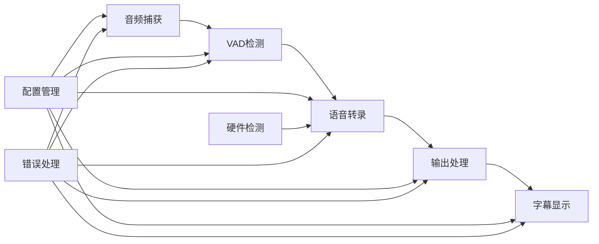
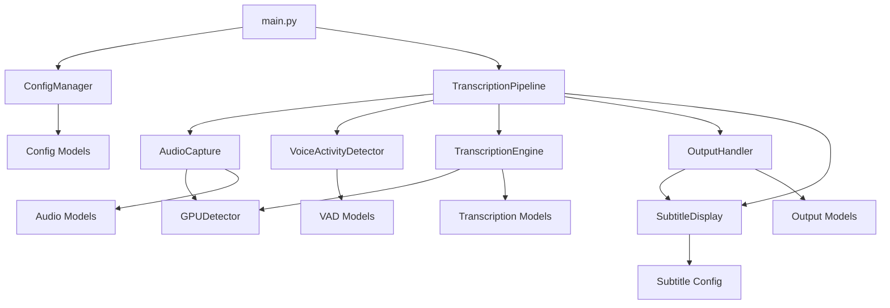

# Speech2Subtitles 仓库全面分析报告

## 项目概览

### 项目类型和目的
**Speech2Subtitles** 是一个基于 Python 的高性能实时语音识别系统，专注于离线语音转文本功能。该项目属于 **AI/ML ��面应用程序**，提供命令行界面和实时处理能力。

**核心目标**:
- 实时语音转录（麦克风/系统音频输入）
- 离线媒体文件转字幕
- 屏幕字幕显示功能
- 低延迟、高精度的语音识别

### 技术栈分析

#### 核心技术栈
- **编程语言**: Python 3.10+
- **深度学习框架**: PyTorch 2.6.0+, ONNX Runtime
- **语音识别引擎**: sherpa-onnx + sense-voice 模型
- **语音活动检测**: Silero VAD
- **音频处理**: PyAudio, numpy, soundfile, librosa
- **GUI框架**: tkinter (字幕显示功能)
- **媒体处理**: FFmpeg (外部依赖)

#### 开发工具链
- **包管理器**: uv (现代Python包管理器)
- **构建系统**: setuptools
- **代码格式化**: Black (line-length=88)
- **代码检查**: flake8
- **测试框架**: pytest + pytest-cov
- **类型注解**: typing-extensions

#### 项目配置
```toml
# pyproject.toml 核心配置
[project]
name = "speech2subtitles"
version = "0.1.0"
requires-python = ">=3.10"
dependencies = [
    "sherpa-onnx>=1.12.9",
    "torch>=2.6.0",
    "silero-vad>=4.0.0",
    "numpy>=1.21.0",
    "PyAudio>=0.2.11",
    "soundfile>=0.12.0",
    "librosa>=0.9.0"
]
```

## 架构设计模式

### 核心架构 - 事件驱动流水线
系统采用 **事件驱动的流水线架构 (Event-driven Pipeline Architecture)**，通过 `TranscriptionPipeline` 协调各组件工作:



### 设计模式识别
1. **观察者模式**: 事件系统支持多个监听器
2. **策略模式**: 多种音频源和输出格式
3. **工厂模式**: 组件初始化和配置
4. **上下文管理器模式**: 资源生命周期管理
5. **适配器模式**: 不同音频设备的统一接口

## 模块结构分析

### 核心模块层次结构
```
speech2subtitles/
├── src/                          # 源代码主目录
│   ├── config/                   # 配置管理层
│   │   ├── manager.py           # 命令行参数解析
│   │   ├── models.py            # 配置数据模型
│   │   └── CLAUDE.md            # 模块文档
│   ├── audio/                    # 音频捕获层
│   │   ├── capture.py           # 主音频捕获类
│   │   ├── soundcard_capture.py # 系统音频捕获
│   │   ├── models.py            # 音频数据模型
│   │   └── CLAUDE.md            # 模块文档
│   ├── vad/                      # 语音检测层
│   │   ├── detector.py          # VAD检测器
│   │   ├── models.py            # VAD数据模型
│   │   └── CLAUDE.md            # 模块文档
│   ├── transcription/            # 转录引擎层
│   │   ├── engine.py            # 转录引擎
│   │   ├── models.py            # 转录数据模型
│   │   └── CLAUDE.md            # 模块文档
│   ├── output/                   # 输出处理层
│   │   ├── handler.py           # 输出处理器
│   │   ├── models.py            # 输出数据模型
│   │   └── CLAUDE.md            # 模块文档
│   ├── subtitle_display/         # 字幕显示层 ⭐ 新功能
│   │   ├── simple.py            # 简化字幕显示
│   │   ├── thread_safe.py       # 线程安全字幕显示
│   │   └── __init__.py          # 模块初始化
│   ├── media/                    # 媒体处理层
│   │   ├── converter.py         # 媒体格式转换
│   │   ├── subtitle_generator.py # 字幕文件生成
│   │   ├── batch_processor.py   # 批量处理
│   │   └── CLAUDE.md            # 模块文档
│   ├── hardware/                 # 硬件检测层
│   │   ├── gpu_detector.py      # GPU检测器
│   │   ├── models.py            # 硬件数据模型
│   │   └── CLAUDE.md            # 模块文档
│   ├── coordinator/              # 流程协调层
│   │   ├── pipeline.py          # 核心流水线
│   │   └── CLAUDE.md            # 模块文档
│   └── utils/                    # 工具函数层
│       ├── logger.py            # 日志工具
│       ├── error_handler.py     # 错误处理
│       └── CLAUDE.md            # 模块文档
├── tests/                        # 测试套件
│   ├── test_config.py           # 配置测试
│   ├── test_coordinator.py      # 协调器测试
│   ├── test_output.py           # 输出测试
│   ├── test_integration.py      # 集成测试
│   └── CLAUDE.md                # 测试文档
├── tools/                        # 调试工具
│   ├── gpu_info.py              # GPU信息工具
│   ├── audio_info.py            # 音频设备工具
│   ├── vad_test.py              # VAD测试工具
│   └── performance_test.py      # 性能测试工具
├── models/                       # 模型文件目录
│   ├── silero-vad/              # VAD模型
│   └── sherpa-onnx-*/           # 转录模型
├── docs/                         # 用���文档
│   ├── installation.md          # 安装指南
│   ├── usage.md                 # 使用指南
│   ├── troubleshooting.md       # 故障排除
│   ├── deployment.md            # 部署指南
│   ├── SUBTITLE_DISPLAY_GUIDE.md # 字幕显示指南
│   └── SUBTITLE_DISPLAY_EXAMPLES.md # 字幕显示示例
├── main.py                       # 主程序入口
├── README.md                     # 项目说明
├── requirements.txt              # 依赖列表
├── pyproject.toml               # 项目配置
├── pytest.ini                  # 测试配置
└── CLAUDE.md                    # 项目AI上下文文档
```

### 模块依赖关系


## 代码组织和约定

### 编码标准
- **格式化**: Black (line-length=88)
- **导入顺序**: 标准库 → 第三方库 → 本地模块
- **命名约定**:
  - 类名: PascalCase
  - 函数/变量: snake_case
  - 常量: UPPER_SNAKE_CASE
  - 私有成员: _leading_underscore
- **文档字符串**: Google风格
- **类型注解**: 广泛使用 typing 模块

### 数据模型设计
项目广泛使用 `@dataclass` 定义配置和数据结构:

```python
@dataclass
class Config:
    model_path: str
    input_source: str
    use_gpu: bool = True
    vad_sensitivity: float = 0.5
    # ... 更多配置字段

    def validate(self) -> None:
        """配置验证逻辑"""
        pass
```

### 错误处理策略
- **自定义异常类**: 每个模块定义专门的异常类型
- **异常链**: 保持异常传播信息
- **错误恢复**: 支持组件级错误恢复
- **日志记录**: 统一的错误日志记录

## 开发工作流分析

### Git工作流
- **当前分支**: master
- **工作流状态**: 开发中，功能分支策略待完善
- **提交信息**: 中文提交信息，遵循语义化提交

### 测试策略
```python
# pytest.ini 配置
[tool:pytest]
testpaths = tests
python_files = test_*.py
addopts = -v --tb=short --strict-markers
markers =
    unit: 单元测试
    integration: 集成测试
    audio: 需要音频设备的测试
    gpu: 需要GPU的测试
```

**测试覆盖层次**:
1. **单元测试**: 每个模块的核心功能
2. **集成测试**: 模块间协作测试
3. **端到端测试**: 完整流程测试
4. **性能测试**: 延迟和吞吐量测试

### CI/CD配置
- **当前状态**: 未配置CI/CD流水线
- **建议**: 添加GitHub Actions进行自动化测试
- **代码质量**: 集成black、flake8检查

## 当前开发状态

### 已完成功能 ✅
- **配置管理系统**: 完整的命令行参数解析和验证
- **音频捕获模块**: 支持麦克风和系统音频
- **VAD检测模块**: 基于Silero VAD的语音活动检测
- **输出处理模块**: 多格式输出支持
- **硬件检测模块**: GPU/CPU环境检测
- **工具函数模块**: 日志、错误处理等工具
- **媒体处理模块**: FFmpeg集成和批量处理
- **字幕显示模块**: ⭐ 新增的屏幕字幕功能

### 当前开发状态 🚧
- **转录引擎**: 模型加载功能待完善
- **流水线协调**: 配置初始化问题修复中
- **字幕显示**: 基础功能完成，待优化

### 技术债务和已知问题
- **配置参数类型错误**: 流水线初始化问题
- **模型加载未实现**: TranscriptionEngine核心功能
- **音频格式枚举不匹配**: 配置兼容性问题
- **测试覆盖不足**: 部分模块测试不完整

## 新功能集成点

### 字幕显示功能集成
**新增模块**: `src/subtitle_display/`
- **simple.py**: 独立进程字幕显示
- **thread_safe.py**: 线程安全字幕显示
- **集成点**: `OutputHandler` 调用字幕显示组件

### 配置扩展
新增字幕相关配置参数:
```python
@dataclass
class SubtitleDisplayConfig:
    show_subtitles: bool = False
    subtitle_position: str = "bottom"
    subtitle_font_size: int = 24
    subtitle_font_family: str = "Microsoft YaHei"
    subtitle_opacity: float = 0.8
    subtitle_max_display_time: float = 5.0
    subtitle_text_color: str = "#FFFFFF"
    subtitle_background_color: str = "#000000"
```

### 输出处理器修改
`src/output/handler.py` 已集成字幕显示功能:
```python
try:
    from ..subtitle_display.simple import SubtitleDisplay
    SUBTITLE_DISPLAY_AVAILABLE = True
except ImportError:
    SUBTITLE_DISPLAY_AVAILABLE = False
```

## 性能和约束分析

### 性能目标
- **音频延迟**: < 100ms
- **转录延迟**: < 500ms (GPU) / < 2s (CPU)
- **内存使用**: < 2GB (含模型)
- **CPU使用**: < 30% (单核心)

### 系统约束
- **模型依赖**: sense-voice .onnx/.bin 模型文件
- **外部依赖**: FFmpeg (媒体处理), tkinter (GUI)
- **硬件要求**: 推荐GPU加速，需要音频设备
- **平台支持**: Windows/Linux/macOS

### 扩展性考虑
- **模块化设计**: 新功能可独立开发和测试
- **配置系统**: 向后兼容的配置扩展
- **事件架构**: 支持新的事件类型和处理器
- **插件系统**: 预留的扩展接口

## 推荐开发指导

### 新功能开发流程
1. **模块设计**: 遵循现有的模块化结构
2. **配置扩展**: 在`src/config/models.py`中添加配置
3. **命令行参数**: 在`ConfigManager`中添加参数解析
4. **接口实现**: 创建对应的处理器和数据模型
5. **集成测试**: 在流水线中集成新组件
6. **文档更新**: 更新CLAUDE.md和用户文档

### 代码质量保证
- **类型注解**: 所有公共接口必须有类型注解
- **错误处理**: 使用自定义异常类，提供详细错误信息
- **日志记录**: 适当使用logging模块记录关键操作
- **单元测试**: 新功能必须包含对应的单元测试
- **文档字符串**: 所有公共API需要详细的文档字符串

### 性能优化建议
- **异步处理**: 使用独立线程处理耗时操作
- **资源管理**: 使用上下文管理器确保资源清理
- **缓存机制**: 对重复计算结果进行缓存
- **内存监控**: 监控内存使用，避免内存泄漏

## 总结

Speech2Subtitles是一个架构良好、模块化设计清晰的Python语音识别项目。项目采用事件驱动的流水线架构，具有良好的扩展性和维护性。当前主要功能已基本完成，正在修复一些关键的初始化问题。

**项目优势**:
- 清晰的模块化架构
- 完善的配置管理系统
- 良好的错误处理和日志记录
- 丰富的调试工具和测试套件
- 详细的文档和AI上下文

**改进机会**:
- 完善CI/CD流水线
- 提升测试覆盖率
- 优化性能和内存使用
- 添加更多语言支持
- 完善用户界面

该项目为新增字幕显示功能提供了良好的基础架构，新功能可以无缝集成到现有的事件驱动流水线中。