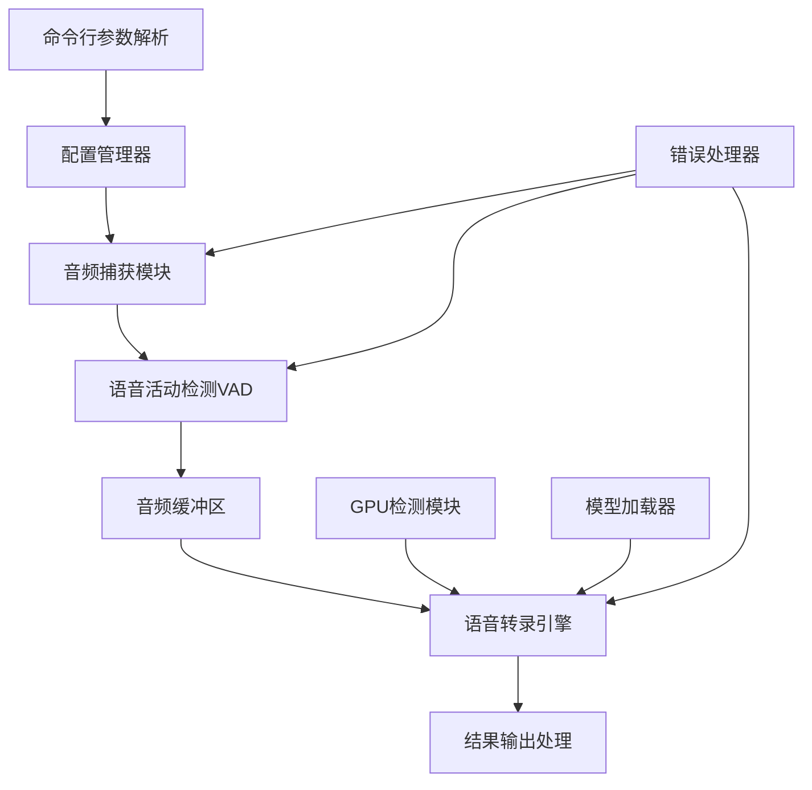

# Design Document

## Overview

实时语音转录系统是一个基于Python的高性能语音识别应用程序，采用模块化设计，利用sherpa-onnx框架和阿里sense-voice模型提供本地化的实时语音转文本功能。系统支持多种音频输入源，包括麦克风捕获和系统音频捕获，并提供GPU加速支持以确保低延迟的实时处理能力。

## Steering Document Alignment

### Technical Standards (tech.md)
*注：tech.md文档尚未创建，以下标准基于requirements文档中的架构要求制定*

- **Python代码规范**: 遵循PEP 8编码规范
- **模块化设计**: 采用单一职责原则，每个模块专注特定功能
- **依赖管理**: 使用uv进行依赖管理，支持虚拟环境
- **错误处理**: 统一的异常处理机制和日志记录
- **性能优化**: GPU/CPU自适应加速，内存优化管理

### Project Structure (structure.md)
*注：structure.md文档尚未创建，以下结构基于模块化设计原则制定*

```
speech2subtitles/
├── src/
│   ├── audio/          # 音频处理模块
│   ├── transcription/  # 转录处理模块
│   ├── config/         # 配置管理模块
│   └── utils/          # 工具函数模块
├── models/             # 模型文件目录
├── tests/              # 测试文件
└── main.py             # 程序入口
```

## Code Reuse Analysis

### Existing Components to Leverage
- **sherpa-onnx**: 作为核心语音识别引擎，提供model loading和inference功能
- **PyAudio**: 用于音频设备访问和音频流处理
- **numpy**: 用于音频数据的数值计算和处理
- **argparse**: 用于命令行参数解析
- **silero_vad**: 高精度语音活动检测预训练模型
- **torch**: PyTorch深度学习框架，支持silero_vad推理

### Integration Points
- **sherpa-onnx模型接口**: 集成sense-voice模型进行语音识别推理
- **Windows音频API**: 通过PyAudio或wasapi进行系统音频捕获
- **CUDA接口**: 通过onnxruntime-gpu进行GPU加速推理
- **silero_vad接口**: 通过torch集成silero_vad预训练模型进行语音活动检测

## Architecture

系统采用事件驱动的流水线架构，实现音频数据的实时处理流程。主要组件包括音频捕获、语音活动检测、模型推理和结果输出四个核心模块。

### Modular Design Principles
- **Single File Responsibility**: 每个文件处理特定的功能域（音频、转录、配置等）
- **Component Isolation**: 创建小而专注的组件，避免大型单体文件
- **Service Layer Separation**: 分离数据访问、业务逻辑和表示层
- **Utility Modularity**: 将工具函数分解为专注的单用途模块



## Components and Interfaces

### AudioCapture 音频捕获组件
- **Purpose:** 负责从麦克风或系统音频源捕获音频数据
- **Interfaces:**
  - `start_capture(source_type: str) -> bool`
  - `stop_capture() -> bool`
  - `get_audio_stream() -> Generator[np.ndarray]`
  - `list_devices() -> List[AudioDevice]`
- **Dependencies:** PyAudio, numpy
- **Reuses:** 标准的音频设备API和数据结构

### VoiceActivityDetector VAD组件
- **Purpose:** 检测音频流中的语音活动，识别语音开始和结束
- **Interfaces:**
  - `detect(audio_chunk: np.ndarray) -> VadResult`
  - `set_sensitivity(level: float) -> None`
  - `reset() -> None`
- **Dependencies:** numpy, torch, silero_vad
- **Reuses:** Silero VAD预训练模型和音频分析工具

### TranscriptionEngine 转录引擎组件
- **Purpose:** 使用sherpa-onnx和sense-voice模型进行语音到文本的转换
- **Interfaces:**
  - `load_model(model_path: str, use_gpu: bool) -> bool`
  - `transcribe(audio_data: np.ndarray) -> TranscriptionResult`
  - `get_model_info() -> ModelInfo`
- **Dependencies:** sherpa-onnx, onnxruntime-gpu/cpu
- **Reuses:** sherpa-onnx的model loading和inference接口

### ConfigManager 配置管理组件
- **Purpose:** 处理命令行参数和系统配置
- **Interfaces:**
  - `parse_arguments() -> Config`
  - `validate_config(config: Config) -> bool`
  - `get_default_config() -> Config`
- **Dependencies:** argparse, pathlib
- **Reuses:** 标准的参数解析和配置验证模式

### GPUDetector GPU检测组件
- **Purpose:** 检测和管理GPU资源，支持CPU/GPU自适应切换
- **Interfaces:**
  - `detect_cuda() -> bool`
  - `get_gpu_info() -> GPUInfo`
  - `check_memory(required_mb: int) -> bool`
- **Dependencies:** onnxruntime, nvidia-ml-py
- **Reuses:** 标准的CUDA检测和内存管理API

### OutputHandler 输出处理组件
- **Purpose:** 格式化和输出转录结果，包含时间戳和置信度
- **Interfaces:**
  - `format_result(result: TranscriptionResult) -> str`
  - `output_realtime(text: str, timestamp: float) -> None`
  - `set_output_format(format_type: str) -> None`
- **Dependencies:** datetime, logging
- **Reuses:** 标准的时间处理和格式化工具

## Data Models

### Config 配置模型
```python
@dataclass
class Config:
    model_path: str           # sense-voice模型文件路径
    input_source: str         # "microphone" 或 "system"
    use_gpu: bool            # 是否使用GPU加速
    vad_sensitivity: float   # VAD敏感度 (0.0-1.0)
    output_format: str       # 输出格式类型
    device_id: Optional[int] # 音频设备ID
```

### AudioDevice 音频设备模型
```python
@dataclass
class AudioDevice:
    id: int                  # 设备ID
    name: str               # 设备名称
    channels: int           # 声道数
    sample_rate: int        # 采样率
    is_input: bool          # 是否为输入设备
```

### TranscriptionResult 转录结果模型
```python
@dataclass
class TranscriptionResult:
    text: str               # 识别的文本
    confidence: float       # 置信度 (0.0-1.0)
    start_time: float      # 开始时间戳
    end_time: float        # 结束时间戳
    language: Optional[str] # 检测到的语言
```

### VadResult VAD结果模型
```python
@dataclass
class VadResult:
    is_speech: bool         # 是否为语音
    confidence: float       # VAD置信度
    speech_start: bool      # 是否为语音开始
    speech_end: bool        # 是否为语音结束
```

## Error Handling

### Error Scenarios
1. **模型文件不存在或损坏**
   - **Handling:** 检查文件路径和完整性，提供详细错误信息和建议
   - **User Impact:** 显示清晰的错误消息，指导用户检查模型路径

2. **音频设备不可用或权限不足**
   - **Handling:** 检测可用设备，提供设备列表，请求必要权限
   - **User Impact:** 显示设备状态和权限要求，提供解决方案

3. **GPU内存不足或CUDA不可用**
   - **Handling:** 自动降级到CPU模式，记录警告信息
   - **User Impact:** 通知用户已切换到CPU模式，性能可能受影响

4. **音频流中断或异常**
   - **Handling:** 实现自动重连机制，保持转录会话连续性
   - **User Impact:** 短暂的转录暂停，自动恢复后继续工作

5. **模型推理异常**
   - **Handling:** 记录错误详情，跳过当前音频片段，继续处理
   - **User Impact:** 可能丢失部分转录内容，但系统保持运行

## Testing Strategy

### Unit Testing
- **ConfigManager**: 测试参数解析和配置验证逻辑
- **VoiceActivityDetector**: 使用预录制音频测试VAD准确性
- **TranscriptionEngine**: 使用已知音频样本测试转录准确性
- **GPUDetector**: 模拟不同硬件环境测试GPU检测逻辑

### Integration Testing
- **音频捕获到VAD流程**: 测试音频数据从捕获到VAD检测的完整流程
- **VAD到转录流程**: 测试语音片段检测到转录输出的集成
- **GPU/CPU切换流程**: 测试硬件加速的自动切换机制
- **错误恢复流程**: 测试各种异常情况下的系统恢复能力

### End-to-End Testing
- **实时麦克风转录**: 使用真实麦克风输入测试完整转录流程
- **系统音频转录**: 测试浏览器、音乐播放器等系统音频的转录
- **长时间运行测试**: 验证系统在连续运行2小时以上的稳定性
- **多种音频质量测试**: 测试不同质量音频的转录效果和性能