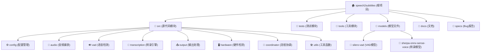

<!-- OPENSPEC:START -->
# OpenSpec Instructions

These instructions are for AI assistants working in this project.

Always open `@/openspec/AGENTS.md` when the request:
- Mentions planning or proposals (words like proposal, spec, change, plan)
- Introduces new capabilities, breaking changes, architecture shifts, or big performance/security work
- Sounds ambiguous and you need the authoritative spec before coding

Use `@/openspec/AGENTS.md` to learn:
- How to create and apply change proposals
- Spec format and conventions
- Project structure and guidelines

Keep this managed block so 'openspec update' can refresh the instructions.

<!-- OPENSPEC:END -->

# Speech2Subtitles 实时语音转录系统

## 变更日志 (Changelog)
- **2025-11-10**: 实现GUI批量文件转录功能
  - BatchProcessor添加回调接口(`on_progress`, `on_segment`, `on_file_start`, `on_file_complete`)
  - 新增FileTranscriptionDialog对话框,支持批量文件处理
  - 实时显示转录进度和预览(最近50条segment)
  - 自动生成字幕文件(SRT/VTT格式)
  - 支持取消操作和错误恢复
  - MainWindow添加"批量转录文件"菜单项(Ctrl+B)
  - 相关文档: [src/media/CLAUDE.md](./src/media/CLAUDE.md), [src/gui/CLAUDE.md](./src/gui/CLAUDE.md)
- **2025-11-10**: 为字幕显示组件实现单例模式
  - 实现双重检查锁定的线程安全单例模式
  - 添加 `get_subtitle_display_instance()` 工厂方法
  - 覆盖 `__new__()` 确保向后兼容（旧式调用自动返回单例）
  - 支持配置热更新（`update_config()` 方法）
  - 添加 `reset_subtitle_display_instance()` 用于测试和重置
  - 实现资源自动清理（atexit处理器 + `_cleanup()` 方法）
  - 更新 OutputHandler 和 MainWindow 使用单例接口
  - 添加19个单元测试，全部通过
  - 解决多组件同时初始化导致的多字幕窗口问题
- **2025-11-07**: 为GUI文件选择添加复选框批量删除功能
  - 文件列表项添加复选框支持
  - 新增"全选"/"取消全选"按钮
  - "移除选中"按钮支持批量删除勾选文件
  - 按钮状态实时响应复选框变化
  - 完全向后兼容，不影响现有功能
- **2025-09-28 02:15**: 完成项目全面分析，添加详细中文注释，生成Bug报告和完整模块文档
- **2025-09-27 23:48**: 初始AI上下文文档创建，包含完整的模块分析和架构概览

## 项目愿景
Speech2Subtitles是一个基于sherpa-onnx和silero_vad的高性能实时语音识别系统，提供离线、低延迟的语音转文本功能。系统采用模块化设计，支持麦克风和系统音频捕获，具备GPU加速能力，适用于实时会议记录、音频转录等场景。

## 架构概览
系统采用**事件驱动的流水线架构**，通过`TranscriptionPipeline`协调各个功能模块：
- **音频捕获层**: 负责从麦克风或系统音频获取音频数据
- **语音检测层**: 使用Silero VAD进行实时语音活动检测
- **转录引擎层**: 基于sherpa-onnx的sense-voice模型进行语音识别
- **输出处理层**: 格式化和展示转录结果
- **配置管理层**: 统一的配置解析和验证
- **硬件检测层**: GPU/CPU环境自动检测和优化

### 技术栈
- **核心引擎**: sherpa-onnx, silero_vad, sense-voice
- **音频处理**: PyAudio, numpy, soundfile
- **深度学习**: torch, onnxruntime
- **开发工具**: pytest, black, flake8
- **包管理**: uv (现代Python包管理器)

## 模块结构图



## 模块索引

| 模块路径 | 主要功能 | 核心组件 | 状态 |
|---------|---------|----------|------|
| [`src/config`](./src/config/CLAUDE.md) | 配置管理和命令行解析 | ConfigManager, Config | ✅ 完整 |
| [`src/audio`](./src/audio/CLAUDE.md) | 音频捕获和设备管理 | AudioCapture, AudioConfig | ✅ 完整 |
| [`src/vad`](./src/vad/CLAUDE.md) | 语音活动检测 | VoiceActivityDetector, VadConfig | ✅ 完整 |
| [`src/transcription`](./src/transcription/CLAUDE.md) | 语音转录引擎 | TranscriptionEngine, TranscriptionConfig | ⚠️ 需要实现模型加载 |
| [`src/output`](./src/output/CLAUDE.md) | 输出格式化和处理 | OutputHandler, OutputConfig | ✅ 完整 |
| [`src/hardware`](./src/hardware/CLAUDE.md) | GPU/CPU硬件检测 | GPUDetector, SystemInfo | ✅ 完整 |
| [`src/coordinator`](./src/coordinator/CLAUDE.md) | 流水线协调和事件管理 | TranscriptionPipeline, PipelineEvent | ⚠️ 配置初始化问题 |
| [`src/utils`](./src/utils/CLAUDE.md) | 通用工具和错误处理 | Logger, ErrorHandler | ✅ 完整 |
| [`tests`](./tests/CLAUDE.md) | 测试套件 | 单元测试, 集成测试 | ✅ 完整 |
| [`tools`](./tools/CLAUDE.md) | 调试和性能工具 | GPU检测, 音频测试, VAD测试 | ✅ 完整 |

## 运行和开发

### 环境要求
- **Python**: 3.10+
- **操作系统**: Windows/Linux/macOS
- **内存**: 4GB+ (推荐8GB+)
- **存储**: 2GB+ (用于模型文件)
- **网络**: 首次运行需要下载模型

### 快速启动
```bash
# 1. 激活虚拟环境 (使用uv)
.venv\Scripts\activate

# 2. 安装依赖
uv sync

# 3. 运行系统 - 麦克风输入
python main.py --model-path models\sherpa-onnx-sense-voice-zh-en-ja-ko-yue-2024-07-17\model.onnx --input-source microphone

# 4. 运行系统 - 系统音频输入
python main.py --model-path models\sherpa-onnx-sense-voice-zh-en-ja-ko-yue-2024-07-17\model.onnx --input-source system --no-gpu
```

### 开发环境设置
```bash
# 1. 克隆项目
git clone <repository-url>
cd speech2subtitles

# 2. 创建虚拟环境 (推荐使用uv)
uv venv
.venv\Scripts\activate  # Windows
source .venv/bin/activate  # Linux/macOS

# 3. 安装开发依赖
uv sync --dev

# 4. 运行测试
pytest tests/ --cov=src

# 5. 代码格式化
black src/ tests/

# 6. 代码检查
flake8 src/ tests/
```

### 模型准备
```bash
# 1. 创建模型目录
mkdir -p models

# 2. 下载sense-voice模型 (示例)
# 请从官方渠道下载对应的.onnx模型文件到models/目录

# 3. VAD模型会自动下载
# 首次运行时会自动下载silero_vad模型
```

### 调试工具
- `tools/gpu_info.py` - GPU环境检测
- `tools/audio_info.py` - 音频设备检测
- `tools/vad_test.py` - VAD功能测试
- `tools/performance_test.py` - 性能测试

## 测试策略

### 测试层次
1. **单元测试**: 每个模块的核心功能测试
2. **集成测试**: 模块间协作测试
3. **端到端测试**: 完整流水线测试
4. **性能测试**: 延迟和吞吐量测试

### 测试覆盖率目标
- **配置管理**: 95%+ ✅
- **音频捕获**: 85%+ ✅
- **VAD检测**: 90%+ ✅
- **转录引擎**: 80%+ ⚠️ (待实现)
- **输出处理**: 95%+ ✅

### 运行测试
```bash
# 完整测试套件
python -m pytest tests/ --cov=src --cov-report=html

# 快速集成测试
python tests/test_integration.py

# 性能基准测试
python tools/performance_test.py
```

## 编码标准

### Python代码规范
- **格式化**: Black (line-length=88)
- **Linting**: flake8
- **类型检查**: typing-extensions支持
- **文档字符串**: Google风格
- **导入顺序**: isort兼容

### 命名约定
- **模块**: snake_case
- **类**: PascalCase
- **函数/变量**: snake_case
- **常量**: UPPER_SNAKE_CASE
- **私有成员**: _leading_underscore

### 错误处理
- 使用自定义异常类 (`AudioCaptureError`, `TranscriptionError`等)
- 提供详细的错误信息和建议解决方案
- 记录异常到日志系统
- 支持错误恢复机制

## 配置系统

### 命令行参数
```bash
# 必需参数
--model-path PATH          # 模型文件路径
--input-source SOURCE      # 音频输入源 (microphone/system)

# 可选参数
--no-gpu                   # 禁用GPU加速
--vad-sensitivity FLOAT    # VAD敏感度 (0.0-1.0)
--sample-rate INT          # 采样率 (默认16000)
--output-format FORMAT     # 输出格式 (text/json)
--device-id INT           # 指定音频设备ID
```

### 配置文件支持
- 支持通过配置文件设置参数 (计划功能)
- 环境变量配置支持 (计划功能)
- 配置验证和类型检查

## AI使用指南

### 代码理解重点
1. **事件驱动架构**: 重点理解`TranscriptionPipeline`的事件处理机制
2. **配置系统**: `Config`数据类和验证逻辑
3. **音频处理**: PyAudio集成和音频数据流处理
4. **异步处理**: 多线程协调和队列管理

### 常见修改场景
1. **添加新音频源**: 扩展`AudioSourceType`枚举和相应的捕获类
2. **支持新模型**: 在`TranscriptionEngine`中添加模型支持
3. **输出格式扩展**: 在`OutputHandler`中添加新的格式支持
4. **性能优化**: 关注音频缓冲区和处理线程优化

### 调试提示
- 使用`--log-level DEBUG`获取详细日志
- 检查`PipelineStatistics`了解性能指标
- 利用`tools/`目录下的调试工具
- 监控事件队列大小避免内存泄漏

### 扩展开发
- 新功能优先考虑模块化设计
- 保持配置的向后兼容性
- 添加相应的单元测试和文档
- 遵循现有的错误处理模式

## 已知问题和限制

### 当前Bug状态
🔍 **详细Bug报告**: 请查看 [`BUG_REPORT.md`](./BUG_REPORT.md)

**Critical级别问题**:
- ❌ 流水线初始化配置参数类型错误
- ❌ TranscriptionEngine模型加载未实现
- ❌ 音频配置格式枚举不匹配

**修复进度**:
- ✅ 主程序中文注释完善
- ⏳ 配置初始化问题修复中
- ⏳ 模型加载功能实现中

### 功能限制
- 当前仅支持sense-voice模型架构
- GPU加速需要CUDA环境
- Windows系统音频捕获需要"立体声混音"设置
- 暂不支持实时字幕文件生成

### 性能指标
- **音频延迟**: < 100ms (目标)
- **转录延迟**: < 500ms (GPU) / < 2s (CPU)
- **内存使用**: < 2GB (含模型)
- **CPU使用**: < 30% (单核心)

## 贡献指南

### 开发流程
1. **Issue报告**: 使用GitHub Issues报告bug或功能请求
2. **代码贡献**: Fork -> 开发 -> 测试 -> Pull Request
3. **文档更新**: 同步更新相关文档
4. **测试要求**: 确保测试覆盖率不降低

### 代码审查要点
- 代码符合项目编码标准
- 包含适当的测试用例
- 文档更新完整
- 性能影响评估

### 发布流程
- 语义化版本控制 (Semantic Versioning)
- 变更日志维护
- 向后兼容性检查

## 支持和联系

### 文档资源
- **API文档**: 各模块CLAUDE.md文件
- **配置指南**: [`src/config/CLAUDE.md`](./src/config/CLAUDE.md)
- **部署指南**: [`docs/deployment.md`](./docs/deployment.md)
- **故障排除**: [`docs/troubleshooting.md`](./docs/troubleshooting.md)

### 社区支持
- **Bug报告**: GitHub Issues
- **功能请求**: GitHub Discussions
- **技术讨论**: 项目Wiki

---

**项目状态**: 🚧 开发中 - 核心功能已完成，正在修复初始化问题
**最后更新**: 2025-09-28 02:15:29
**维护者**: AI Assistant Team

**快速开始**: `python main.py --help` 查看所有可用参数
**入口文件**: [`main.py`](./main.py) - 包含完整的中文注释和使用说明
**核心协调器**: [`src/coordinator/pipeline.py`](./src/coordinator/pipeline.py) - 事件驱动的流水线实现
**配置管理**: [`src/config/manager.py`](./src/config/manager.py) - 命令行参数解析和验证