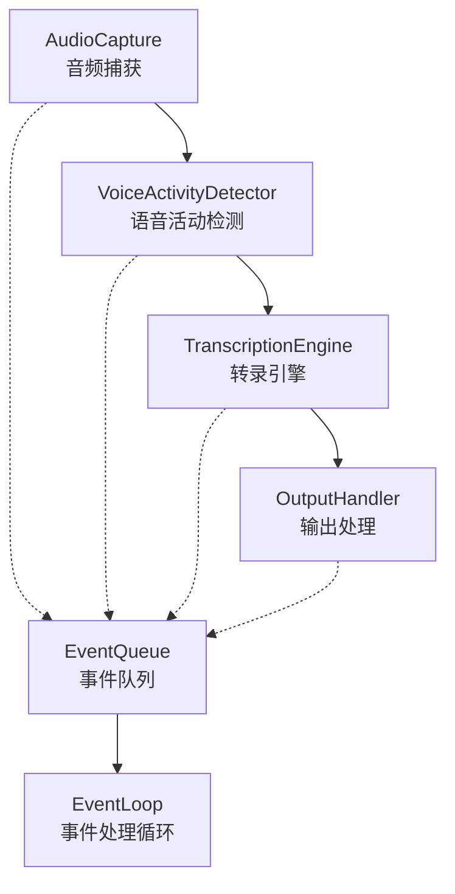

# TranscriptionPipeline 事件处理机制与语音转录流程分析

> 本文档详细分析了 `F:\py\speech2subtitles\src\coordinator\pipeline.py` 中 `TranscriptionPipeline` 的事件处理机制，以及完整的语音转录（STT）过程事件流转。

## 📋 事件驱动架构概览

`TranscriptionPipeline` 采用事件驱动的流水线架构，通过异步事件队列协调各个组件的工作流程。

### 核心组件构成


### 架构特点
- **松耦合设计**：各组件通过事件队列通信，不直接依赖
- **异步处理**：独立事件处理线程避免阻塞主流程
- **可扩展性**：支持动态添加/移除事件处理器
- **错误隔离**：单个组件错误不影响整体流程

## 🔄 事件类型与数据流

### 事件类型定义
```python
class EventType(Enum):
    AUDIO_DATA = "audio_data"             # 音频数据事件
    VAD_RESULT = "vad_result"             # VAD检测结果事件
    TRANSCRIPTION_RESULT = "transcription_result"  # 转录结果事件
    ERROR = "error"                       # 错误事件
    STATE_CHANGE = "state_change"         # 状态变化事件
```

### 事件数据结构
```python
@dataclass
class PipelineEvent:
    event_type: EventType      # 事件类型，决定处理方式
    timestamp: float          # 事件发生时间戳，用于性能分析
    data: Any                # 事件载荷数据，类型由事件类型决定
    source: str              # 事件来源组件名称，用于调试
    metadata: Dict[str, Any] # 附加元数据，用于扩展信息
```

## 📊 完整事件流转案例

### 案例场景：用户通过麦克风说话 "你好，今天天气很好"

#### 🎤 阶段1：音频捕获
**代码位置**: `pipeline.py:446`
```python
def _on_audio_data(self, audio_chunk: AudioChunk) -> None:
    """音频数据回调 - 由AudioCapture组件调用"""
    self._emit_event(EventType.AUDIO_DATA, audio_chunk, "audio_capture")
```

**事件数据示例**：
```python
PipelineEvent(
    event_type=EventType.AUDIO_DATA,
    timestamp=1727647123.456,
    data=AudioChunk(
        data=numpy.array([...]),  # 1024个16位PCM采样点
        sample_rate=16000,        # 16kHz采样率
        timestamp=1727647123.456,
        channels=1                # 单声道
    ),
    source="audio_capture",
    metadata={}
)
```

**工作流程**：
1. AudioCapture 以16kHz采样率、1024样本块大小捕获音频
2. 每当捕获到音频块时触发 `_on_audio_data` 回调
3. 回调函数将音频数据封装为事件发送到事件队列

#### 🔊 阶段2：VAD处理
**代码位置**: `pipeline.py:403`
```python
def _handle_audio_data(self, event: PipelineEvent) -> None:
    """处理音频数据事件"""
    if self.vad_detector and isinstance(event.data, AudioChunk):
        self.statistics.total_audio_chunks += 1  # 更新统计
        self.vad_detector.process_audio(event.data.data)  # 传递给VAD检测器
```

**VAD检测完成后触发事件**：
**代码位置**: `pipeline.py:450`
```python
def _on_vad_result(self, vad_result: VadResult) -> None:
    """VAD检测结果回调 - 由VoiceActivityDetector调用"""
    self._emit_event(EventType.VAD_RESULT, vad_result, "vad_detector")
```

**事件数据示例**：
```python
PipelineEvent(
    event_type=EventType.VAD_RESULT,
    timestamp=1727647123.500,
    data=VadResult(
        state=VadState.SPEECH,        # 检测到语音活动
        is_speech=True,               # 布尔标识
        confidence=0.85,              # VAD置信度85%
        audio_data=numpy.array([...]), # 累积的语音段音频数据
        start_time=1727647123.456,    # 语音开始时间
        end_time=1727647125.890       # 语音结束时间
    ),
    source="vad_detector",
    metadata={}
)
```

**处理逻辑**：
1. 事件处理循环接收到AUDIO_DATA事件
2. 调用 `_handle_audio_data` 将音频数据传递给VAD检测器
3. VAD检测器使用Silero V5模型分析音频
4. 检测完成后通过回调触发VAD_RESULT事件

#### 📝 阶段3：转录触发决策
**代码位置**: `pipeline.py:409`
```python
def _handle_vad_result(self, event: PipelineEvent) -> None:
    """处理VAD检测结果事件"""
    if self.transcription_engine and isinstance(event.data, VadResult):
        self.statistics.total_vad_detections += 1

        # 添加调试日志
        logger.debug(f"VAD结果: state={event.data.state.name}, is_speech={event.data.is_speech}, "
                    f"has_audio_data={event.data.audio_data is not None}, "
                    f"confidence={event.data.confidence:.3f}")

        # 🔑 关键决策：只有检测到语音且有音频数据才转录
        if event.data.state == VadState.SPEECH and event.data.audio_data is not None:
            logger.info(f"触发转录: 音频数据长度={len(event.data.audio_data)}")
            self.transcription_engine.transcribe_audio(event.data.audio_data)
        else:
            logger.debug(f"未触发转录: state={event.data.state.name}, "
                       f"has_audio={event.data.audio_data is not None}")
```

**决策逻辑**：
- ✅ **触发转录条件**: `event.data.state == VadState.SPEECH` 且 `event.data.audio_data is not None`
- ❌ **跳过转录情况**: 静音段、背景噪音、或音频数据为空
- 📊 **统计更新**: 无论是否转录都会更新VAD检测计数

#### 🧠 阶段4：语音识别
转录引擎处理语音数据，完成后触发回调：

**代码位置**: `pipeline.py:457`
```python
def _on_transcription_result(self, transcription_result: TranscriptionResult) -> None:
    """转录结果回调 - 由TranscriptionEngine调用"""
    self._emit_event(EventType.TRANSCRIPTION_RESULT, transcription_result, "transcription_engine")
```

**事件数据示例**：
```python
PipelineEvent(
    event_type=EventType.TRANSCRIPTION_RESULT,
    timestamp=1727647126.123,
    data=TranscriptionResult(
        text="你好，今天天气很好",      # 识别出的文本
        confidence=0.92,            # 整体识别置信度92%
        language="zh",              # 检测到的语言（中文）
        word_timestamps=[           # 词级时间戳信息
            ("你好", 0.0, 0.5),
            ("今天", 0.6, 1.0),
            ("天气", 1.1, 1.4),
            ("很好", 1.5, 2.0)
        ],
        processing_time=0.65,       # 处理耗时650毫秒
        model_name="sense-voice"    # 使用的模型名称
    ),
    source="transcription_engine",
    metadata={}
)
```

**处理流程**：
1. 转录引擎接收语音音频数据
2. 使用sense-voice模型进行语音识别
3. 根据配置选择GPU或CPU进行推理
4. 生成转录结果并触发回调事件

#### 📤 阶段5：输出处理
**代码位置**: `pipeline.py:427`
```python
def _handle_transcription_result(self, event: PipelineEvent) -> None:
    """处理转录结果事件"""
    if self.output_handler and isinstance(event.data, TranscriptionResult):
        self.statistics.total_transcriptions += 1  # 更新转录统计
        self.output_handler.process_result(event.data)  # 格式化输出
```

**控制台输出示例**：
```
[2024-09-29 10:25:26] 你好，今天天气很好 (置信度: 0.92, 处理时间: 650ms)
```

**JSON格式输出示例**：
```json
{
    "timestamp": "2024-09-29T10:25:26.123Z",
    "text": "你好，今天天气很好",
    "confidence": 0.92,
    "language": "zh",
    "processing_time": 0.65,
    "word_timestamps": [
        {"word": "你好", "start": 0.0, "end": 0.5},
        {"word": "今天", "start": 0.6, "end": 1.0},
        {"word": "天气", "start": 1.1, "end": 1.4},
        {"word": "很好", "start": 1.5, "end": 2.0}
    ]
}
```

## ⚙️ 事件处理机制详解

### 事件循环核心
**代码位置**: `pipeline.py:357`
```python
def _event_loop(self) -> None:
    """事件处理循环 - 在独立线程中运行"""
    logger.info("Event processing loop started")

    while self.is_running and not self.shutdown_event.is_set():
        try:
            # 从队列获取事件（100ms超时避免阻塞）
            event = self.event_queue.get(timeout=0.1)
            self._process_event(event)  # 处理事件
            self.event_queue.task_done()

        except Empty:
            continue  # 队列为空，继续循环
        except Exception as e:
            logger.error(f"Error in event loop: {e}")

    logger.info("Event processing loop stopped")
```

**设计特点**：
- **非阻塞设计**: 100ms超时避免线程阻塞
- **异常隔离**: 单个事件处理错误不影响循环
- **优雅停止**: 通过 `shutdown_event` 控制循环退出

### 事件分发机制
**代码位置**: `pipeline.py:375`
```python
def _process_event(self, event: PipelineEvent) -> None:
    """处理单个事件"""
    try:
        # 1. 更新活动统计
        self.statistics.update_activity()

        # 2. 调用外部注册的事件处理器
        for handler in self.event_handlers.get(event.event_type, []):
            handler(event)

        # 3. 内置事件处理逻辑
        if event.event_type == EventType.AUDIO_DATA:
            self._handle_audio_data(event)
        elif event.event_type == EventType.VAD_RESULT:
            self._handle_vad_result(event)
        elif event.event_type == EventType.TRANSCRIPTION_RESULT:
            self._handle_transcription_result(event)
        elif event.event_type == EventType.ERROR:
            self._handle_error_event(event)

    except Exception as e:
        logger.error(f"Error processing event {event.event_type}: {e}")
```

**处理顺序**：
1. **统计更新**: 记录最后活动时间
2. **外部处理器**: 调用用户注册的自定义处理器
3. **内置处理**: 执行系统默认的事件处理逻辑

### 事件发射机制
**代码位置**: `pipeline.py:464`
```python
def _emit_event(self, event_type: EventType, data: Any, source: str, metadata: Dict[str, Any] = None) -> None:
    """发射事件到事件队列"""
    event = PipelineEvent(
        event_type=event_type,
        timestamp=time.time(),  # 当前时间戳
        data=data,
        source=source,
        metadata=metadata or {}
    )

    try:
        self.event_queue.put_nowait(event)  # 非阻塞方式入队
    except Exception as e:
        logger.error(f"Failed to emit event {event_type}: {e}")
```

## 📈 性能监控与统计

### 实时统计信息
**代码位置**: `pipeline.py:82`
```python
@dataclass
class PipelineStatistics:
    start_time: float = 0.0               # 流水线启动时间戳
    total_audio_chunks: int = 0           # 音频块处理数量
    total_vad_detections: int = 0         # VAD检测次数
    total_transcriptions: int = 0         # 转录成功次数
    total_errors: int = 0                 # 错误统计
    last_activity_time: float = 0.0      # 最后活动时间

    @property
    def uptime(self) -> float:
        """获取运行时间（秒）"""
        if self.start_time == 0.0:
            return 0.0
        return time.time() - self.start_time

    @property
    def audio_throughput(self) -> float:
        """计算音频处理吞吐量（块/秒）"""
        if self.uptime == 0.0:
            return 0.0
        return self.total_audio_chunks / self.uptime
```

### 统计信息获取
**代码位置**: `pipeline.py:532`
```python
def get_statistics(self) -> Dict[str, Any]:
    """获取流水线统计信息"""
    return {
        "state": self.state.value,
        "uptime": self.statistics.uptime,
        "total_audio_chunks": self.statistics.total_audio_chunks,
        "total_vad_detections": self.statistics.total_vad_detections,
        "total_transcriptions": self.statistics.total_transcriptions,
        "total_errors": self.statistics.total_errors,
        "audio_throughput": self.statistics.audio_throughput,
        "last_activity": self.statistics.last_activity_time,
        "event_queue_size": self.event_queue.qsize() if hasattr(self.event_queue, 'qsize') else 0
    }
```

### 监控示例代码
```python
# 获取实时统计
stats = pipeline.get_statistics()

print(f"🚀 运行时间: {stats['uptime']:.1f}s")
print(f"📊 音频吞吐量: {stats['audio_throughput']:.2f} 块/秒")
print(f"🎯 转录成功率: {stats['total_transcriptions']}/{stats['total_vad_detections']}")
print(f"📦 事件队列大小: {stats['event_queue_size']}")
print(f"⚠️ 错误次数: {stats['total_errors']}")
```

## 🚨 错误处理机制

### 错误事件处理
**代码位置**: `pipeline.py:433`
```python
def _handle_error_event(self, event: PipelineEvent) -> None:
    """处理错误事件"""
    self.statistics.total_errors += 1
    error_msg = event.data if isinstance(event.data, str) else str(event.data)
    logger.error(f"Pipeline error from {event.source}: {error_msg}")

    # 调用注册的错误回调函数
    for callback in self.error_callbacks:
        try:
            callback(Exception(error_msg))
        except Exception as e:
            logger.error(f"Error in error callback: {e}")
```

### 错误回调注册
**代码位置**: `pipeline.py:523`
```python
def add_error_callback(self, callback: Callable[[Exception], None]) -> None:
    """添加错误回调"""
    self.error_callbacks.append(callback)
```

### 自定义错误处理示例
```python
def custom_error_handler(exception: Exception):
    """自定义错误处理器"""
    error_msg = str(exception)

    if "CUDA" in error_msg:
        print("❌ GPU错误，建议切换到CPU模式")
    elif "Audio" in error_msg:
        print("❌ 音频设备错误，请检查麦克风连接")
    elif "Model" in error_msg:
        print("❌ 模型加载错误，请检查模型文件路径")
    else:
        print(f"❌ 未知错误: {error_msg}")

# 注册错误处理器
pipeline.add_error_callback(custom_error_handler)
```

## 🔧 扩展与自定义

### 添加自定义事件处理器
**代码位置**: `pipeline.py:500`
```python
def add_event_handler(self, event_type: EventType, handler: Callable[[PipelineEvent], None]) -> None:
    """添加事件处理器"""
    if event_type not in self.event_handlers:
        self.event_handlers[event_type] = []
    self.event_handlers[event_type].append(handler)
```

### 自定义处理器示例
```python
def custom_transcription_handler(event: PipelineEvent):
    """自定义转录结果处理"""
    result = event.data

    # 实时显示转录结果
    print(f"🎯 识别结果: {result.text}")
    print(f"📊 置信度: {result.confidence:.2f}")
    print(f"⏱️ 处理时间: {result.processing_time:.3f}s")

    # 保存到文件
    with open("transcription_log.txt", "a", encoding="utf-8") as f:
        f.write(f"[{time.strftime('%Y-%m-%d %H:%M:%S')}] {result.text}\n")

def custom_vad_handler(event: PipelineEvent):
    """自定义VAD结果处理"""
    vad_result = event.data

    if vad_result.is_speech:
        print(f"🔊 检测到语音 (置信度: {vad_result.confidence:.2f})")
    else:
        print(f"🔇 静音状态")

# 注册自定义处理器
pipeline.add_event_handler(EventType.TRANSCRIPTION_RESULT, custom_transcription_handler)
pipeline.add_event_handler(EventType.VAD_RESULT, custom_vad_handler)
```

### 状态变化监听
```python
def state_change_handler(event: PipelineEvent):
    """流水线状态变化处理"""
    old_state = event.data.get('old')
    new_state = event.data.get('new')
    print(f"🔄 状态变化: {old_state} → {new_state}")

pipeline.add_event_handler(EventType.STATE_CHANGE, state_change_handler)
```

## 🎛️ 流水线状态管理

### 状态枚举定义
**代码位置**: `pipeline.py:36`
```python
class PipelineState(Enum):
    """流水线状态枚举"""
    IDLE = "idle"                # 空闲状态，未启动或已停止
    INITIALIZING = "initializing" # 初始化中，正在加载各组件
    RUNNING = "running"          # 运行中，正在处理音频数据
    STOPPING = "stopping"        # 停止中，正在清理资源
    ERROR = "error"              # 错误状态，需要重新初始化
```

### 状态转换逻辑
**代码位置**: `pipeline.py:487`
```python
def _change_state(self, new_state: PipelineState) -> None:
    """改变流水线状态"""
    if self.state != new_state:
        old_state = self.state
        self.state = new_state
        logger.info(f"Pipeline state changed: {old_state.value} -> {new_state.value}")

        # 发射状态变化事件
        self._emit_event(
            EventType.STATE_CHANGE,
            {"old": old_state.value, "new": new_state.value},
            "pipeline"
        )
```

### 正常状态转换流程
```
IDLE → INITIALIZING → RUNNING → STOPPING → IDLE
```

### 异常状态转换
```
任何状态 → ERROR (发生异常时)
ERROR → IDLE (重新初始化后)
```

## 🔄 生命周期管理

### 初始化流程
**代码位置**: `pipeline.py:175`
```python
def initialize(self) -> bool:
    """初始化所有组件"""
    try:
        self._change_state(PipelineState.INITIALIZING)

        # 1. GPU检测
        self.gpu_detector = GPUDetector()
        gpu_available = self.gpu_detector.detect_cuda()

        # 2. 音频捕获初始化
        audio_config = AudioConfig(...)
        self.audio_capture = AudioCapture(audio_config)
        self.audio_capture.add_callback(self._on_audio_data)

        # 3. VAD检测器初始化
        vad_config = VadConfig(...)
        self.vad_detector = VoiceActivityDetector(vad_config)
        self.vad_detector.add_callback(self._on_vad_result)

        # 4. 转录引擎初始化
        transcription_config = TranscriptionConfig(...)
        self.transcription_engine = TranscriptionEngine(transcription_config)
        self.transcription_engine.add_callback(self._on_transcription_result)

        # 5. 输出处理器初始化
        output_config = OutputConfig(...)
        self.output_handler = OutputHandler(output_config)

        return True

    except Exception as e:
        logger.error(f"Failed to initialize pipeline: {e}")
        self._change_state(PipelineState.ERROR)
        return False
```

### 启动流程
**代码位置**: `pipeline.py:268`
```python
def start(self) -> bool:
    """启动流水线"""
    if not self.initialize():
        return False

    try:
        self.is_running = True
        self.shutdown_event.clear()
        self.statistics.start_time = time.time()

        # 启动事件处理线程
        self.event_thread = threading.Thread(target=self._event_loop, daemon=True)
        self.event_thread.start()

        # 启动各组件
        self.output_handler.start()
        self.audio_capture.start()

        self._change_state(PipelineState.RUNNING)
        return True

    except Exception as e:
        logger.error(f"Failed to start pipeline: {e}")
        self._change_state(PipelineState.ERROR)
        return False
```

### 停止流程
**代码位置**: `pipeline.py:307`
```python
def stop(self) -> None:
    """停止流水线"""
    logger.info("Stopping transcription pipeline...")
    self._change_state(PipelineState.STOPPING)

    try:
        # 停止接收新数据
        self.is_running = False
        self.shutdown_event.set()

        # 停止各组件
        if self.audio_capture:
            self.audio_capture.stop()
        if self.output_handler:
            self.output_handler.stop()

        # 等待事件处理线程结束
        if self.event_thread and self.event_thread.is_alive():
            self.event_thread.join(timeout=2.0)

        self._change_state(PipelineState.IDLE)

    except Exception as e:
        logger.error(f"Error stopping pipeline: {e}")
        self._change_state(PipelineState.ERROR)
```

## 🎯 性能优化要点

### 1. 事件队列优化
```python
# 监控事件队列大小，避免内存泄漏
queue_size = pipeline.event_queue.qsize()
if queue_size > 100:  # 队列过大
    logger.warning(f"Event queue size is large: {queue_size}")
```

### 2. 回调函数优化
```python
def efficient_handler(event: PipelineEvent):
    """高效的事件处理器"""
    # ✅ 保持处理逻辑轻量级
    # ✅ 避免阻塞操作
    # ✅ 及时释放资源
    pass
```

### 3. 内存管理
```python
# 及时清理音频数据
def cleanup_audio_data(event: PipelineEvent):
    if hasattr(event.data, 'audio_data'):
        # 处理完成后释放音频数据
        event.data.audio_data = None
```

### 4. 线程调度优化
```python
# 为事件处理线程设置更高优先级
import os
if os.name == 'nt':  # Windows
    import win32process
    win32process.SetPriorityClass(-1, win32process.HIGH_PRIORITY_CLASS)
```

## 📝 使用示例

### 基础使用
```python
from src.coordinator.pipeline import TranscriptionPipeline
from src.config.models import Config

# 创建配置
config = Config(
    model_path="models/sense-voice.onnx",
    input_source="microphone",
    sample_rate=16000,
    use_gpu=True
)

# 创建并运行流水线
pipeline = TranscriptionPipeline(config)

try:
    with pipeline:  # 自动管理生命周期
        pipeline.run()
except KeyboardInterrupt:
    print("用户中断")
```

### 高级监控使用
```python
import threading
import time

def monitor_performance(pipeline):
    """性能监控函数"""
    while pipeline.state == PipelineState.RUNNING:
        stats = pipeline.get_statistics()
        status = pipeline.get_status()

        print(f"\n📊 流水线性能监控:")
        print(f"  运行时间: {stats['uptime']:.1f}s")
        print(f"  音频吞吐量: {stats['audio_throughput']:.2f} 块/秒")
        print(f"  转录次数: {stats['total_transcriptions']}")
        print(f"  错误次数: {stats['total_errors']}")
        print(f"  事件队列大小: {stats['event_queue_size']}")

        time.sleep(5)  # 每5秒更新一次

# 启动监控线程
monitor_thread = threading.Thread(
    target=monitor_performance,
    args=(pipeline,),
    daemon=True
)
monitor_thread.start()

# 运行流水线
pipeline.run()
```

## 🔍 调试技巧

### 1. 日志级别设置
```python
import logging

# 设置调试级别日志
logging.getLogger('src.coordinator.pipeline').setLevel(logging.DEBUG)
```

### 2. 事件流跟踪
```python
def debug_event_handler(event: PipelineEvent):
    """调试事件处理器"""
    print(f"🔍 事件: {event.event_type.value}")
    print(f"  来源: {event.source}")
    print(f"  时间: {time.strftime('%H:%M:%S', time.localtime(event.timestamp))}")
    print(f"  数据类型: {type(event.data).__name__}")

# 为所有事件类型添加调试处理器
for event_type in EventType:
    pipeline.add_event_handler(event_type, debug_event_handler)
```

### 3. 性能分析
```python
import time

class PerformanceAnalyzer:
    def __init__(self):
        self.event_times = {}

    def analyze_event(self, event: PipelineEvent):
        """分析事件处理性能"""
        event_type = event.event_type.value
        current_time = time.time()

        if event_type not in self.event_times:
            self.event_times[event_type] = []

        # 记录事件间隔
        if self.event_times[event_type]:
            interval = current_time - self.event_times[event_type][-1]
            print(f"📈 {event_type} 间隔: {interval:.3f}s")

        self.event_times[event_type].append(current_time)

analyzer = PerformanceAnalyzer()
for event_type in EventType:
    pipeline.add_event_handler(event_type, analyzer.analyze_event)
```

## ❓ 常见问题 (FAQ)

### Q1: 事件处理延迟过高怎么办？
**A**:
- 检查事件队列大小 (`event_queue.qsize()`)
- 优化事件处理器，减少处理时间
- 考虑提高事件处理线程优先级
- 检查是否有阻塞操作在处理器中

### Q2: 内存使用持续增长如何解决？
**A**:
- 监控事件队列是否堆积
- 确保音频数据及时释放
- 检查回调函数是否正确释放资源
- 使用内存分析工具定位泄漏点

### Q3: 转录准确率低怎么优化？
**A**:
- 调整VAD敏感度参数 (`vad_threshold`)
- 优化音频质量（降噪、增益）
- 检查采样率配置是否匹配模型要求
- 尝试不同的模型文件

### Q4: 如何添加新的事件类型？
**A**:
1. 在 `EventType` 枚举中添加新类型
2. 在相应组件中发射新事件
3. 在 `_process_event` 中添加处理逻辑
4. 更新文档和测试

### Q5: 流水线初始化失败如何排查？
**A**:
- 检查模型文件路径是否正确
- 验证音频设备是否可用
- 检查GPU驱动和CUDA环境
- 查看详细错误日志 (`--log-level DEBUG`)

## 📚 相关文档

- [配置管理模块](../src/config/CLAUDE.md)
- [音频捕获模块](../src/audio/CLAUDE.md)
- [VAD检测模块](../src/vad/CLAUDE.md)
- [转录引擎模块](../src/transcription/CLAUDE.md)
- [输出处理模块](../src/output/CLAUDE.md)

## 📄 技术规格

- **事件队列**: `queue.Queue` (线程安全)
- **事件处理**: 独立线程，100ms超时
- **支持的事件类型**: 5种核心事件类型
- **状态管理**: 5种流水线状态
- **错误处理**: 隔离式错误处理机制
- **性能监控**: 实时统计和性能指标

---

**文档版本**: 1.0
**创建日期**: 2024-09-29
**最后更新**: 2024-09-29
**适用版本**: speech2subtitles v1.0+