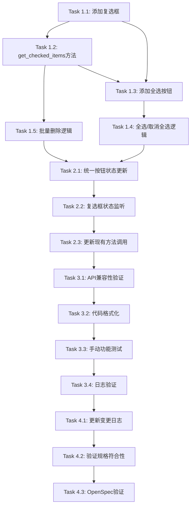

# Tasks: 文件复选框批量删除功能实现

## 变更ID
`add-file-checkbox-multiselect`

## 任务概述

本任务清单详细列出了实现文件复选框批量删除功能所需的所有开发步骤。任务按照依赖关系排序，建议按顺序完成。

## 实现任务清单

### 阶段1: 核心功能实现

#### Task 1.1: 为文件列表项添加复选框
- [ ] **文件**: `src/gui/widgets/audio_source_selector.py`
- [ ] **具体步骤**:
  1. 修改`_on_browse_clicked()`方法，在创建`QListWidgetItem`时添加复选框标志
  2. 为每个item设置`Qt.ItemIsUserCheckable`标志
  3. 设置默认复选框状态为`Qt.Unchecked`
  4. 验证复选框显示在文件名左侧

- [ ] **代码示例**:
  ```python
  item = QListWidgetItem(file_name)
  item.setToolTip(file_path)
  item.setData(Qt.UserRole, file_path)
  item.setFlags(item.flags() | Qt.ItemIsUserCheckable)  # 添加复选框
  item.setCheckState(Qt.Unchecked)  # 默认未勾选
  self.file_list_widget.addItem(item)
  ```

- [ ] **验收标准**:
  - 添加文件后每项都显示复选框
  - 复选框默认为未勾选状态
  - 点击复选框可以切换状态

---

#### Task 1.2: 实现`get_checked_items()`方法
- [ ] **文件**: `src/gui/widgets/audio_source_selector.py`
- [ ] **具体步骤**:
  1. 在`AudioSourceSelector`类中添加新方法
  2. 遍历所有列表项，检查复选框状态
  3. 返回所有勾选项的列表

- [ ] **代码实现**:
  ```python
  def get_checked_items(self) -> List[QListWidgetItem]:
      """获取所有勾选的文件项

      Returns:
          List[QListWidgetItem]: 勾选的文件项列表
      """
      checked_items = []
      for i in range(self.file_list_widget.count()):
          item = self.file_list_widget.item(i)
          if item.checkState() == Qt.Checked:
              checked_items.append(item)
      return checked_items
  ```

- [ ] **验收标准**:
  - 方法正确返回所有勾选的项
  - 未勾选的项不在返回列表中
  - 空列表时返回空列表

---

#### Task 1.3: 添加"全选"按钮
- [ ] **文件**: `src/gui/widgets/audio_source_selector.py`
- [ ] **具体步骤**:
  1. 在`_setup_ui()`方法中添加"全选"按钮组件
  2. 将按钮添加到`file_button_layout`布局中（在"选择文件..."和"移除选中"之间）
  3. 连接按钮的`clicked`信号到`_on_toggle_select_all_clicked()`槽函数
  4. 设置按钮初始状态为禁用

- [ ] **UI布局调整**:
  ```python
  # 在 _setup_ui() 方法中，文件选择按钮布局部分
  self.browse_button = QPushButton("选择文件...")
  self.browse_button.setEnabled(False)
  self.browse_button.setFixedWidth(100)
  self.browse_button.clicked.connect(self._on_browse_clicked)
  file_button_layout.addWidget(self.browse_button)

  # 新增：全选按钮
  self.select_all_button = QPushButton("全选")
  self.select_all_button.setEnabled(False)
  self.select_all_button.setFixedWidth(60)
  self.select_all_button.clicked.connect(self._on_toggle_select_all_clicked)
  file_button_layout.addWidget(self.select_all_button)

  self.remove_file_button = QPushButton("移除选中")
  # ... 其余代码
  ```

- [ ] **验收标准**:
  - 按钮正确显示在UI上
  - 按钮位置在"选择文件..."和"移除选中"之间
  - 按钮初始为禁用状态

---

#### Task 1.4: 实现全选/取消全选逻辑
- [ ] **文件**: `src/gui/widgets/audio_source_selector.py`
- [ ] **具体步骤**:
  1. 实现`_are_all_checked()`辅助方法
  2. 实现`_on_toggle_select_all_clicked()`槽函数
  3. 实现`_update_select_all_button_text()`方法更新按钮文本

- [ ] **代码实现**:
  ```python
  def _are_all_checked(self) -> bool:
      """检查是否所有文件都被勾选

      Returns:
          bool: 所有文件都勾选返回True，否则返回False
      """
      if self.file_list_widget.count() == 0:
          return False

      for i in range(self.file_list_widget.count()):
          item = self.file_list_widget.item(i)
          if item.checkState() == Qt.Unchecked:
              return False
      return True

  @Slot()
  def _on_toggle_select_all_clicked(self) -> None:
      """切换全选/取消全选"""
      all_checked = self._are_all_checked()
      new_state = Qt.Unchecked if all_checked else Qt.Checked

      for i in range(self.file_list_widget.count()):
          item = self.file_list_widget.item(i)
          item.setCheckState(new_state)

      logger.debug(f"Toggle select all: {new_state == Qt.Checked}")

      # 更新按钮状态
      self._update_button_states()

  def _update_select_all_button_text(self) -> None:
      """更新全选按钮文本"""
      if self._are_all_checked() and self.file_list_widget.count() > 0:
          self.select_all_button.setText("取消全选")
      else:
          self.select_all_button.setText("全选")
  ```

- [ ] **验收标准**:
  - 点击"全选"后所有文件被勾选
  - 按钮文本变为"取消全选"
  - 点击"取消全选"后所有文件取消勾选
  - 按钮文本变回"全选"

---

#### Task 1.5: 修改批量删除逻辑
- [ ] **文件**: `src/gui/widgets/audio_source_selector.py`
- [ ] **具体步骤**:
  1. 完全重写`_on_remove_file_clicked()`方法
  2. 改为删除所有勾选的文件（而非当前高亮项）
  3. 添加日志记录删除的文件数量和文件名

- [ ] **代码实现**:
  ```python
  @Slot()
  def _on_remove_file_clicked(self) -> None:
      """移除所有勾选的文件"""
      checked_items = self.get_checked_items()

      if not checked_items:
          logger.debug("No files checked for removal")
          return

      # 收集要删除的文件路径
      files_to_remove = []
      for item in checked_items:
          file_path = item.data(Qt.UserRole)
          files_to_remove.append(file_path)

      # 从内部列表移除
      for file_path in files_to_remove:
          if file_path in self.file_paths:
              self.file_paths.remove(file_path)

      # 从UI中移除（逆序删除，避免索引问题）
      for item in reversed(checked_items):
          row = self.file_list_widget.row(item)
          self.file_list_widget.takeItem(row)

      logger.info(f"{len(files_to_remove)} file(s) removed")

      # 更新按钮状态
      self._update_button_states()

      # 触发源变化信号
      if self.file_radio.isChecked():
          self._on_source_changed()
  ```

- [ ] **验收标准**:
  - 仅删除勾选的文件
  - 未勾选的文件保持不变
  - 日志正确记录删除操作
  - 删除后UI正确更新

---

### 阶段2: 按钮状态管理

#### Task 2.1: 实现统一的按钮状态更新方法
- [ ] **文件**: `src/gui/widgets/audio_source_selector.py`
- [ ] **具体步骤**:
  1. 创建`_update_button_states()`方法
  2. 集中管理所有按钮的启用/禁用逻辑
  3. 在所有相关操作后调用此方法

- [ ] **代码实现**:
  ```python
  def _update_button_states(self) -> None:
      """更新所有按钮的启用/禁用状态"""
      file_mode = self.file_radio.isChecked()
      has_files = len(self.file_paths) > 0
      has_checked = len(self.get_checked_items()) > 0

      # 全选按钮：文件模式且有文件时启用
      self.select_all_button.setEnabled(file_mode and has_files)

      # 移除选中按钮：文件模式且有勾选项时启用
      self.remove_file_button.setEnabled(file_mode and has_checked)

      # 清空全部按钮：文件模式且有文件时启用（保持现有逻辑）
      self.clear_files_button.setEnabled(file_mode and has_files)

      # 更新全选按钮文本
      self._update_select_all_button_text()
  ```

- [ ] **验收标准**:
  - 按钮状态实时响应操作
  - 状态逻辑正确
  - 不影响现有功能

---

#### Task 2.2: 添加复选框状态变化监听
- [ ] **文件**: `src/gui/widgets/audio_source_selector.py`
- [ ] **具体步骤**:
  1. 连接`QListWidget`的`itemChanged`信号
  2. 在复选框状态变化时更新按钮状态

- [ ] **代码实现**:
  ```python
  # 在 _setup_ui() 方法中添加信号连接
  self.file_list_widget.itemChanged.connect(self._on_item_changed)

  @Slot(object)
  def _on_item_changed(self, item: QListWidgetItem) -> None:
      """处理列表项变化（复选框状态变化）

      Args:
          item: 变化的列表项
      """
      # 更新按钮状态
      self._update_button_states()
      logger.debug(f"Item checkbox changed: {item.text()}")
  ```

- [ ] **验收标准**:
  - 勾选/取消勾选任意文件后按钮状态立即更新
  - 无性能问题

---

#### Task 2.3: 更新现有方法调用`_update_button_states()`
- [ ] **文件**: `src/gui/widgets/audio_source_selector.py`
- [ ] **具体步骤**:
  1. 在`_on_source_changed()`中调用
  2. 在`_on_browse_clicked()`中调用
  3. 在`_on_clear_files_clicked()`中调用
  4. 移除旧的独立按钮状态更新代码

- [ ] **修改位置**:
  - `_on_source_changed()`: 替换现有的按钮状态更新代码
  - `_on_browse_clicked()`: 在添加文件后调用`self._update_button_states()`
  - `_on_clear_files_clicked()`: 在清空列表后调用`self._update_button_states()`
  - 删除`_on_file_selection_changed()`中的单独按钮状态更新

- [ ] **验收标准**:
  - 所有操作后按钮状态都正确更新
  - 代码无重复逻辑

---

### 阶段3: 兼容性和测试

#### Task 3.1: 验证API兼容性
- [ ] **文件**: `src/gui/widgets/audio_source_selector.py`
- [ ] **具体步骤**:
  1. 确认`get_file_paths()`方法行为未改变
  2. 确认`get_selected_source()`方法行为未改变
  3. 确认`source_changed`信号触发逻辑未改变
  4. 确认`set_enabled()`方法兼容新按钮

- [ ] **需要修改**:
  ```python
  def set_enabled(self, enabled: bool) -> None:
      """设置是否可选择（转录中禁用）"""
      self.microphone_radio.setEnabled(enabled)
      self.system_audio_radio.setEnabled(enabled)
      self.file_radio.setEnabled(enabled)

      file_mode = self.file_radio.isChecked()
      has_files = len(self.file_paths) > 0
      has_checked = len(self.get_checked_items()) > 0

      self.browse_button.setEnabled(enabled and file_mode)
      self.select_all_button.setEnabled(enabled and file_mode and has_files)  # 新增
      self.remove_file_button.setEnabled(enabled and file_mode and has_checked)
      self.clear_files_button.setEnabled(enabled and file_mode and has_files)
      self.file_list_widget.setEnabled(enabled and file_mode)
  ```

- [ ] **验收标准**:
  - 现有调用代码无需修改
  - 文件转录功能正常工作
  - 所有按钮在转录时正确禁用

---

#### Task 3.2: 代码格式化和注释
- [ ] **文件**: `src/gui/widgets/audio_source_selector.py`
- [ ] **具体步骤**:
  1. 为所有新增方法添加中文文档字符串
  2. 为关键逻辑添加中文注释
  3. 运行Black格式化代码
  4. 运行flake8检查代码质量

- [ ] **命令**:
  ```bash
  # 激活虚拟环境
  .venv\Scripts\activate

  # 格式化代码
  black src/gui/widgets/audio_source_selector.py

  # 代码检查
  flake8 src/gui/widgets/audio_source_selector.py
  ```

- [ ] **验收标准**:
  - 代码符合项目编码规范
  - 所有新方法都有文档字符串
  - 无flake8警告

---

#### Task 3.3: 手动功能测试
- [ ] **测试场景**:
  - [ ] 添加单个文件并勾选删除
  - [ ] 添加5个文件，勾选3个删除
  - [ ] 使用"全选"按钮选择所有文件并删除
  - [ ] 测试"取消全选"功能
  - [ ] 验证清空全部功能仍然正常
  - [ ] 验证文件转录功能不受影响
  - [ ] 验证转录过程中按钮正确禁用

- [ ] **性能测试**:
  - [ ] 添加50个文件，测试全选操作是否流畅
  - [ ] 批量删除30个文件，验证无卡顿

- [ ] **验收标准**:
  - 所有测试场景通过
  - 无明显性能问题
  - UI交互流畅

---

#### Task 3.4: 日志验证
- [ ] **测试步骤**:
  1. 运行程序，启用DEBUG级别日志
  2. 执行各种操作
  3. 检查日志输出是否符合预期

- [ ] **预期日志**:
  - 勾选文件：`DEBUG: Item checkbox changed: video1.mp4`
  - 全选操作：`DEBUG: Toggle select all: True`
  - 批量删除：`INFO: 3 file(s) removed`

- [ ] **验收标准**:
  - 日志信息完整
  - 日志级别正确
  - 日志内容有助于调试

---

### 阶段4: 文档和交付

#### Task 4.1: 更新变更日志
- [ ] **文件**: `CLAUDE.md` 或 `CHANGELOG.md`
- [ ] **内容**:
  ```markdown
  ## 变更日志 (Changelog)
  - **2025-11-07**: 为GUI文件选择添加复选框批量删除功能
    - 文件列表项添加复选框支持
    - 新增"全选"/"取消全选"按钮
    - "移除选中"按钮支持批量删除勾选文件
    - 按钮状态实时响应复选框变化
  ```

---

#### Task 4.2: 验证规格符合性
- [ ] **检查清单**:
  - [ ] 所有ADDED Requirements都已实现
  - [ ] 所有Scenario都可以正常执行
  - [ ] 测试要求中的测试用例都已通过
  - [ ] 性能要求达标

---

#### Task 4.3: 运行OpenSpec验证
- [ ] **命令**:
  ```bash
  openspec validate add-file-checkbox-multiselect --strict
  ```

- [ ] **验收标准**:
  - 验证通过，无错误
  - 无警告信息

---

## 任务依赖关系



## 预估工作量

| 阶段 | 任务数 | 预估时间 |
|------|--------|----------|
| 阶段1: 核心功能实现 | 5 | 1.0小时 |
| 阶段2: 按钮状态管理 | 3 | 0.5小时 |
| 阶段3: 兼容性和测试 | 4 | 1.0小时 |
| 阶段4: 文档和交付 | 3 | 0.5小时 |
| **总计** | **15** | **3.0小时** |

## 完成标准

所有任务清单项都已勾选（`- [x]`），且满足以下条件：

1. ✅ 所有代码修改完成并通过格式化检查
2. ✅ 所有功能测试通过
3. ✅ API兼容性验证通过
4. ✅ 性能测试达标
5. ✅ 日志记录完整
6. ✅ OpenSpec验证通过
7. ✅ 文档更新完成

---

**注意事项**：
- 每完成一个任务，立即勾选对应的复选框
- 如遇到问题，记录在任务项下方
- 建议按顺序完成，避免依赖问题
- 测试驱动开发：实现功能后立即测试
