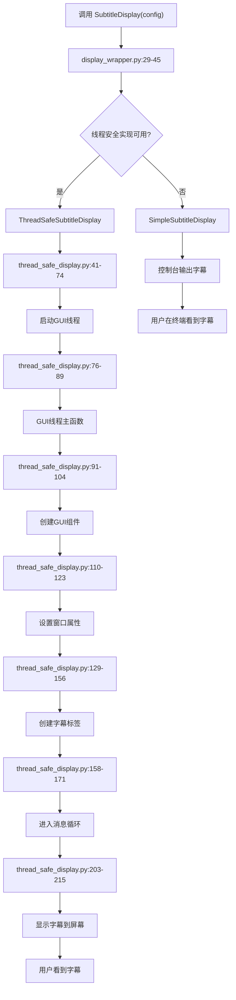
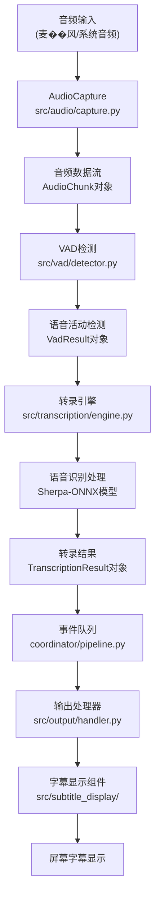

# 字幕显示模块文档

## 模块概览

字幕显示模块（`src/subtitle_display/`）负责在桌面上实时显示语音转录结果的字幕。该模块采用多层次架构设计，提供线程安全、可扩展的字幕显示功能，支持多种显示模式和后备方案。

### ���心特性
- **自动降级机制**：GUI不可用时自动切换到控制台模式
- **桌面悬浮窗口**：无边框、置顶、半透明的字幕窗口
- **拖拽移动**：支持鼠标拖拽调整字幕位置
- **智能布局**：根据文本内容自动调整窗口大小
- **多语言支持**：支持中文字体和编码

## 架构设计

### 文件结构
```
src/subtitle_display/
├── __init__.py              # 模块入口，导出主要接口
├── CLAUDE.md               # 本文档
├── display_wrapper.py      # 统一接口包装器
├── thread_safe_display.py  # 线程安全的GUI实现
├── simple_display.py       # 控制台后备实现
```

### 核心流程图



## 详细实现分析

### 1. 入口点 (`__init__.py`)

**位置**: `src/subtitle_display/__init__.py`

**核心功能**:
- 第12-16行：尝试导入线程安全实现
- 第19行：导入统一接口包装器
- 第31-49行：提供工厂函数 `create_subtitle_display()`
- 第51-58行：提供可用性检查函数

### 2. 统一接口包装器 (`display_wrapper.py`)

**位置**: `src/subtitle_display/display_wrapper.py`

**核心初始化**:
- **第29-45行**: `SubtitleDisplay.__init__()`
  - 第40行：验证配置 `self.config.validate()`
  - 第43行：创建具体实现 `self._implementation = self._create_implementation()`

**实现选择逻辑**:
- **第47-62行**: `_create_implementation()`
  - 第49-54行：优先尝试 `ThreadSafeSubtitleDisplay`
  - 第57-60行：降级到 `SimpleSubtitleDisplay`

**公共接口**:
- 第65-67行：`start()` - 启动字幕显示
- 第69-71行：`stop()` - 停止字幕显示
- 第73-81行：`show_subtitle()` - 显示字幕文本
- 第83-85行：`clear_subtitle()` - 清除字幕
- 第87-90行：`is_running` 属性 - 运行状态

### 3. 线程安全GUI实现 (`thread_safe_display.py`)

**位置**: `src/subtitle_display/thread_safe_display.py`

#### 3.1 初始化阶段 (第41-74行)

**核心初始化流程**:
- **第48-56行**: 基础验证
  - 第52行：检查tkinter可用性
  - 第56行：验证配置有效性
- **第58-71行**: 线程组件初始化
  - 第60行：创建消息队列 `queue.Queue()`
  - 第61行：创建停止事件 `threading.Event()`
  - 第62行：创建启动事件 `threading.Event()`
- **第74行**: 启动GUI线程 `self._start_gui_thread()`

#### 3.2 GUI线程启动 (第76-89行)

**线程启动流程**:
- **第78-82行**: 创建GUI线程
  ```python
  self._gui_thread = threading.Thread(
      target=self._gui_thread_main,
      name="SubtitleDisplayGUI",
      daemon=True
  )
  ```
- **第83行**: 启动线程 `self._gui_thread.start()`
- **第86-87行**: 等待初始化完成（5秒超时）

#### 3.3 GUI线程主函数 (第91-104行)

**核心流程**:
- **第95行**: 记录GUI线程ID
- **第98行**: 创建GUI组件 `self._create_gui()`
- **第101行**: 通知主线程准备就绪
- **第104行**: 进入消息循环 `self._message_loop()`

#### 3.4 GUI组件创建 (第110-123行)

**窗口创建流程**:
- **第114行**: 创建tkinter主窗口 `tk.Tk()`
- **第115行**: 设置窗口属性 `self._setup_window()`
- **第118行**: 创建字幕标签 `self._create_label()`
- **第121行**: 初始隐藏窗口 `self._root.withdraw()`

#### 3.5 窗口属性设置 (第129-156行)

**窗口配置**:
- **第135行**: 设置标题 "实时字幕"
- **第138行**: 无边框窗口 `overrideredirect(True)`
- **第141行**: 置顶显示 `attributes("-topmost", True)`
- **第144行**: 透明度设置 `attributes("-alpha", self.config.opacity)`
- **第147行**: 初始���小 "800x100"
- **第149行**: 背景色设置

#### 3.6 拖拽功能实现 (第155-201行)

**拖拽实现**:
- **第199-201行**: 绑定鼠标事件
  - `<Button-1>`: 鼠标点击
  - `<B1-Motion>`: 鼠标拖拽
  - `<ButtonRelease-1>`: 鼠标释放

#### 3.7 消息循环 (第203-215行)

**核心消息处理**:
- **第206行**: 启动消息处理 `self._root.after(100, self._process_pending_messages)`
- **第210行**: 进入tkinter主循环 `self._root.mainloop()`

#### 3.8 消息处理 (第217-238行)

**消息队列处理**:
- **第225-232行**: 非阻塞获取消息
  ```python
  while True:
      try:
          message = self._message_queue.get_nowait()
          self._process_message(message)
      except queue.Empty:
          break
  ```
- **第237-238行**: 继续下一次检查（50ms间隔）

#### 3.9 字幕显示处理 (第259-295行)

**字幕显示流程**:
- **第265-267行**: 清除之前的定时器
- **第272-276行**: 清理和过滤文本
- **第279-281行**: 格式化显示文本
- **第284行**: 更新标签文本 `self._update_label_text(display_text)`
- **第287-291行**: 设置自动清除定时器

#### 3.10 文本更新 (第314-341行)

**智能文本更新**:
- **第317行**: 设置标签文本 `self._label.config(text=text)`
- **第319行**: 延迟调整窗口大小 `self._root.after_idle(self._adjust_window_size)`

#### 3.11 窗口大小调整 (第321-341行)

**自适应窗口**:
- **第325-327行**: 更新布局计算
- **第328-329行**: 获取所需大小
- **第335-339行**: 设置窗口大小（限制最大尺寸）

### 4. 控制台后备实现 (`simple_display.py`)

**位置**: `src/subtitle_display/simple_display.py`

**初始化**: **第23-35行**
- 简单的线程安全初始化
- 仅包含状态标志和锁

**字幕显示**: **第57-80行**
- **第74-75行**: 格式化时间戳和置信度
- **第77行**: 绿色控制台输出
- **第79行**: 记录日志

## 字幕显示的完整流程

### 阶段1：初始化和配置
```python
# 1. 创建配置对象
config = SubtitleDisplayConfig(
    enabled=True,
    font_size=24,
    opacity=0.8,
    position="bottom"
)

# 2. 创建字幕显示组件
# display_wrapper.py:29-45
subtitle_display = SubtitleDisplay(config)

# 3. 自动选择实现
# display_wrapper.py:47-62
# -> ThreadSafeSubtitleDisplay (优先)
# -> SimpleSubtitleDisplay (降级)
```

### 阶段2：GUI线程初始化
```python
# thread_safe_display.py:76-89
# 启动名为 "SubtitleDisplayGUI" 的独立线程

# thread_safe_display.py:91-104
# 在GUI线程中：
#   - 创建tkinter窗口 (第114行)
#   - 设置窗口属性 (第115行)
#   - 初始隐藏窗口 (第121行)
#   - 启动消息循环 (第104行)
```

### 阶段3：启动显示
```python
# 调用启动方法
subtitle_display.start()

# thread_safe_display.py:364-376
# 发送 "start" 消息到队列
# GUI线程处理消息，显示窗口
```

### 阶段4：显示字幕
```python
# 显示字幕文本
subtitle_display.show_subtitle("你好世界", confidence=0.95)

# thread_safe_display.py:380-389
# 创建 SubtitleMessage 并放入队列

# thread_safe_display.py:240-257
# GUI线程处理消息：

# thread_safe_display.py:259-295
# _handle_show_message():
#   - 清除旧定时器
#   - 清理文本
#   - 格式化显示
#   - 更新标签

# thread_safe_display.py:314-319
# _update_label_text():
#   - 设置标签文本
#   - 延迟调整窗口大小

# thread_safe_display.py:321-341
# _adjust_window_size():
#   - 计算所需大小
#   - 设置窗口几何
#   - 字幕显示在屏幕上
```

## 字幕数据来源和流向

### 完整的数据流管道



### 详细数据流程

#### 1. 音频捕获阶段
**位置**: `src/audio/capture.py`
- 从麦克风或系统音频捕获音频数据
- 创建 `AudioChunk` 对象包含音频数据
- 发送 `AUDIO_DATA` 事件到流水线

#### 2. 语音活动检测
**位置**: `src/vad/detector.py`
- 接收音频数据并进行VAD检测
- 创建 `VadResult` 对象表示语音活动状态
- 发送 `VAD_RESULT` 事件

#### 3. 语音转录
**位置**: `src/transcription/engine.py`
- 使用sherpa-onnx sense-voice模型进行语音识别
- 创建 `TranscriptionResult` 对象包含识别文本和置信度
- **第522行**: 发送 `TRANSCRIPTION_RESULT` 事件
```python
# coordinator/pipeline.py:522-525
def _on_transcription_result(self, transcription_result: TranscriptionResult) -> None:
    """转录结果回调函数"""
    self._emit_event(EventType.TRANSCRIPTION_RESULT, transcription_result, "transcription_engine")
```

#### 4. 事件处理和分发
**位置**: `src/coordinator/pipeline.py`
- **第370行**: 事件循环处理
```python
# coordinator/pipeline.py:370-385
def _event_loop(self) -> None:
    """事件处理主循环"""
    while not self.shutdown_event.is_set():
        try:
            # 从事件队列获取事件
            event = self.event_queue.get(timeout=0.1)
            # 分发到相应处理器
            if event.event_type == EventType.TRANSCRIPTION_RESULT:
                self._handle_transcription_result(event)
```

- **第492行**: 转录结果处理
```python
# coordinator/pipeline.py:492-498
def _handle_transcription_result(self, event: PipelineEvent) -> None:
    """处理转录结果事件"""
    if self.output_handler and isinstance(event.data, TranscriptionResult):
        self.statistics.total_transcriptions += 1
        self.output_handler.process_result(event.data)
```

#### 5. 输出处理和字幕显示
**位置**: `src/output/handler.py`
- **第718-734行**: 屏幕字幕更新
```python
# src/output/handler.py:718-734
def _update_screen_subtitle(self, result: TranscriptionResult) -> None:
    """更新屏幕字幕显示"""
    # 检查是否为最终结果
    if not result.is_final:
        return  # 仅显示最终结果，避免中间结果闪烁

    # 检查文本有效性
    if not result.text or result.text.strip() == "":
        return

    # 显示字幕
    try:
        self.subtitle_display.show_subtitle(
            text=result.text,
            confidence=result.confidence
        )
    except Exception as e:
        logging.warning(f"屏幕字幕显示失败: {e}")
```

#### 6. 字幕最终显示
**位置**: `src/subtitle_display/thread_safe_display.py`
- **第380-389行**: 接收字幕显示请求
- **第259-295行**: 处理字幕显示消息
- **第314-341行**: 更新GUI组件显示字幕

### 关键数据结构

#### TranscriptionResult 对象
```python
# src/transcription/models.py
@dataclass
class TranscriptionResult:
    text: str                    # 转录的文本内容
    confidence: float           # 置信度分数(0.0-1.0)
    start_time: float           # 音频开始时间
    end_time: Optional[float]    # 音频结束时间
    duration_ms: Optional[float] # 音频持续时间
    language: Optional[str]     # 检测到的语言
    is_final: bool              # 是否为最终结果
```

#### 字幕显示过滤条件
**位置**: `src/output/handler.py:718-726`
```python
# 字幕显示的条件过滤：
if not result.is_final:
    # 条件1: 仅显示最终结果，避免中间结果造成闪烁
    return

if not result.text or result.text.strip() == "":
    # 条件2: 空结果不显示，避免界面闪烁
    return
```

### 实际使用示例

#### 完整的调用链
```python
# 1. 用户启动语音转录
python main.py --model-path models/model.onnx --input-source microphone --show-subtitles

# 2. 音频数据流
AudioCapture -> AudioChunk -> VAD检测 -> 语音转录 -> TranscriptionResult

# 3. 事件处理
coordinator/pipeline.py:_handle_transcription_result() -> output/handler.py:process_result()

# 4. 字幕显示
output/handler.py:_update_screen_subtitle() -> subtitle_display/show_subtitle()

# 5. GUI更新
thread_safe_display.py:_handle_show_message() -> _update_label_text() -> 屏幕显示
```

### 配置和控制

#### 字幕显示配置
**位置**: `src/config/models.py:80-106`
```python
@dataclass
class SubtitleDisplayConfig:
    enabled: bool = True                    # 是否启用字幕显示
    position: str = "bottom"               # 字幕位置
    font_size: int = 24                    # 字体大小
    font_family: str = "Microsoft YaHei"    # 字体
    opacity: float = 0.8                   # 透明度
    max_display_time: float = 5.0           # 最大显示时间
    text_color: str = "#FFFFFF"            # 文字颜色
    background_color: str = "#000000"      # 背景颜色
```

## 性能和资源管理

### 内存使用
- **消息队列**：使用标准 `queue.Queue`，内存占用最小
- **GUI组件**：仅在GUI线程中创建，避免内存泄漏
- **定时器管理**：及时清除旧的定时器，防止内存累积

### 线程安全
- **消息传递**：通过队列实现线程间通信，完全线程安全
- **GUI操作**：所有GUI操作都在专用线程中执行
- **状态管理**：使用 `threading.Event()` 进行线程同步

### 错误处理
- **异常恢复**：GUI线程异常时自动降级到控制台模式
- **超时保护**：GUI线程启动超时（5秒）自动失败
- **资源清理**：组件销毁时自动清理GUI资源

## 使用示例

### 基本使用
```python
from src.subtitle_display import SubtitleDisplay
from src.config.models import SubtitleDisplayConfig

# 创建配置
config = SubtitleDisplayConfig(
    enabled=True,
    font_size=24,
    opacity=0.9
)

# 创建字幕显示组件
subtitle = SubtitleDisplay(config)

# 启动显示
subtitle.start()

# 显示字幕
subtitle.show_subtitle("你好，世界！", confidence=0.95)

# 清除字幕
subtitle.clear_subtitle()

# 停止显示
subtitle.stop()
```

### 集成到主程序
```python
# 在 output/handler.py 中集成
from src.subtitle_display import SubtitleDisplay

class OutputHandler:
    def __init__(self, subtitle_display_config=None):
        if subtitle_display_config and subtitle_display_config.enabled:
            self.subtitle_display = SubtitleDisplay(subtitle_display_config)
        else:
            self.subtitle_display = None

    def process_result(self, result):
        # ... 其他处理逻辑 ...

        # 显示字幕
        if self.subtitle_display and result.is_final:
            self.subtitle_display.show_subtitle(
                result.text,
                confidence=result.confidence
            )
```
---

## 单例模式实现 (2025-11-10)

### 设计目标

确保整个应用程序生命周期内只有一个 `SubtitleDisplay` 实例，解决多组件同时初始化导致的多窗口问题。

### 核心实现

#### 1. 工厂方法（推荐使用）
```python
from src.subtitle_display import get_subtitle_display_instance

# 获取或创建单例实例
config = SubtitleDisplayConfig(enabled=True, position="bottom")
display = get_subtitle_display_instance(config)
```

#### 2. 向后兼容的直接实例化
```python
# 旧式调用方式仍然有效，会自动返回单例
display = SubtitleDisplay(config)
```

### 单例管理

#### 重置单例（测试或强制重新初始化）
```python
from src.subtitle_display import reset_subtitle_display_instance

# 清理现有单例并释放资源
reset_subtitle_display_instance()

# 下次调用会创建新实例
display = get_subtitle_display_instance(config)
```

#### 配置更新
```python
# 单例已存在时，配置会自动更新
new_config = SubtitleDisplayConfig(enabled=True, position="top", font_size=30)
display = get_subtitle_display_instance(new_config)  # 更新配置

# 或直接调用更新方法
display.update_config(new_config)
```

### 技术细节

#### 线程安全保证
- **双重检查锁定 (Double-Checked Locking)**：第一次检查避免锁竞争，第二次检查确保并发安全
- **threading.Lock**：确保多线程场景下只创建一个实例
- **原子操作**：配置更新和实例创建都是原子的

#### 资源清理
- **atexit 处理器**：应用退出时自动清理单例资源
- **_cleanup() 方法**：集中处理GUI线程停止和资源释放
- **__del__() 保险**：对象销毁时的双重保险清理

#### 降级策略
```python
# 单例初始化失败时，自动降级到多实例模式并记录警告
try:
    display = get_subtitle_display_instance(config)
except Exception as e:
    logger.warning("单例初始化失败，降级到多实例模式")
    # 返回独立实例，不阻塞应用
```

### 测试覆盖

位置：`tests/subtitle_display/test_singleton.py`

**测试类别**：
1. **基本行为**：单例创建、重用、直接实例化
2. **线程安全**：并发初始化测试（10线程）
3. **配置更新**：动态配置更新、热更新
4. **重置功能**：清理、重新初始化
5. **向后兼容**：旧式API兼容性
6. **错误处理**：初始化失败降级、清理错误处理
7. **资源管理**：cleanup方法、缺失实现处理
8. **公共接口**：start/stop/show_subtitle/clear_subtitle委托

**测试统计**：19个测试，100%通过

### 实际使用示例

#### 在 OutputHandler 中使用
```python
# src/output/handler.py:270-272
from src.subtitle_display import get_subtitle_display_instance

self.subtitle_display = get_subtitle_display_instance(self.subtitle_display_config)
```

#### 在 MainWindow 中使用
```python
# src/gui/main_window.py:712-714
from src.subtitle_display import get_subtitle_display_instance

self.subtitle_display = get_subtitle_display_instance(self.config.subtitle_display)
```

### 性能影响

- **首次调用**：与原实现相同（需要创建GUI线程和窗口）
- **后续调用**：几乎零开销（仅检查单例是否存在）
- **内存占用**：减少（避免多个GUI线程和窗口）
- **并发性能**：第一次检查无锁，快速路径优化

### 注意事项

1. **测试隔离**：单元测试需要使用 `reset_subtitle_display_instance()` 重置状态
2. **配置热更新限制**：部分配置（如GUI线程参数）可能无法热更新，需要重置
3. **日志级别**：单例重用在 DEBUG 级别记录，首次创建在 INFO 级别
4. **降级模式**：单例失败时自动降级，不影响应用可用性

---

**模块状态**: ✅ 完全功能正常 + 单例模式
**最后更新**: 2025-11-10
**核心实现**: ThreadSafeSubtitleDisplay (线程安全GUI) + SimpleSubtitleDisplay (控制台降级)
**单例管理**: ✅ 双重检查锁定 + 配置热更新 + 资源自动清理
**线程安全**: ✅ 完全解决tkinter线程问题 + 并发单例创建安全
**用户体验**: ✅ 流畅的桌面悬浮字幕窗口 + 避免多窗口混乱